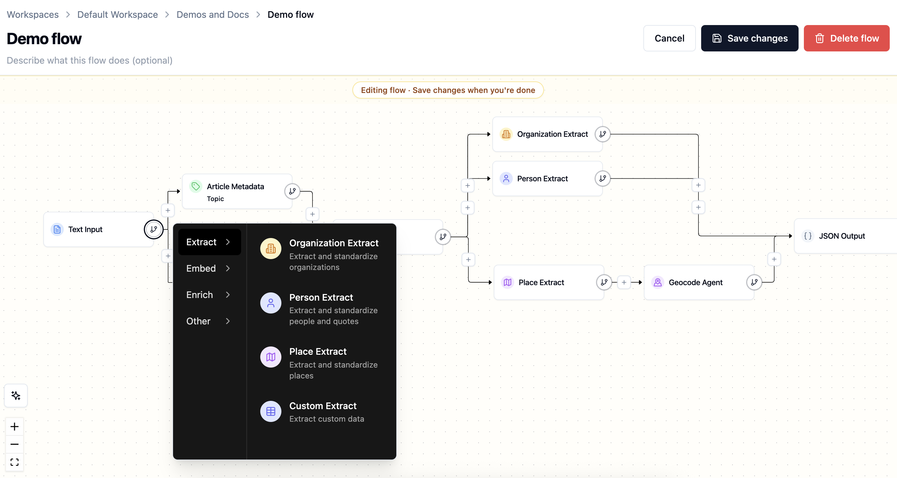
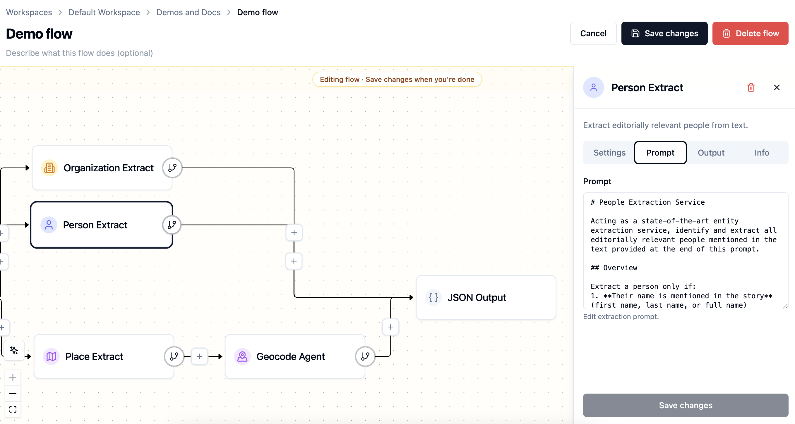

# Flows

**Flows** are Agate's data extraction and enrichment pipelines. They are composed of a series of connected [nodes](nodes/index.md) that read your text and produce structured results.

Every flow begins with a step that brings text **in** and ends with a step that sends results **out**, with extraction and enrichment steps in between.

## What a flow does

Flows turn unstructured text into structured data. A simple flow might take article text, identify its people and places, geocode the places, and save the results for review. A more advanced flow can branch into several extraction tasks and gather results back together.

Most flows follow the same pattern:

1. **Input** — bring text into the flow.
2. **Extract** — find the entities, metadata, or custom records you care about.
3. **Enrich** — add useful context, such as coordinates for locations or embeddings for search.
4. **Output** — save the results to Backfield or export them elsewhere.

## Building flows

Nodes can be inserted into your flow either in parallel or in serial. Nodes at the same level of the graph execute simultaneously, which can save time on complex processing tasks.

The output of each node serves as input for the next. For example, extracting places with the **PlaceExtract** node feeds those places to the **GeocodeAgent** for geocoding. Most nodes just require the text of the article, which persists across all nodes from the flow's input.

Each node has its own settings panel. Use it to set options that are unique to each node, including the LLMs the node should use, prompt language and other configurable instructions.

## Inputs and outputs

Every runnable flow needs at least one input and one output. Creating a new flow requires defining these first.

| Node type | What it does |
| --- | --- |
| **Input** | Defines what text or data the run receives, such as pasted text, JSON, or files from cloud storage |
| **Output** | Defines where the flow sends results, such as Backfield, JSON, or cloud storage |

The input and output are the bookends of the flow. The nodes you insert between them are what transforms, extracts, enriches, or routes the data into its final output form.

## Branches and control flow

A flow does not have to be a single straight line. You can branch when several steps should read from the same input — for example, one branch extracts people while another extracts locations. Use flow-control nodes to gather branches when a later step needs their combined output.

Branching keeps each node focused. It also makes runs easier to debug because each extraction or enrichment step has its own output.

## Validation

Before you run a flow, check that it is complete:

- The flow has an input node and an output node.
- Required node settings are filled in.
- Each node that needs upstream data is connected.
- Model-backed nodes use an approved model configuration.
- Output nodes receive the fields they expect.

Agate surfaces validation issues in the builder so you can fix missing settings or broken connections before starting a run.

## Running a flow

Building a flow defines the pipeline. A [run](runs.md) executes that pipeline. After a run finishes, each article becomes a [processed item](processed-items.md), where you can inspect node outputs, review extracted entities and correct article-level results before they feed the rest of Backfield.

## Related

- [Nodes](nodes/index.md) — the building blocks of a flow
- [Runs](runs.md) — executing a flow and tracking progress
- [Processed items](processed-items.md) — reviewing run results
- [Backfield Output](nodes/outputs.md) — saving flow results into Backfield
