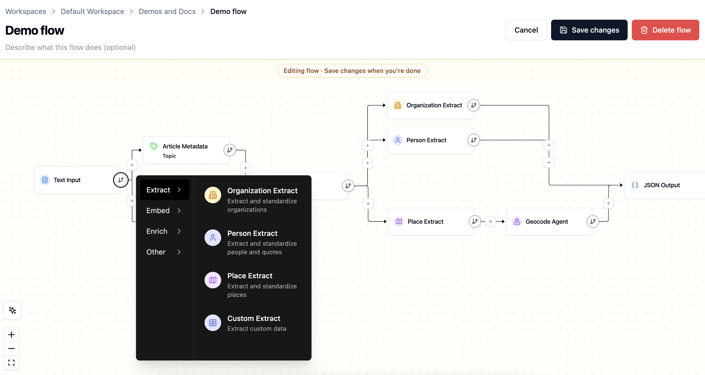
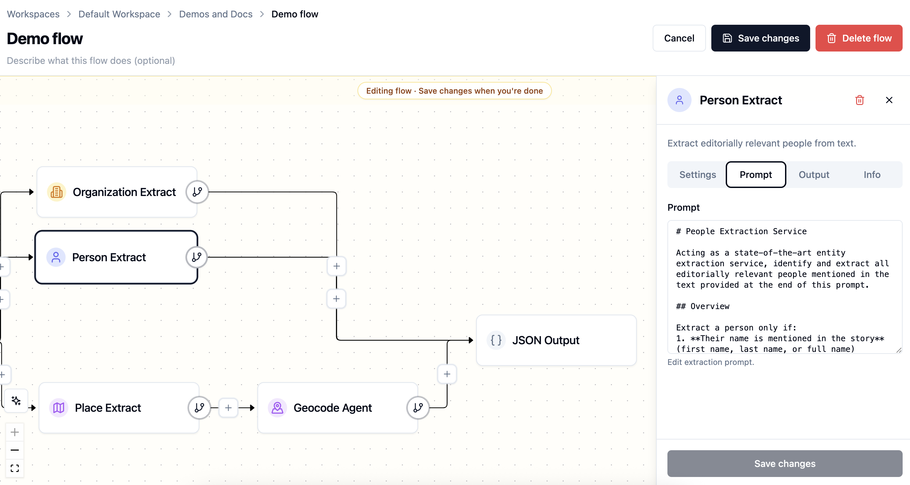

# Flows

**Flows** are Agate's data extraction and enrichment pipelines. They are composed of a series of connected [nodes](nodes/index.md) that read your text and produce structured results.

Every flow begins with a step that brings text **in** and ends with a step that sends results **out**, with extraction and enrichment steps in between.

## What a flow does

Flows turn unstructured text into structured data. A simple flow might take article text, identify its people and places, geocode the places, and save the results for review. A more advanced flow can branch into several extraction tasks and gather results back together.

Most flows follow the same pattern:

1. **Input** — bring text into the flow.
2. **Extract** — find the entities, metadata, or custom records you care about.
3. **Enrich** — add useful context, such as coordinates for locations or embeddings for search.
4. **Output** — save the results to Backfield or export them elsewhere.

## Building flows

Agate uses a guided builder rather than asking you to wire a technical graph by
hand:

1. Choose the input that describes where content comes from.
2. Choose the output that describes where results go.
3. Use the **+** controls between steps or on a branch to add compatible nodes.
4. Open a node to review its settings, prompt, model choice, and help text.

Agate creates the connections automatically and offers only steps that can use
the available upstream data.

Steps can be inserted in sequence or placed on parallel branches. For example,
person and organization extraction can run independently from the same article,
while **Geocode** must come after **Place Extract** because it needs the places
that step produced.

Each node has its own panel. Depending on the node, it may include Settings,
Prompt, Models, Info, Stylebook, or Output tabs. The builder draws model choices
from the project's approved [AI models](../settings/ai-models.md).

## Inputs and outputs

Every runnable flow needs at least one input and one output. Creating a new flow requires defining these first.

| Node type | What it does |
| --- | --- |
| **Input** | Defines what text or data the run receives, such as pasted text, JSON, or files from cloud storage |
| **Output** | Defines where the flow sends results, such as Backfield, JSON, or cloud storage |

The input and output are the bookends of the flow. The nodes you insert between them are what transforms, extracts, enriches, or routes the data into its final output form.

## Branches and control flow

A flow does not have to be a single straight line. You can branch when several steps should read from the same input — for example, one branch extracts people while another extracts locations. Use flow-control nodes to gather branches when a later step needs their combined output.

Branching keeps each node focused. It also makes runs easier to debug because each extraction or enrichment step has its own output.

## Saving and editing

Saving validates the complete flow and its node settings. When you edit an
existing flow, **Cancel** restores the saved version and **Save flow** makes the
new definition available to future runs.

A run keeps a snapshot of the flow it executed. This matters when diagnosing
older results: changing today's prompt or model does not rewrite yesterday's
run graph.

Flows can also be duplicated when a team needs a safe starting point for a
different process. Deleting a flow is a separate, confirmed action; historical
run records retain the execution context needed to understand past work.

## Validation

Before you run a flow, check that it is complete:

- The flow has an input node and an output node.
- Required node settings are filled in.
- Each node that needs upstream data is connected.
- Model-backed nodes use an approved model configuration.
- Output nodes receive the fields they expect.

Agate surfaces validation issues in the builder so you can fix missing settings or broken connections before starting a run.

## Running a flow

Building a flow defines the pipeline. A [run](runs.md) executes that pipeline. After a run finishes, each article becomes a [processed item](processed-items.md), where you can inspect node outputs, review extracted entities and correct article-level results before they feed the rest of Backfield.

For Text and JSON inputs, the run view lets you supply or update the current
item before starting. S3 inputs instead describe a batch source. A flow may
also be enabled for trusted API-triggered runs when an external system needs to
start it.

## Reconciliation on rerun

When Backfield Output saves an article that has been processed before, its
reconciliation policy determines how new machine-produced evidence combines
with existing evidence:

- **Add Only** keeps prior machine output and adds new results.
- **Smart Merge** updates compatible data without treating the new run as a
  complete replacement.
- **Replace** treats emitted machine domains as authoritative, removing prior
  machine associations that are no longer present.

Editor-added and editor-modified evidence is preserved. Agate shows this policy
in rerun confirmation so the effect is clear before processing starts.

## Related

- [Nodes](nodes/index.md) — the building blocks of a flow
- [Runs](runs.md) — executing a flow and tracking progress
- [Processed items](processed-items.md) — reviewing run results
- [Backfield Output](nodes/outputs.md) — saving flow results into Backfield
