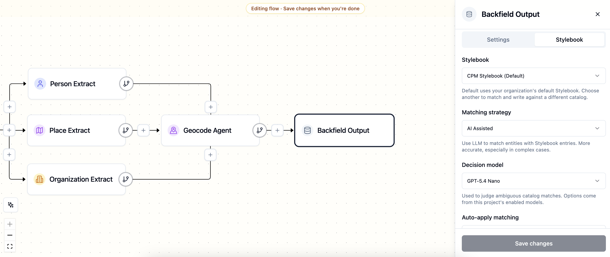

# Agate

Agate is where you build and run the pipelines that pull structured data from your text and enrich it with arbitrary metadata. It does this by executing composable workflows that you construct from a library of nodes.

## Three concepts to know

Agate executions revolve around three connected concepts:

| Concept | Definition |
| --- | --- |
| **[Flows](flows.md)** | A series of steps composed of nodes that are wired together. You build it once and reuse it. |
| **[Runs](runs.md)** | A single execution of a flow over one or more articles. |
| **[Processed items](processed-items.md)** | A flow's output for one article: the people, places, metadata and other information extracted by the flow — which you can review and correct. |

## Building flows

A flow is built from **[nodes](nodes/index.md)**. Each node does one job, such as assigning a topic to an article or extracting its places. Nodes can be run in parallel or in serial, and the output of each one serves as input for the next. A typical flow begins with an article, extracts and enriches data from the text, then saves the results.

Nodes come in a variety of flavors, and developers can create new ones for specific tasks. See the [Nodes overview](nodes/index.md) for the full catalog.

## How Agate works with Stylebook

Agate either produces raw JSON (via JSON or S3 Output nodes) or sends its output into a shared Backfield database.

The **Backfield Output** node is responsible for saving data into the Backfield ecosystem. As it saves, it can match each extracted person or place against your [Stylebook](../stylebook/index.md), reconciling data with known records, proposing new ones and forming connections between them.

This process is known as **[canonicalization](../stylebook/canonicalization.md)**. It can be performed using fixed rules or with AI assistance, with options set via the Backfield Output node.

## In this section

| Page | What it covers |
| --- | --- |
| [Flows](flows.md) | Building and executing pipelines |
| [Nodes](nodes/index.md) | The building blocks, grouped by what they do |
| [Runs](runs.md) | Running flows on one item or a batch, and tracking progress |
| [Processed items](processed-items.md) | Reviewing and correcting results article by article |
