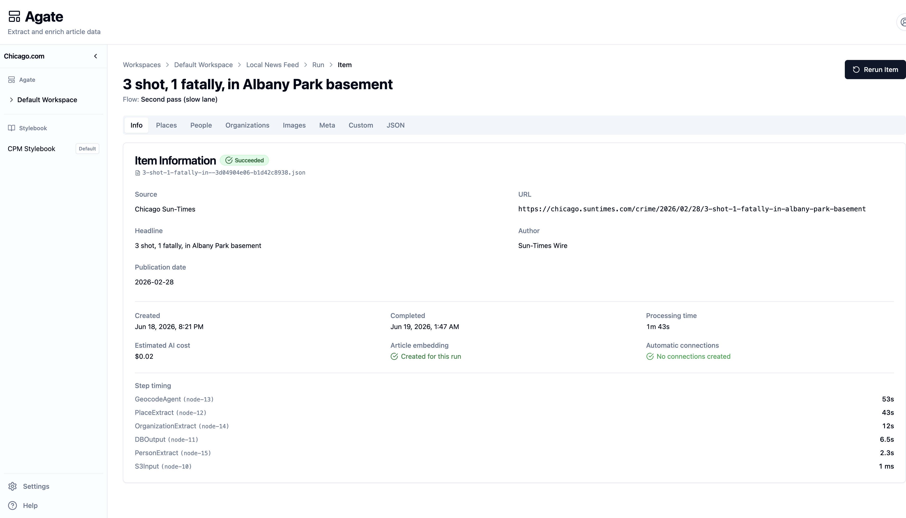
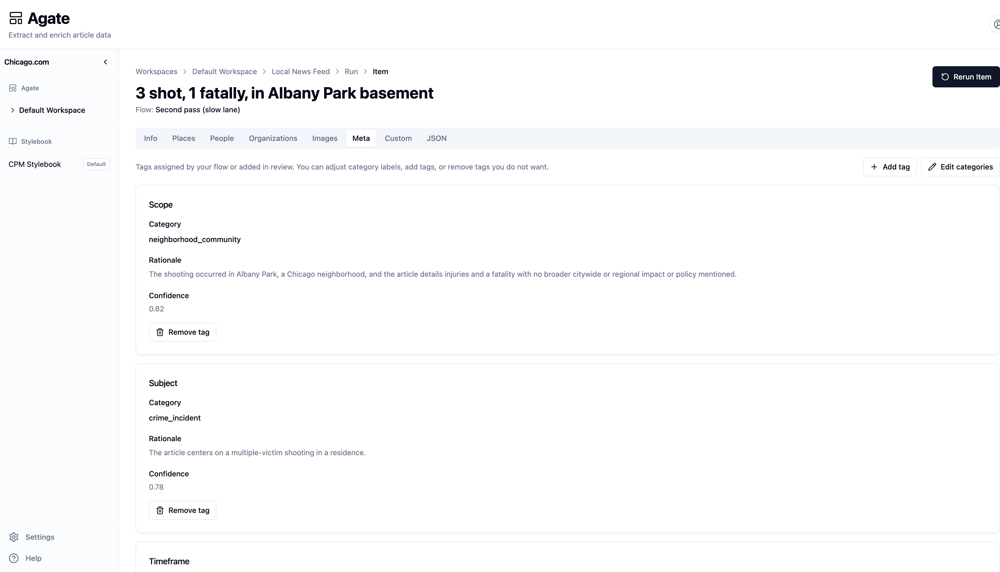

# Processed items

A **processed item** is the result of a [run](runs.md) for a single article: the places, people, organizations, topics, and other details the [flow](flows.md) produced. Open one from a run's item list to **verify** what the pipeline produced against the original story and **correct** anything that's wrong.

Because the model's original output is always preserved, your edits are saved as a separate **review layer** on top. You can fix mistakes, add things the model missed, and re-run flows without losing the record of what you changed.

## Opening a processed item

From a [run](runs.md), click through to an individual item. The page shows the article headline, which flow produced the result, and a row of tabs — one for each kind of extracted data.

Entity review tabs (**Places**, **People**, **Organizations**, and similar) share the same basic layout: the **story text on one side**, the **extracted entities on the other**, with highlights that connect mentions in the prose to the rows in the list.

When an editor has saved corrections on a tab, an amber banner appears at the top: *"… has been corrected or enhanced by an editor."* That is your signal that the displayed data includes human review, not just the raw model output.

## The tabs

| Tab | What you review |
| --- | --- |
| **Info** | Run status, source file, headline and byline fields, indexing summaries, and any flow-specific visualizations |
| **Places** | Locations mentioned in the story, with map geometry and geocoding |
| **People** | People mentioned or quoted, linked to Stylebook when matched |
| **Organizations** | Companies, agencies, and other orgs mentioned in the story |
| **Images** | Images from the article with generated descriptions (read-only) |
| **Meta** | Topic, subject, and other metadata tags applied to the article |
| **Custom** | Structured records from custom extractors you defined in the flow |
| **JSON** | The full machine-readable output — original model result and, when present, reviewed output |

## Provenance: seeing where something came from

The entity tabs are built around **evidence in the story**. When you select a person, place, or organization, the matching passages in the article text light up. Click a highlight in the story to jump to the corresponding entity (and disambiguate when one phrase could refer to several places).

This is the core review pattern: every extracted entity should be traceable to language in the source text. If the model invented something or attached the wrong passage, you can see it immediately.

### Example: People

The **People** tab lists everyone the flow found. For each person you can see display fields (name, title, affiliation, public-figure flag) and whether they link to an existing [Stylebook](../stylebook/index.md) catalog record.

Selecting a person highlights their **mentions** in the story. Quotes are highlighted separately from ordinary name mentions, so you can check whether the model attributed speech correctly. You can add a person the model missed by selecting a passage in the story, or remove spurious extractions — always tied back to quoted evidence.

### Example: Places

The **Places** tab pairs the story with a **map** and a list of geocoded locations. Yellow highlights in the story mark where each place was mentioned; selecting a row focuses those passages and the corresponding pin on the map. You can adjust coordinates, fix a misread place name, or add a location by highlighting the supporting sentence — the same provenance pattern as people, with geography on top.

Places that matched your catalog show a **Stylebook** link; you can open the canonical record or remove a bad extraction from this story.

See [Geography](../stylebook/geography.md) for how place geometry flows into Stylebook and the public API.

### Example: Meta

The **Meta** tab works differently — there is no side-by-side story pane — but the same provenance idea applies. Each tag shows the **category** the model chose, a **rationale** explaining why, and a **confidence** score. You can edit categories, add tags, or remove ones that do not fit.

## Editing and saving

Review edits do not overwrite the model's first pass. They accumulate in a **review overlay** that Agate merges when displaying the item and when building **reviewed output** for export.

Typical corrections include:

- Fixing a field (headline on **Info**, category on **Meta**, person title on **People**)
- Removing a bad extraction
- Adding an entity the model missed, anchored to a story passage
- Adjusting map geometry for a place

Save your changes on each tab before leaving. Unsaved edits trigger a warning if you navigate away.

While a **rerun** is in progress, review editing is **paused** until processing finishes — the item is being regenerated from the flow.

## Stylebook and canonical records

When a flow's output step saves results, extracted entities can link to **canonical** records in [Stylebook](../stylebook/index.md). On a processed item you may see catalog links for matched people, places, and organizations.

Your review corrections update what is stored for **this article** — see [The content model](../concepts/content-model.md). Canonical catalog fields remain authoritative in Stylebook; the processed item is where you fix article-specific mistakes before they propagate.

## JSON and export

The **JSON** tab shows the structured output. When you have saved review changes, you can switch between **original** output (what the flow produced) and **reviewed** output (original plus your corrections). Use **Download** to export the JSON, or follow cloud-storage links when the flow wrote results to S3.

## Related

- [Runs](runs.md) — how items are produced
- [Mentions & evidence](../stylebook/mentions.md) — how story passages become catalog evidence
- [Article detail in the API](../../api/articles/get-article.md) — fetch one article with inline images; optional `include=counts` and `include=text`
