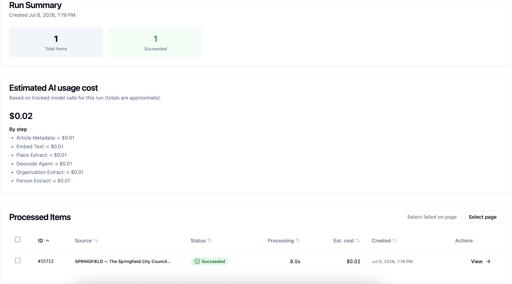

# Runs

A **run** is one execution of a [flow](flows.md). It applies the flow to one article or a batch of articles and records what happened at each step.

Each article in a run becomes a [processed item](processed-items.md): the reviewable output for that article, including extracted entities, article metadata, custom records, JSON output, and any errors.

## Starting a run

Start a run from a flow when the pipeline is complete and valid. Agate uses the flow's input node to decide what you need to provide:

| Input | What the run processes |
| --- | --- |
| **Text input** | One pasted article or document |
| **JSON input** | One structured article object with fields such as `text`, `headline`, `publication`, and `images` |
| **S3 input** | A batch of JSON files from a bucket and prefix |

=== "Start a run"

    

=== "Run details"

    

## Single item and batch runs

**Text Input** and **JSON Input** nodes are designed to process a single article. This is often helpful for testing a flow. Runs with a single input yield a single processed item.

**S3 Input** processes a batch of articles and is more often used for regular production runs. By default, Agate can process 8 articles at a time simultaneously. Developers can change this by tuning the project's environment variables.

**Note:** The act of moving articles into S3 for processing happens outside of the Backfield ecosystem. It might involve writing web scrapers, CMS integrations, processing RSS feeds or other tasks that turn your articles into [properly formatted JSON objects](nodes/inputs.md) in a S3 bucket that Backfield can reach.

## Status and progress

The run page shows both the overall run status and the status of each processed item. Use it to answer three questions:

- Did the run start?
- Which items are still working?
- Which items need attention?

Common statuses include:

| Status | Meaning |
| --- | --- |
| **Pending** | The run or item has been created but has not started processing |
| **Running** | Agate is executing the flow |
| **Succeeded** | Processing finished successfully |
| **Failed** | Processing stopped because a node, model call, input file, or output step failed |

For batches, the overall status summarizes the item list. A run can finish with some items succeeded and others failed, so check the item rows before assuming the whole batch is usable.

## What the run records

Runs preserve the operational details you need to understand what happened:

| Detail | Why it matters |
| --- | --- |
| **Input source** | Shows whether the run came from pasted text, JSON, S3, or an API trigger |
| **Item count** | Shows how many articles were created and how many are pending, running, succeeded, or failed |
| **Node progress** | Helps identify which step is slow or failing |
| **Errors** | Shows the message returned by a failed node or item |
| **Estimated AI cost** | Helps track model usage for the run and its steps |
| **Timestamps** | Show when the run started, updated, and finished |

Cost estimates depend on the [AI models](../settings/ai-models.md) selected in the flow. Treat them as operational estimates for monitoring and comparison, not as audited billing records.

## Failures and reruns

If a run fails, start by checking the failed processed item or node. The most common causes are missing input fields, invalid JSON, inaccessible S3 files, model configuration problems, or one-off network or LLM errors.

After fixing the flow, input, or settings, run it again. Reruns generate new model output from the current flow configuration; review corrections on processed items are kept separate from the original model output so you can tell what the model produced and what an editor later changed.

## Triggering via the API

Flows can also be triggered from code when API runs are enabled for the graph. Use this when an external system needs to send text or JSON into a configured flow and poll for completion.

See [Run endpoints](../../api/runs/index.md) for authentication, request shape, and status polling.

## Related

- [Flows](flows.md) — building the pipeline a run executes
- [Input nodes](nodes/inputs.md) — text, JSON, and S3 inputs
- [Processed items](processed-items.md) — reviewing the output of each article
- [Run endpoints](../../api/runs/index.md) — triggering and polling runs from code
