# Simple Example

The easiest way to understand Backfield is by example. This page follows a short (fake) news article from raw text to structured, queryable data — the same path every story takes through the platform.

## The story

Imagine your newsroom publishes this brief:

> **Riverside Bridge repairs approved after months of delay**
>
> SPRINGFIELD, Ill. — The Springfield City Council voted 6–1 on Tuesday to approve a $2.4 million contract with Harlan Construction Co. to repair the aging Riverside Bridge, closed to trucks since a February inspection found cracks in two support beams.
>
> "We can't ask people on the east side to detour around the river for another winter," said Mayor Jane Doe, who pushed for the expedited timeline.
>
> Councilmember Marcus Webb cast the lone dissenting vote, citing concerns about the no-bid process. Work is expected to begin near Riverside Park in March.

To a reader, this presents as a 100-word brief. To Backfield, it's a bundle of structured facts: two named officials (one quoted), a government body, a construction company, several places, and some metadata.

## Step 1: Build and run a flow

We'll start by building an [Agate flow](agate/flows.md) to process the article. We'll paste our text into the input.

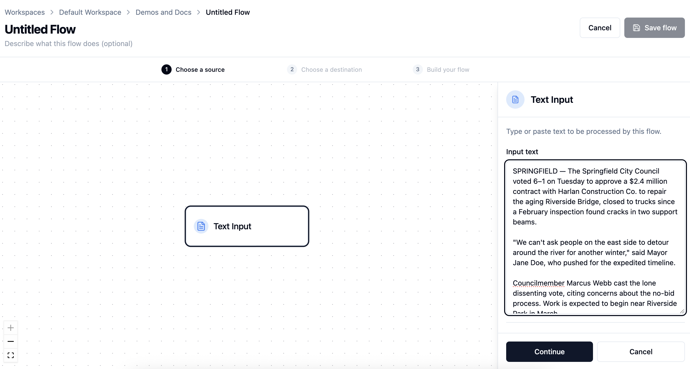

And then we will construct a pipeline of interconnected [nodes](agate/nodes/index.md) — in this case, assigning some topical metadata; creating a semantic embedding of the article; extracting people, places and organizations; and geocoding the locations so they can be plotted on a map.

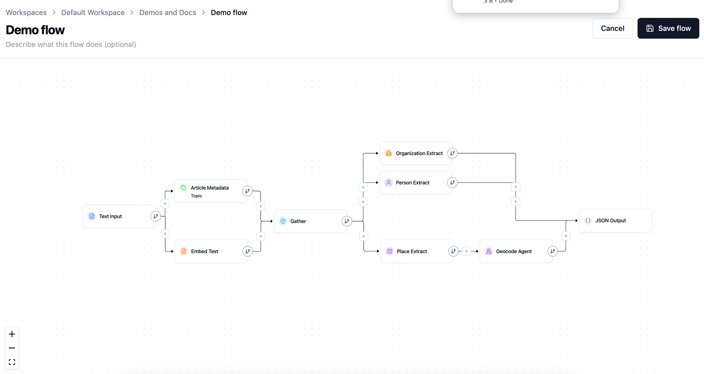

The screenshot ends with **JSON Output**, which is useful while inspecting and
testing the structure. To save the article, evidence, and canonical links used
in Steps 4 and 5, the reusable production flow must instead end with
**Backfield Output**. Output choice is a real behavior difference, not just a
display preference.

Executing the flow creates [Run](agate/runs.md), which processes the article in a matter of seconds.

The run details drawer confirms that the flow has started, and the run page shows each processed item's status with a link to review the story.

=== "Start a run"

    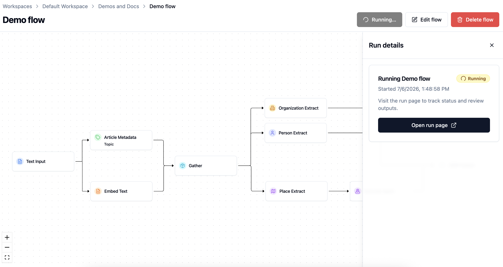

=== "Run details"

    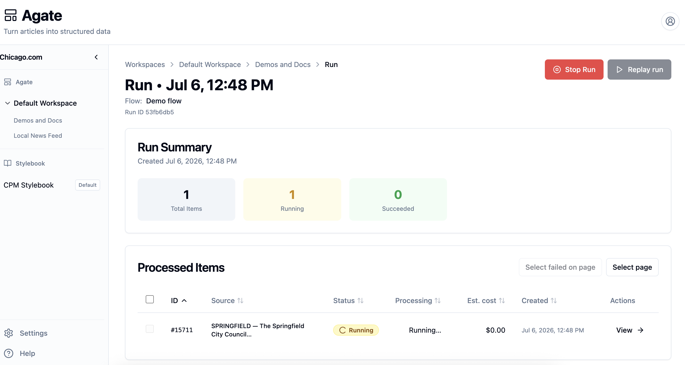

## Step 2: Review the output

Once the run finishes, the story becomes a [processed item](agate/processed-items.md) — a review page with one tab for each type of data extracted by the flow.

Editors can review and change the article-specific people, places,
organizations, and metadata extracted from the story. These corrections affect
this story's evidence; canonical Stylebook records are maintained separately.

=== "Places"

    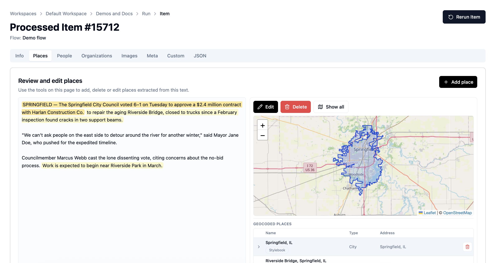

=== "People"

    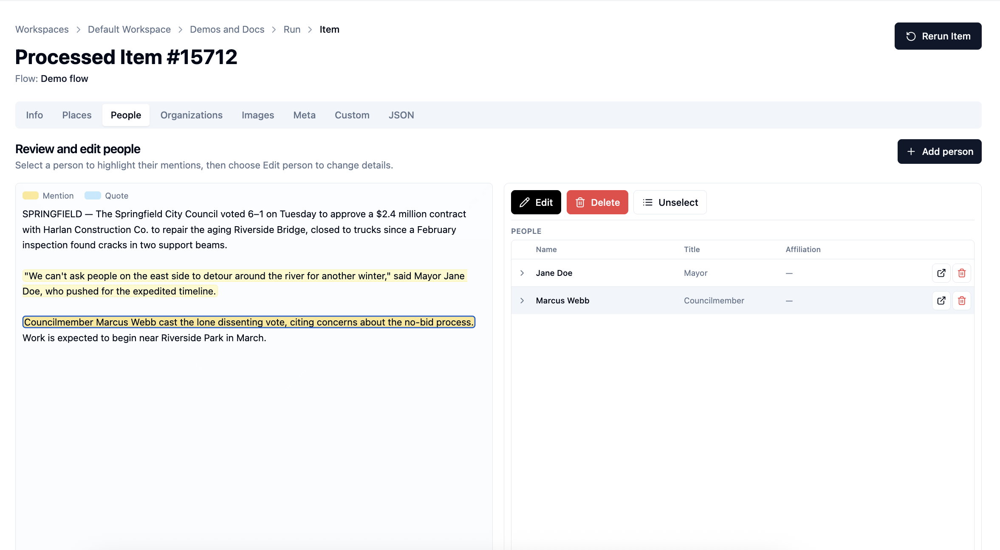

=== "Organizations"

    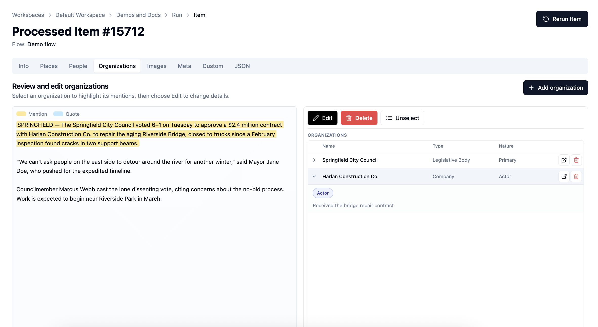

=== "Meta"

    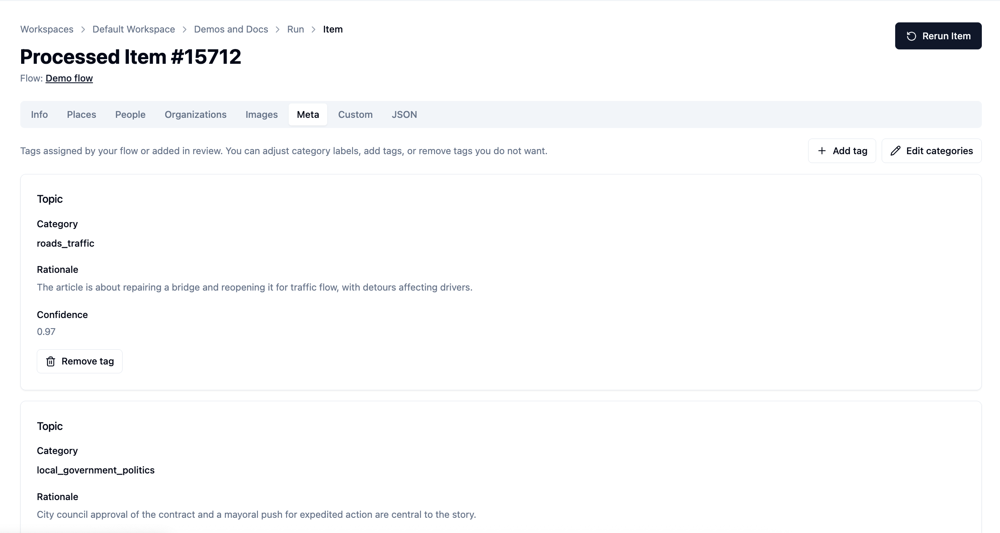

Extracted people, organizations, and places are tied to **evidence** — the
passages that refer to them. Select one and the supporting source material is
highlighted in the review interface. Other outputs, such as embeddings and
generated classification rationales, are not textual mentions.

## Step 3: Correct any mistakes

Models make mistakes, so Agate is built for verification. When reviewing a processed item, an editor can:

- Fix incorrect metadata
- Remove a spurious extraction
- Add something the model missed, anchored to a passage in the story
- Adjust map coordinates for a place

Corrections are saved as a **review layer** on top of the original model
output, so you can compare the original and reviewed versions. Rerunning the
item regenerates that run-local result and clears its review overlay, so review
the rerun warning before proceeding. See
[Processed items](agate/processed-items.md).

=== "Adjust geography"

    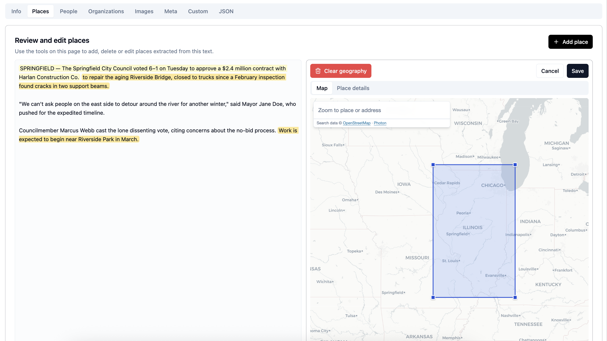

=== "Edit place details"

    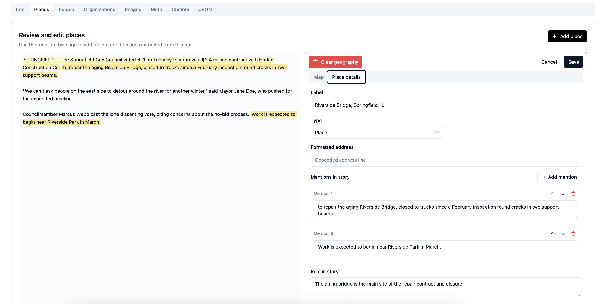

## Step 4: Curate Stylebook records

Suppose your newsroom has written 50 stories about Mayor Jane Doe. Each story
has its own article evidence, potentially with several textual **mentions**,
while all of them can link to a single canonical person.

When **Backfield Output** saves the results,
[Stylebook](stylebook/index.md) matches each extracted person, place, and
organization against the project's assigned Stylebook. This story's "Mayor
Jane Doe" can link to the same canonical Jane Doe as previous stories through
a process called [canonicalization](stylebook/canonicalization.md).

The canonical record brings together trusted names and aliases, mentions with
their evidence, [connections](stylebook/connections.md) to other entities
(Jane Doe *works at* City Hall), geography where relevant, and metadata your
editors maintain. See [Data model](concepts/content-model.md) for how article
evidence and canonical entities fit together.

=== "Canonical details"

    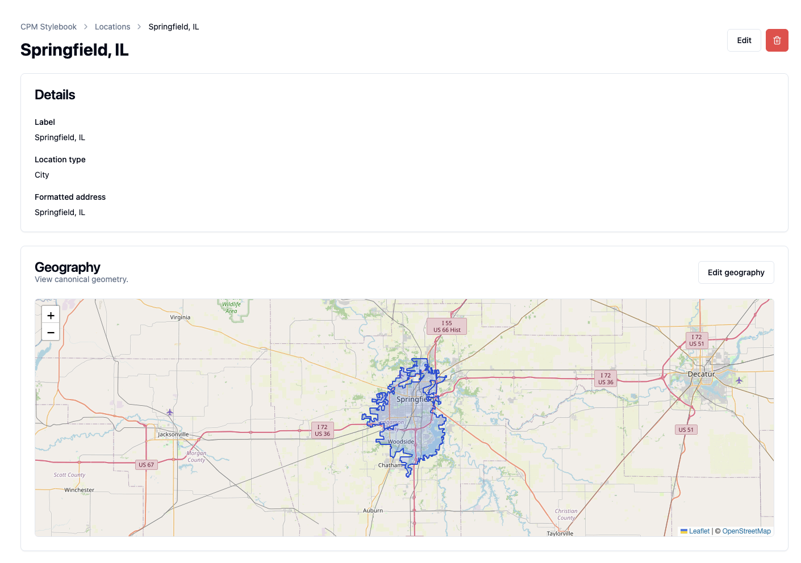

=== "Mentions"

    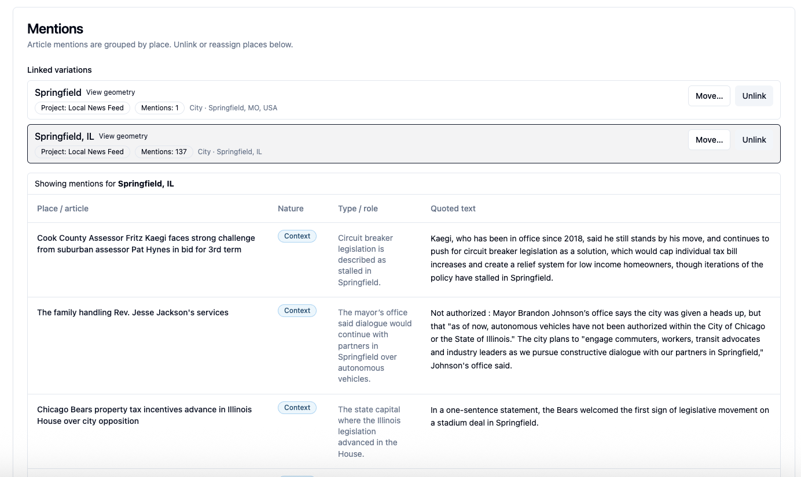

=== "Connections"

    

## Step 5: Use the data through Backfield API

After Backfield Output saves the article, your own products can use the
[Backfield API](../api/index.md) to ask questions such as:

- Which stories mention Jane Doe?
- Which people were quoted in local-government coverage?
- Which articles mention locations near the bridge?
- What metadata, mentions, images, and connections belong to this article or
  canonical record?

The API uses a project key, so results remain within that project's access and
evidence scope. The [API Reference](../api/index.md) documents the request
format when you are ready to build an integration.

## Where to go next

- Get oriented in [Getting Started](getting-started.md)
- Understand reusable processing in [Agate → Flows](agate/flows.md)
- Understand the catalog in [Stylebook](stylebook/index.md)
- Use your data through [Backfield API](../api/index.md)
