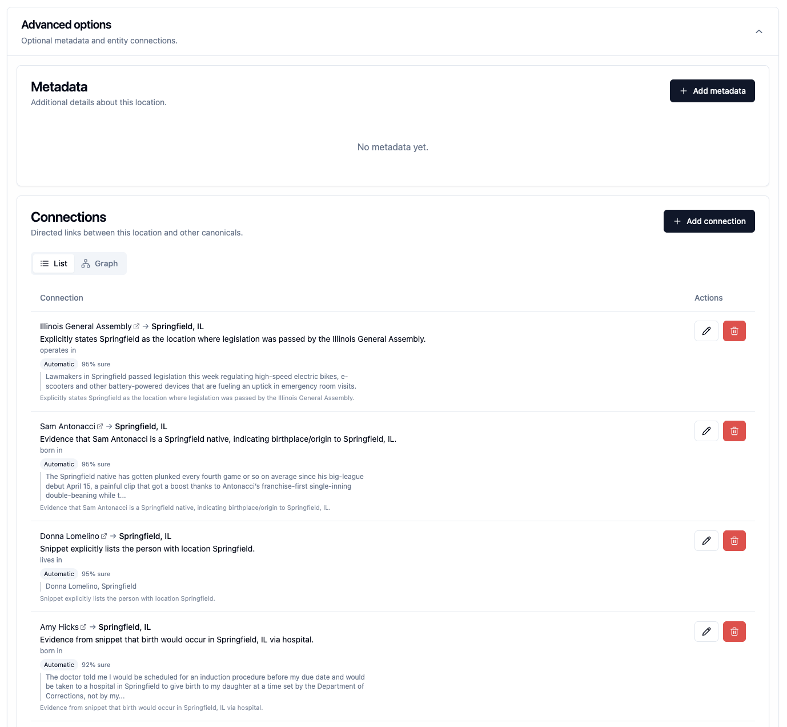

# Connections

**Connections** are relationships between canonical records—for example, a
person who works for an organization or an organization based in a location.

Connections come from two sources:

- **Manual:** an editor creates and describes the relationship.
- **Inferred:** Backfield finds a relationship in reporting and retains the
  supporting evidence for review.

## What a connection contains

A connection has a direction from one record to another. It can include:

- a relationship type, such as *works for* or *located in*;
- a description that preserves useful nuance;
- project, article, and passage evidence for an inferred connection.

Direction matters. “Jane Doe works for City Hall” and “City Hall works for Jane
Doe” do not mean the same thing, even though they contain the same two records.

Connections can link:

- person → organization: works for, leads, represents;
- organization → location: based at, serves, located in;
- person → location: lives in, represents, associated with;
- person → person or organization → organization.

Manual connections are deliberate editorial knowledge. Inferred connections
come from article evidence. In both cases, editors should review the records,
direction, and description.

Two correct canonical records can still be connected in the wrong direction
or with an overbroad description.

Relationships also change over time. Make clear whether a role is current or
former, and include useful dates or context in the description when the
relationship type alone would be misleading.

## Stylebook-wide scope

Connections belong to the shared Stylebook. A project filter may narrow the
evidence shown, but it does not create a project-specific version of a
connection.

The canonical detail page shows connections as both a list and a graph. The
graph is a view of the maintained records and evidence, not a separate source
of information.
