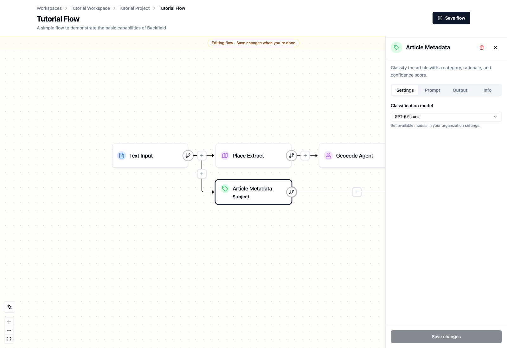
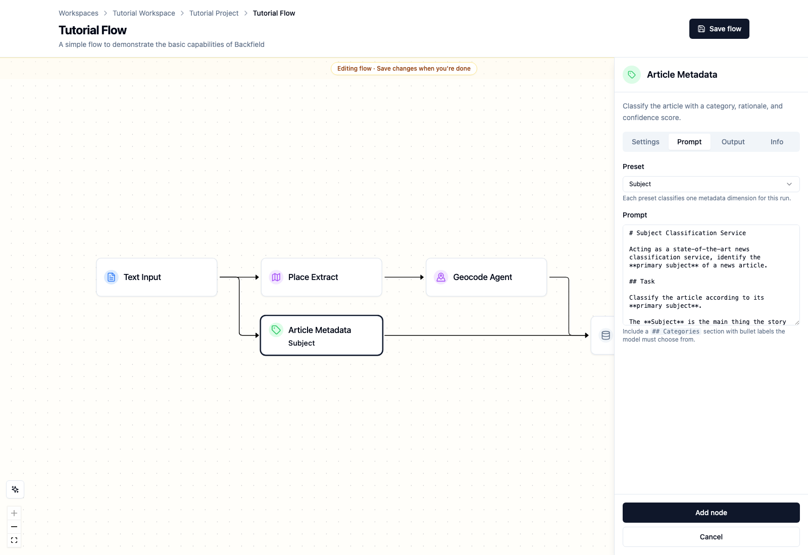
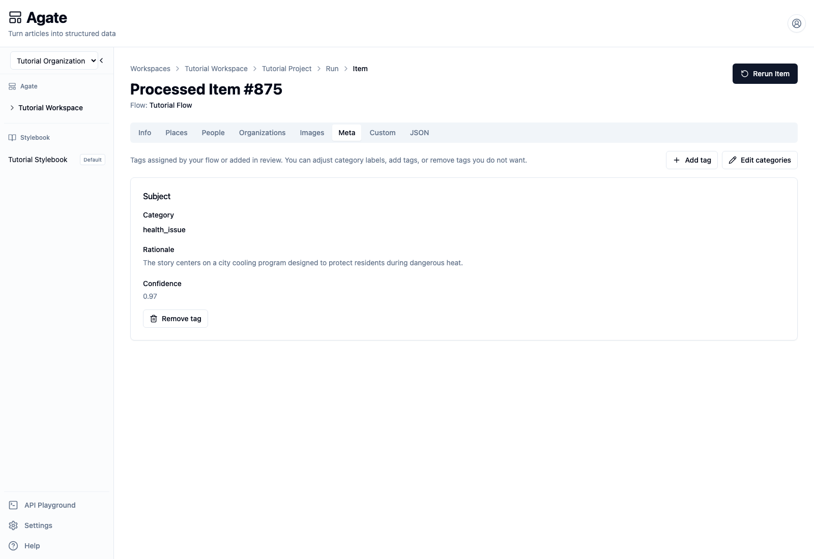
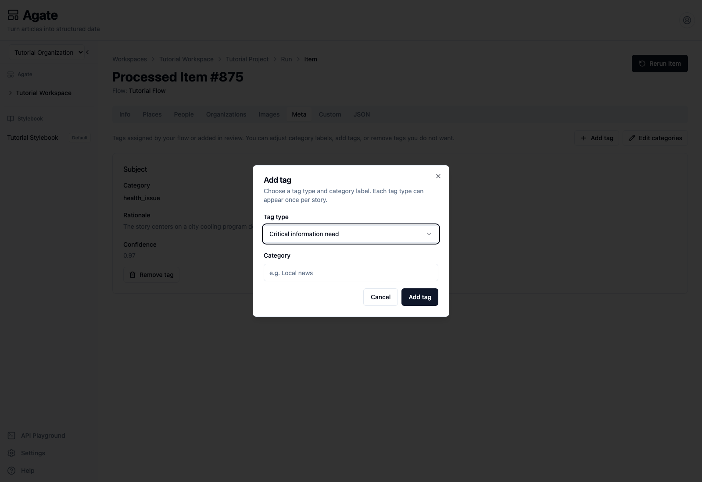

# Add article metadata

Article metadata gives each story consistent labels for filtering, analysis,
and downstream products. In this tutorial, you will classify a sample story by
its primary subject and review the result.

## You'll learn

- The difference between article metadata and canonical Stylebook metadata.
- How to add and configure an **Article Metadata** node.
- How to review a category, rationale, and confidence score.
- How to correct, add, or remove a tag.

## Before you begin

You need:

- A project with **GPT-5.6 Luna** enabled.
- A flow with **Text Input** and **Backfield Output**.
- A short sample article.

You can use the Tutorial Flow and the article from
[Extract people and places](extract-entities.md).

## 1. Add Article Metadata

1. Open the flow and select **Edit flow**.
2. Select **Add another path** under **Text Input**.
3. Select **Enrich**, then **Article Metadata**.
4. On **Settings**, choose **GPT-5.6 Luna**.

One Article Metadata node classifies one metadata dimension. Add more nodes from
the same input if you want several dimensions.

## 2. Choose what to classify

Open **Prompt** and choose a preset. Backfield includes presets for:

- **Topic** — the broad coverage area, such as public health or education.
- **Subject** — the concrete event, institution, project, or issue at the
  center of the story.
- **Format** — how the story is structured, such as a news story, profile, or
  explainer.
- **Geographic scope** — the community or area affected.
- **Timeframe** — whether the story is present, future, ongoing, cyclical, or
  evergreen.
- **User need** — why a reader would value the story.
- **Critical information need** — the practical civic need the story serves.
- **Custom** — a category system created by your newsroom.

For this tutorial, choose **Subject**. The preset supplies the category list,
decision rules, and output instructions. Read the prompt before changing it:
small wording changes can alter classifications across many stories.

Select **Add node**, then **Save flow**.

## 3. Run the sample article

Run the flow with the sample article. When the run succeeds:

1. Open the processed item.
2. Select **Meta**.
3. Review the category, rationale, and confidence.

The verified tutorial run classified the cooling-program story as
`health_issue` with 0.97 confidence. Its rationale explains that the story is
about a city program protecting residents during dangerous heat.

Confidence measures the model's certainty, not editorial correctness. Review
the category and rationale together.

## 4. Correct or add a tag

If a category is wrong:

1. Select **Edit categories**.
2. Replace the category label.
3. Select **Done editing**.

To classify a dimension that the flow did not produce, select **Add tag**,
choose a tag type, enter a category, and select **Add tag**.

Use **Remove tag** when a classification does not belong on the story.

Reviewed values are saved by **Backfield Output** and can be filtered through
the Backfield API.

## Article metadata and Stylebook metadata

Article metadata describes a story: its topic, subject, format, scope, or
reader need. Stylebook metadata describes a canonical entity, such as a
person's political party or a city's population. Editing one does not change
the other.

## Related concepts

- [Enrichment nodes](../../platform/agate/nodes/enrichment.md)
- [Article metadata taxonomy](../../api/taxonomy/article-meta/index.md)
- [Stylebook metadata](../../platform/stylebook/meta.md)
