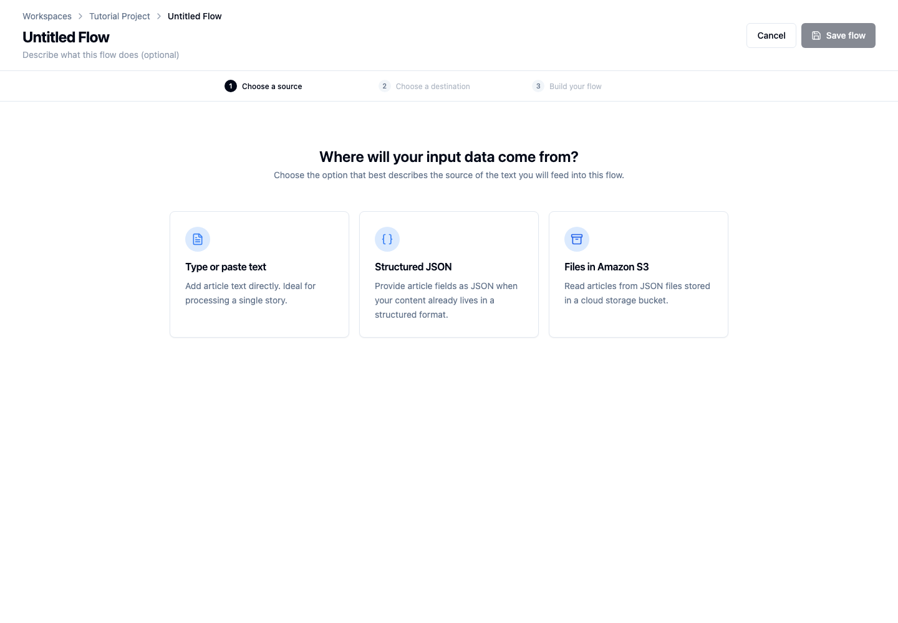
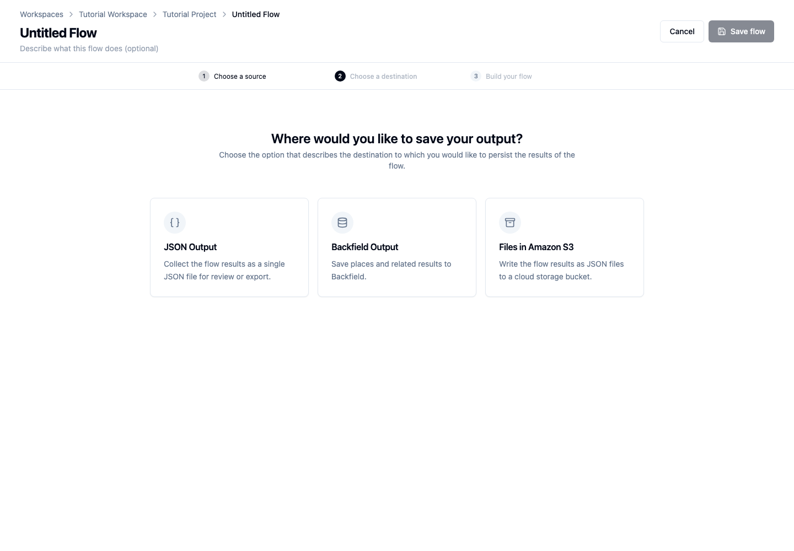
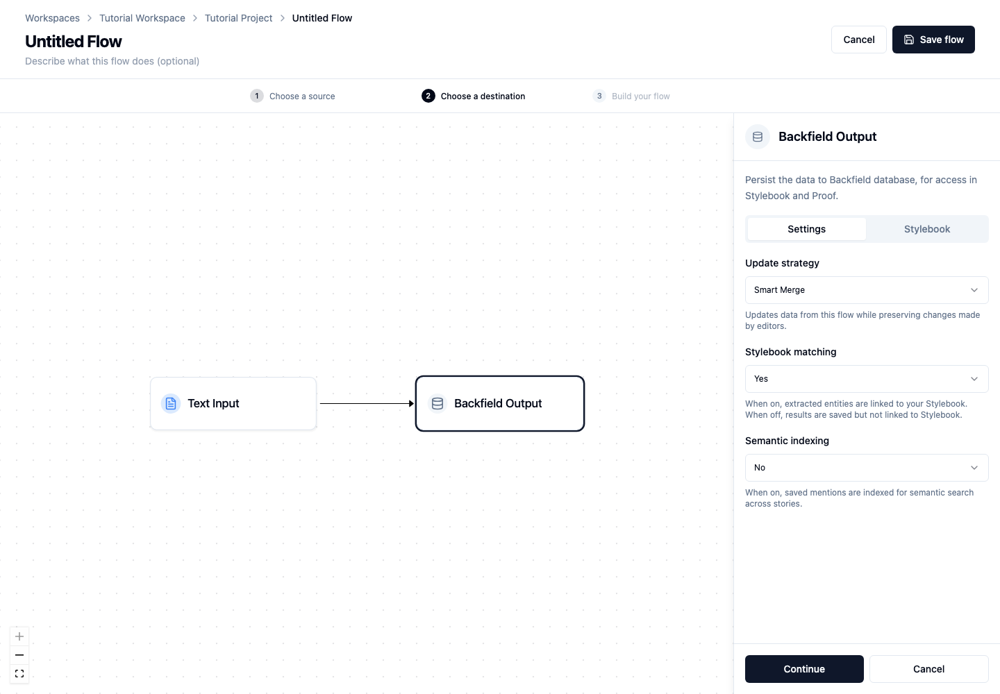
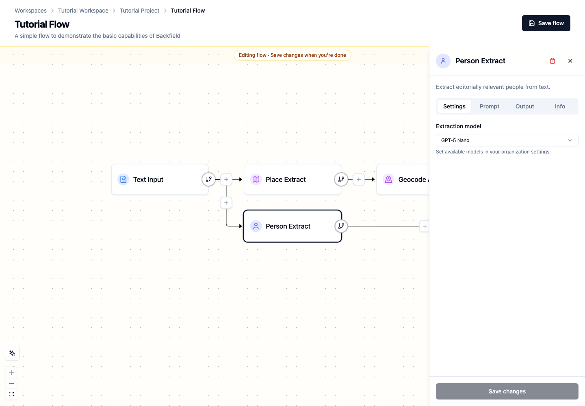
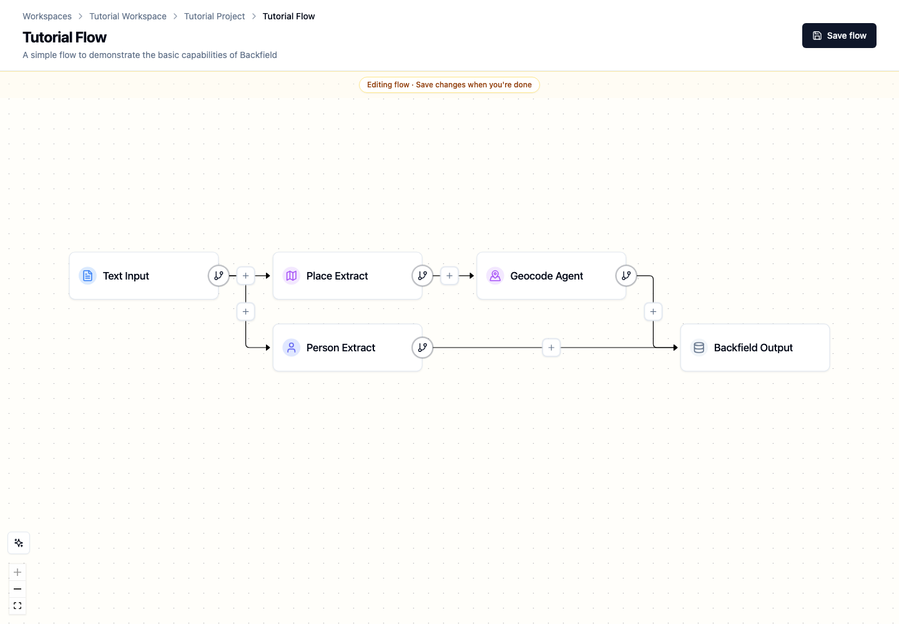

# Build your first flow

Build a reusable flow that finds people and places in an article, geocodes the
places, and saves the results to Backfield.

## Before you begin

You need:

- access to Tutorial Project;
- GPT-5 Nano enabled and configured for that project;
- working geocoding integrations;
- an article containing at least one named person and Minnesota place.

## 1. Start a flow

Open **Tutorial Project**. On the **Flows** tab, choose **New flow**.

Enter `Tutorial Flow` in the name field. A description is optional.

## 2. Choose the input

Choose **Type or paste text**.

Paste the article into **Input text**. Leave **Enable API runs** off for now,
then choose **Continue**.

Text Input stores this article with the flow, making it convenient for a first
manual run. Later tutorials cover structured, S3, and API-triggered input.

## 3. Choose the output

Choose **Backfield Output**.

Use these settings:

- **Update strategy:** Smart Merge
- **Stylebook matching:** Yes
- **Semantic indexing:** No

Open the **Stylebook** tab and confirm that the flow uses Tutorial Stylebook,
then choose **Continue**.

Smart Merge preserves changes editors make during review. Stylebook matching
allows extracted people and places to connect to canonical records.

## 4. Add place extraction and geocoding

The builder begins with Text Input connected directly to Backfield Output.

1. Choose the **+** on that connection.
2. Under **Extract**, choose **Place Extract**.
3. Open Place Extract and select **GPT-5 Nano** as its extraction model.
4. Choose the **+** after Place Extract.
5. Under **Enrich**, choose **Geocode Agent**.

Place Extract identifies location mentions and retains their supporting text.
Geocode Agent resolves those mentions to geographic candidates. Keep these
steps on the same path so geocoding receives the extracted places.

## 5. Add person extraction on another path

Choose **Add another path** on Text Input, then select **Person Extract**.

Open Person Extract and choose **GPT-5 Nano**. The default prompt is a good
starting point for this tutorial.

The builder connects the new path to Backfield Output. Person and place
extraction can run independently because both read the original article.

## 6. Review the completed flow

Your flow should have two paths:

- Text Input → Place Extract → Geocode Agent → Backfield Output
- Text Input → Person Extract → Backfield Output

Select any node to open its panel:

- **Settings** contains choices such as the AI model.
- **Prompt** contains instructions sent to the model.
- **Output** describes the structured result.
- **Info** explains what the node does.

Keep the default prompts for your first run. Prompt changes should have a clear
editorial purpose and should be tested with several articles.

## 7. Save the flow

Choose **Save flow**.

If Agate reports a validation problem, open the named node and complete its
required settings. A valid flow must have one input, one output, and complete
connections between them.

The flow now appears on Tutorial Project's **Flows** tab.

## Next step

Continue with [Extract people and places](extract-entities.md) for a closer look
at extraction results, evidence, and Stylebook matching.

## Related concepts

- [Flows](../../platform/agate/flows.md)
- [Nodes](../../platform/agate/nodes/index.md)
- [Output nodes](../../platform/agate/nodes/outputs.md)
