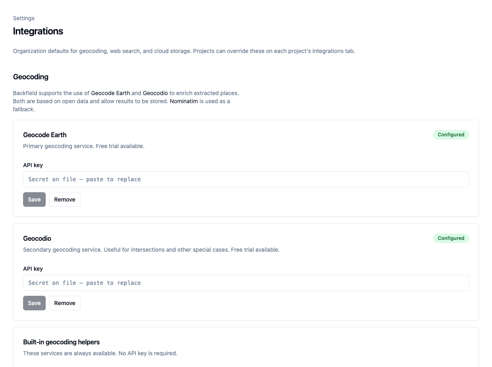
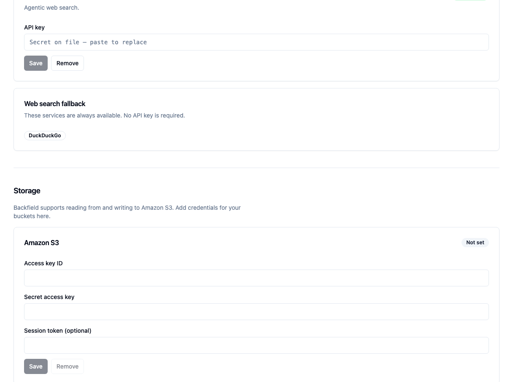

# Configure integrations

Add the outside services used for geocoding, web search, and S3 storage.

## Before you begin

You need organization-administrator access and the credentials for the services
your organization uses.

Saved secrets are write-only. Agate shows whether a secret is configured but
does not reveal its value.

## 1. Open Integrations

In Agate, choose **Settings**, then **Integrations**.

The Tutorial Organization already has Geocode Earth and Geocodio credentials.

## 2. Configure geocoding

Backfield supports:

- **Geocode Earth** as the primary geocoding service;
- **Geocodio** for intersections and other special cases;
- **Nominatim** and **Overpass** as built-in helpers that require no key.

For Geocode Earth or Geocodio:

1. Paste the key into **API key**.
2. Choose **Save**.
3. Confirm that the service shows **Configured**.

Pasting and saving another value replaces the existing secret.

## 3. Configure web search

Scroll to **Search**, paste a Brave Search key, and choose **Save**. Brave can
provide supporting evidence during place resolution. DuckDuckGo remains
available as a built-in fallback.

## 4. Configure S3 when needed

Under **Storage**, enter the access-key ID and secret access key. Add a session
token only for temporary credentials.

Bucket names and folders are configured on S3 Input and S3 Output nodes, not on
this page.

!!! warning
    When rotating temporary credentials, replace the access-key ID, secret key,
    and session token together.

## 5. Check project settings

Open **Tutorial Project**, then its **Integrations** tab.

- **Configured** means the project inherits an organization secret.
- **Overridden** means the project uses its own secret.

To add an override, paste the project-specific value and choose **Save**. Choose
**Remove** to return to the organization default.

Most projects should inherit the organization settings. Use an override only
when a project needs a separate account, quota, or storage boundary.

## 6. Verify the integration

The settings page does not test provider access. Run a small flow that uses the
service:

- Place Extract followed by Geocode for geocoding and search;
- S3 Input for read access;
- S3 Output for write access.

If the run fails, inspect the failed step for provider permissions, quota, or
bucket-access errors.

## Related concepts

- [Integrations](../../platform/settings/integrations.md)
- [Enrichment nodes](../../platform/agate/nodes/enrichment.md)
- [Input nodes](../../platform/agate/nodes/inputs.md)
