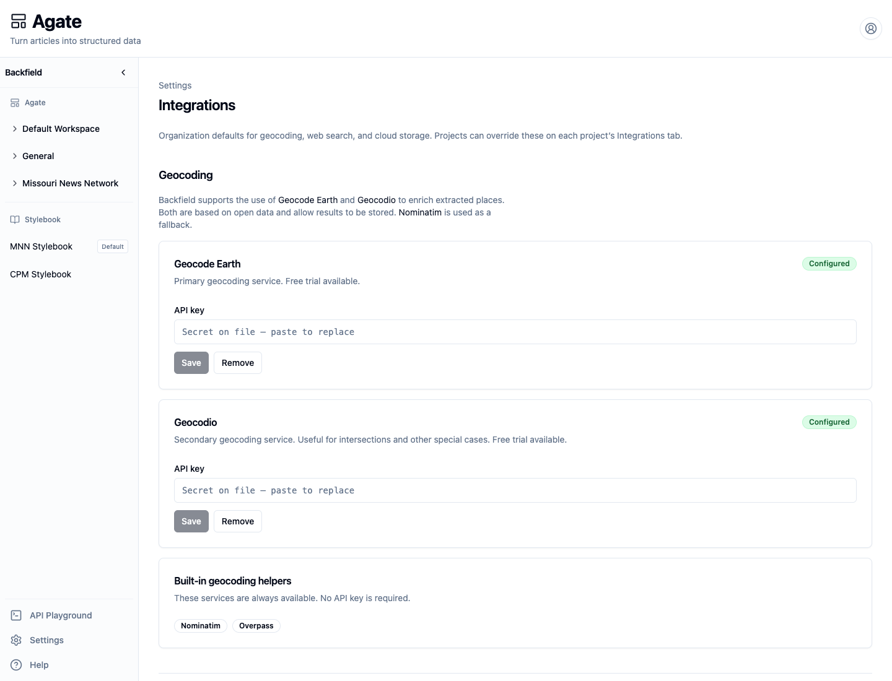
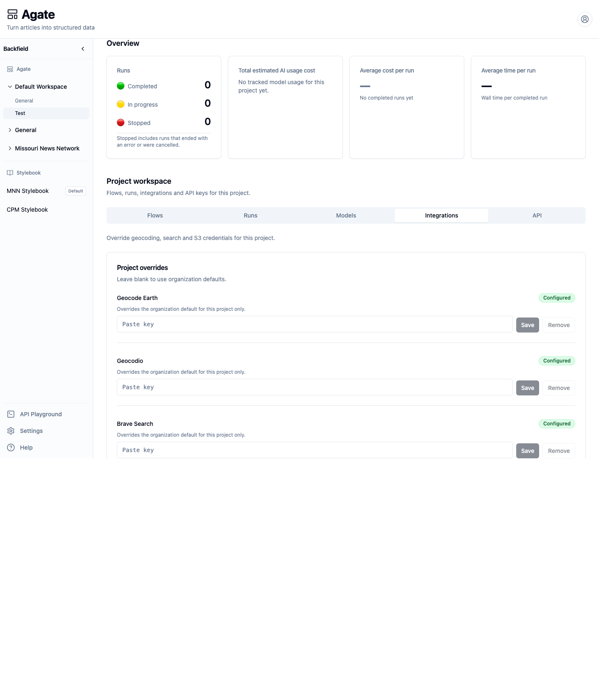
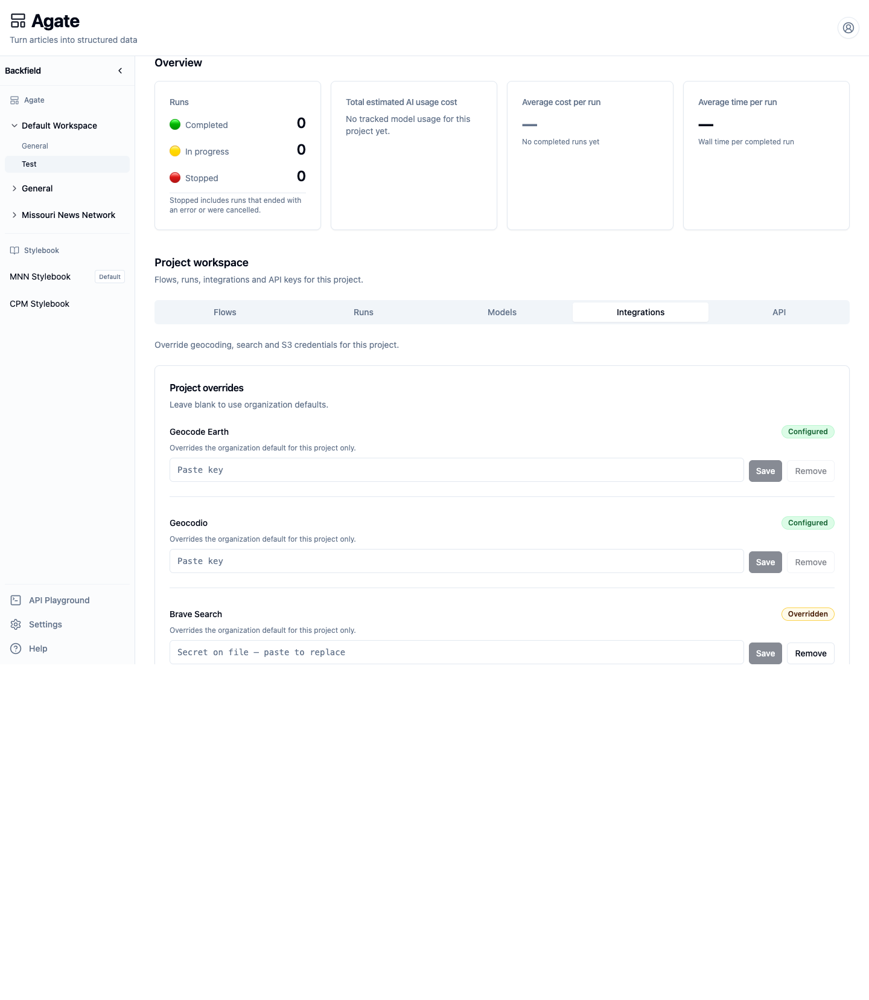

# Configure integrations

Save organization credentials for geocoding, web search, and S3, then add and
remove a project-specific override.

## Before you begin

You need organization-administrator access and the credentials your team plans
to use:

- a Geocode Earth key, a Geocodio key, or both;
- a Brave Search key;
- for S3, an access-key ID and secret access key, plus a session token when
  using temporary credentials.

All fields are write-only. After saving, Backfield shows status rather than the
secret.

## 1. Open organization integrations

In Agate, choose **Settings → Integrations**. This page controls organization
defaults inherited by projects.

## 2. Configure geocoding

The Geocoding section contains:

- **Geocode Earth**, the primary place lookup;
- **Geocodio**, useful for intersections and other special cases;
- **Nominatim** and **Overpass**, built-in helpers that require no saved key.

For each paid service:

1. Paste the key into **API key**.
2. Choose **Save**.
3. Confirm that the card shows **Configured**.

Once saved, the field changes to a placeholder indicating that a secret is on
file. Pasting and saving a new value replaces the old one.

## 3. Configure web search

Under **Search**, paste a Brave Search key and choose **Save**. DuckDuckGo
remains available as a built-in fallback and has no settings field.

Brave Search supplies additional evidence used during place resolution. It is
not a general article-search setting.

## 4. Configure S3

Under **Storage**, enter:

1. **Access key ID**;
2. **Secret access key**;
3. **Session token**, only when the credential is temporary.

Choose **Save**. The access-key ID and secret key are treated as one credential
set. Bucket names and prefixes are configured on S3 Input and S3 Output nodes,
not on this page.

!!! warning
    When rotating temporary credentials, replace the access-key ID, secret key,
    and session token together. A mixture of old and new values will fail.

## 5. Inspect effective project settings

Open a project and select **Integrations**. Every supported service has a
project row:

- **Configured** means an organization credential is available;
- **Overridden** means this project has its own saved value;
- an unavailable **Remove** button means the project is already inheriting the
  organization default.

The input remains blank in every case because secrets are never returned to the
browser.

## 6. Add a project override

1. Paste the project-specific value into the appropriate row.
2. Choose **Save**.
3. Confirm that the row changes to **Overridden**.

Only runs in this project use the override. Other projects continue using the
organization value.

## 7. Return to the organization default

Choose **Remove** on the overridden row. The badge returns to **Configured**,
and future runs use the organization credential again.

Removing a project override does not remove the organization secret.

## 8. Verify the service in a flow

The settings screens do not provide integration test buttons. Run the smallest
flow that uses the service:

- Place Extract followed by Geocode for geocoding and Brave Search;
- S3 Input for read access;
- S3 Output for write access.

Open the run and inspect the relevant step if it fails. A credential can be
configured successfully but still lack provider permissions, quota, bucket
access, or network reachability.

## Related concepts

- [Integrations](../../platform/settings/integrations.md)
- [Enrichment nodes](../../platform/agate/nodes/enrichment.md)
- [Input nodes](../../platform/agate/nodes/inputs.md)
