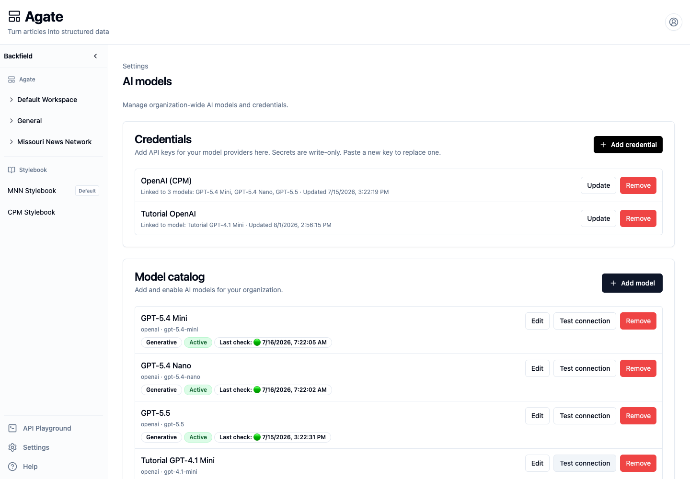
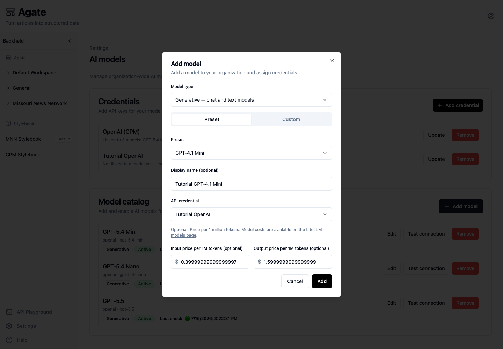

# Configure AI models

Save a provider credential, add and test a model, then control its availability,
default status, and credential inside a project.

## Before you begin

You need organization-administrator access and:

- a provider API key;
- the model's provider and model identifier;
- whether it is a generative or embedding model;
- optional input and output prices per one million tokens.

Backfield encrypts provider keys and never displays a saved value again.

## 1. Add a provider credential

1. In Agate, choose **Settings → AI models**.
2. Under **Credentials**, choose **Add credential**.
3. Enter a recognizable **Display name**, such as the provider and billing
   account.
4. Add an **Endpoint URL** only when the provider requires a custom base URL,
   as Azure OpenAI does.
5. Paste the **API key** and choose **Save**.

The new credential appears with its last-updated time. As models are connected,
the card also lists which models use it.

To rotate a credential, choose **Update**, paste the replacement key, and save.
Review the linked-model list first because every linked model begins using the
new value.

## 2. Add a model

Under **Model catalog**, choose **Add model**.

1. Choose **Generative** for chat, text, and vision models, or **Embedding** for
   semantic vectors.
2. Choose **Preset** to select a curated model, or **Custom** to enter a
   LiteLLM-compatible identifier.
3. Give the model a clear display name. Flow builders see this name.
4. Choose the API credential that should pay for and authorize requests.
5. Optionally enter input and output prices per one million tokens.
6. Choose **Add**.

Pricing is optional, but leaving it blank makes model-cost estimates incomplete.
Use the provider's current published prices and update them when pricing
changes.

## 3. Test the connection

Find the model and choose **Test connection**. Backfield sends a small
provider-appropriate request and records the result on the model row:

- a green dot means the latest check succeeded;
- a red dot and error text mean the provider rejected or could not complete the
  request.

A successful test verifies the model identifier, credential, and endpoint. It
does not prove that every flow prompt will succeed.

## 4. Configure the model in a project

1. Open a project.
2. Select its **Models** tab.
3. Find the model under its Generative or Embedding section.
4. Use **Available for this project** to turn the model on or off.
5. Choose **Default** when it should be the project's normal generative or
   embedding model.

An active organization model is presented to projects automatically. Turning it
off here removes it only from this project. A project must retain a usable
default for each model role it depends on.

## 5. Add or remove a project credential override

Use an override when one project must use a separate provider account or billing
boundary.

1. On the project model row, choose **Override credentials**.
2. Paste the project's **Provider key**.
3. Choose **Save**.

The row changes from **Configured** to **Overridden** and states that the project
uses its own provider key.

To return to the organization credential:

1. Choose **Remove** on the overridden model row.
2. Confirm **Remove** in the dialog.

This removes only the project key. It does not remove the organization
credential or the model.

## 6. Disable or remove a model

To stop offering a model for new work while retaining run history:

1. Return to **Settings → AI models**.
2. Choose **Edit** on the model.
3. Change **Status** from **Active** to **Disabled**.
4. Choose **Save**.

Use **Remove** only when the catalog entry is no longer needed. Remove or update
project defaults and overrides first. If a credential is also being retired,
remove its linked models before removing the credential.

## Troubleshooting

- **No model appears in a node:** confirm that its type is compatible, its
  organization status is Active, and it is available in the project.
- **Test fails immediately:** check the model identifier and any custom endpoint.
- **Authentication failure:** rotate the organization credential or the
  project's override, depending on which badge the project row shows.
- **Costs are missing:** add current per-million-token prices to the model.

## Related concepts

- [AI models](../../platform/settings/ai-models.md)
- [Nodes](../../platform/agate/nodes/index.md)
