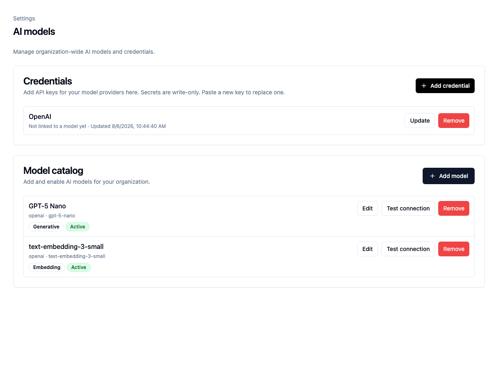
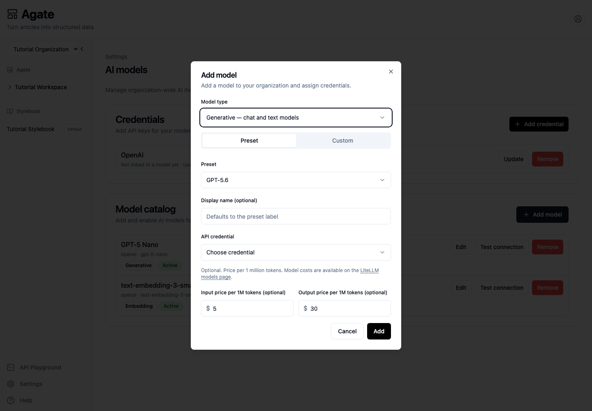

# Configure AI models

Connect an AI provider, add models, and make them available to a project.

## Before you begin

You need organization-administrator access and an API key from your model
provider. Backfield encrypts the key and does not display it after saving.

## 1. Open AI models

In Agate, choose **Settings**, then **AI models**.

The page has two parts:

- **Credentials** stores provider API keys.
- **Model catalog** lists the models flow builders can select.

The Tutorial Organization has an OpenAI credential and two active model
records.

A credential and a model are separate records. A saved credential must be
assigned to a model before that model can make requests.

## 2. Add a credential

Under **Credentials**, choose **Add credential**.

1. Enter a recognizable display name, such as `OpenAI`.
2. Add an endpoint URL only when your provider requires a custom address.
3. Paste the provider API key.
4. Choose **Save**.

Use **Update** to rotate the key later. Every model linked to that credential
will use the replacement.

## 3. Add or edit a model

Choose **Add model**, or choose **Edit** beside an existing model.

1. Choose **Generative** for extraction and enrichment, or **Embedding** for
   semantic search.
2. Choose a preset, or enter a custom LiteLLM-compatible model identifier.
3. Give the model a clear display name.
4. Select its API credential.
5. Keep the status **Active**.
6. Optionally add current input and output prices.
7. Choose **Add** or **Save**.

Pricing is optional. Without it, Backfield can run the model but cannot provide
a complete cost estimate.

## 4. Test the connection

Choose **Test connection** on the model row.

A successful test confirms that Backfield can use the model identifier,
credential, and endpoint together. If it fails, first check that the model has a
credential and that the provider key has access to that model.

## 5. Make the model available to a project

Open **Tutorial Project**, then its **Models** tab.

1. Turn on **Available for this project**.
2. Mark the normal generative model as the generative default.
3. Mark the normal embedding model as the embedding default.

Flow nodes show only active models that are available to the current project.

Use a project credential override only when that project needs a different
provider account or billing boundary. Removing an override returns the project
to the organization credential.

## Troubleshooting

- **A model does not appear in a node:** check its type, active status, and
  project availability.
- **Authentication fails:** check which credential is assigned to the model.
- **The credential says it is not linked:** edit the model and select that
  credential.
- **Cost estimates are incomplete:** add current per-million-token prices.

## Related concepts

- [AI models](../../platform/settings/ai-models.md)
- [Nodes](../../platform/agate/nodes/index.md)
