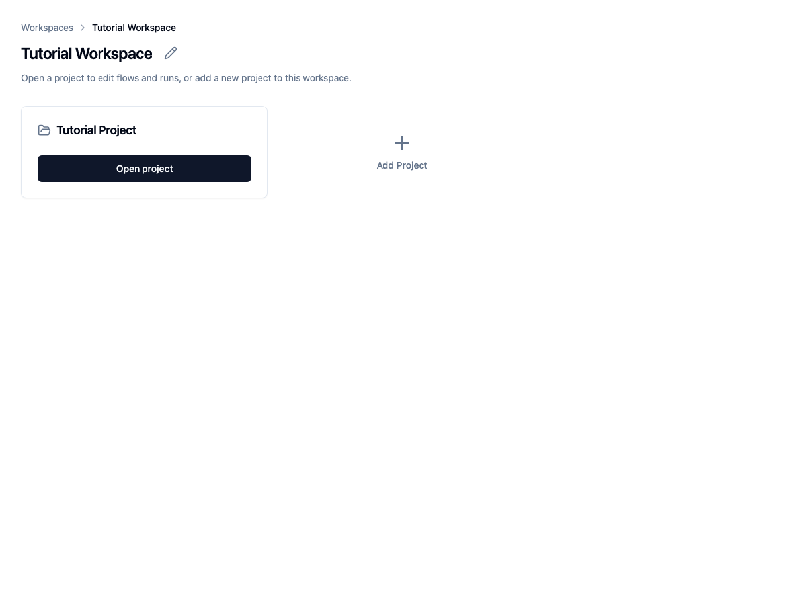
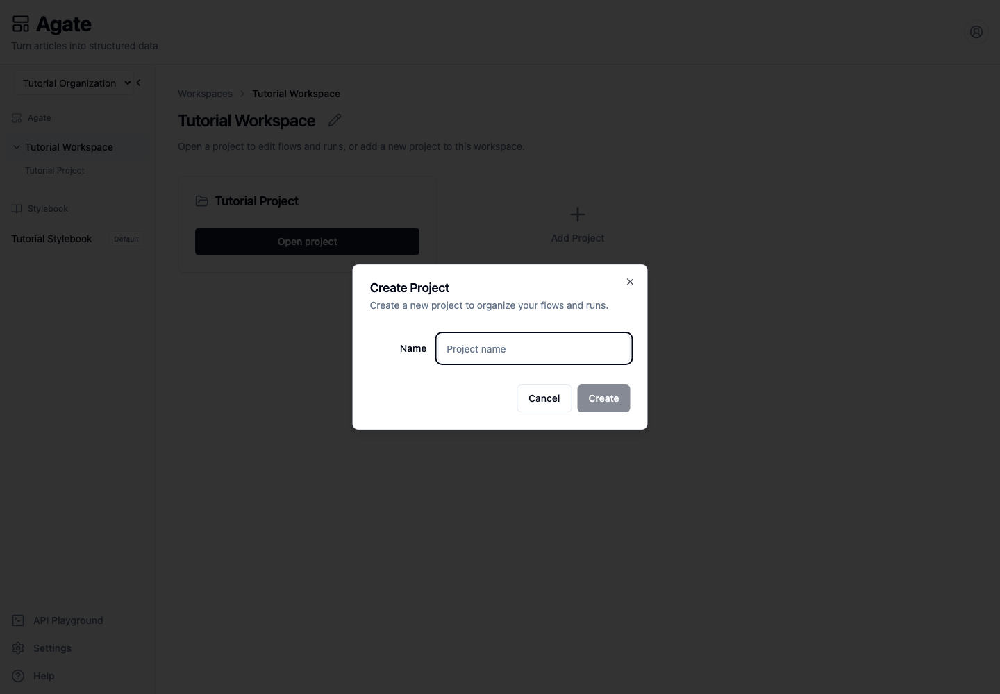
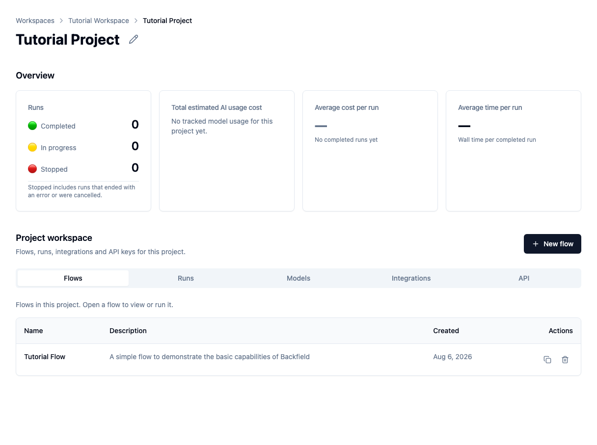
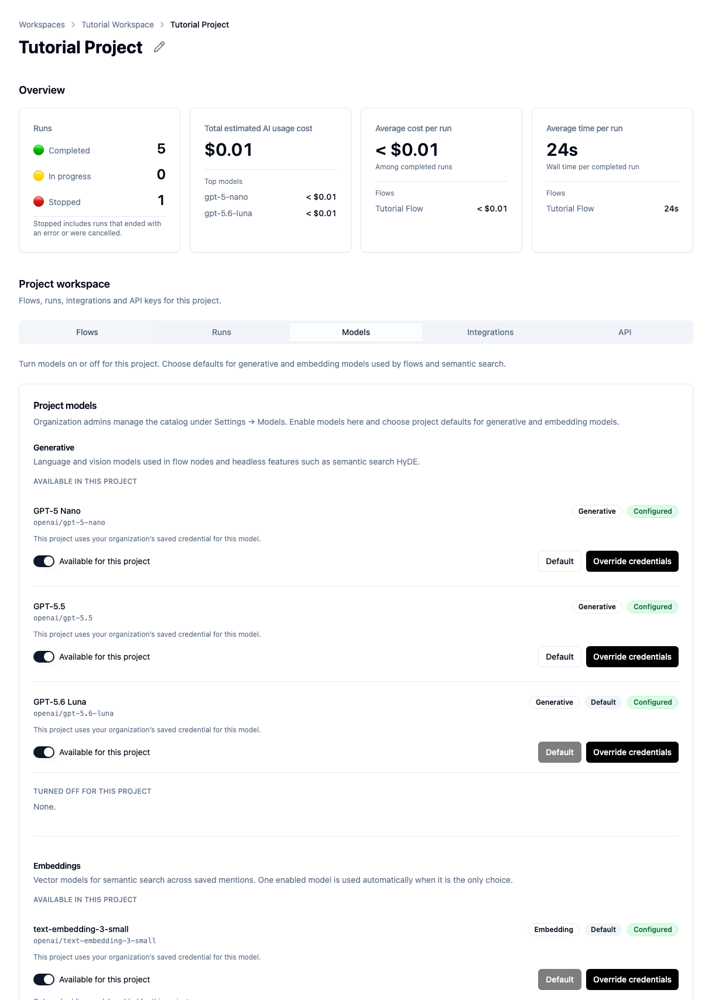
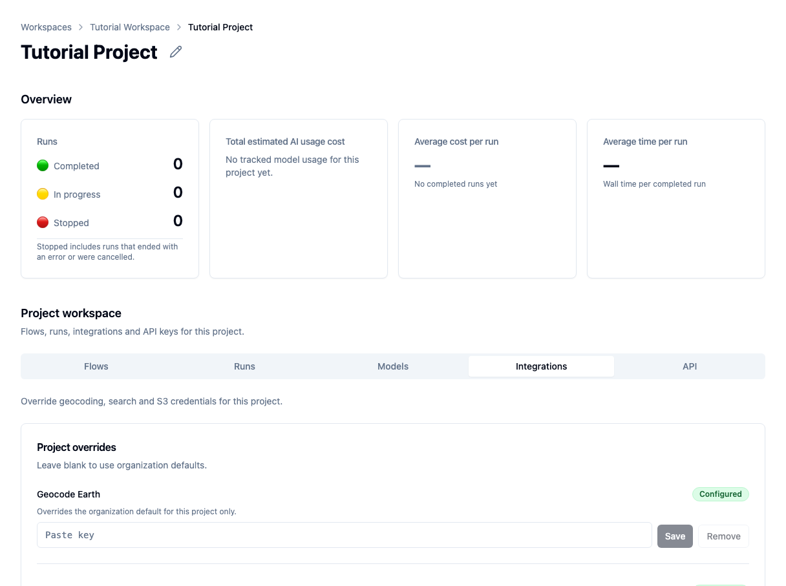
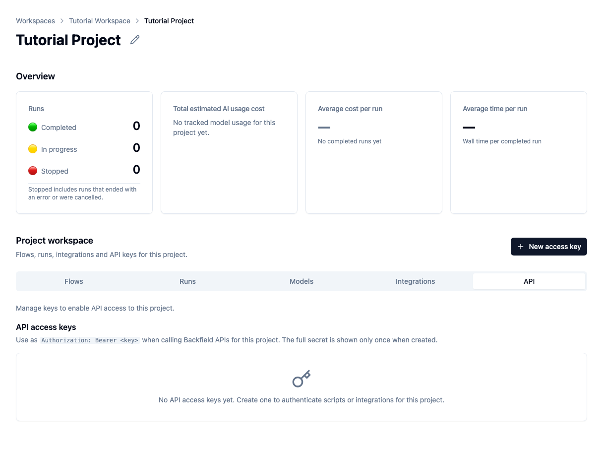

# Create and tour a project

Create a project inside a workspace, then review the controls it uses for flows,
models, integrations, and API access.

## Before you begin

You need access to the destination workspace and permission to create projects.
An organization administrator can provide that access from **Settings → Users**.

## 1. Open a workspace

From the Agate home page, open **Tutorial Workspace**.

A workspace groups projects that belong to the same team or body of work. The
Tutorial Workspace currently contains Tutorial Project.

## 2. Create a project

1. Choose **Add Project**.
2. Enter a clear project name.
3. Choose **Create**.

Agate generates the project's internal slug from its name.

The new project uses the workspace's default Stylebook. That assignment is
fixed when the project is created, so confirm the workspace uses the intended
Stylebook first.

## 3. Read the project overview

Open the project. The overview summarizes:

- completed, active, and stopped runs;
- estimated AI usage cost;
- average cost and processing time for completed runs.

These cards remain empty until the project has run a flow.

The lower part of the page contains five tabs:

- **Flows** lists reusable processing workflows.
- **Runs** lists current and previous executions.
- **Models** controls the models available to this project.
- **Integrations** controls project-specific credential overrides.
- **API** manages keys for outside applications.

Tutorial Flow already appears under **Flows**.

## 4. Check models and the Stylebook

Open **Models**.

Before running a flow, confirm that:

1. a generative model is available and marked **Default**;
2. an embedding model is available and marked **Default** when the project uses
   semantic search;
3. each model shows **Configured**;
4. the listed Stylebook is correct.

The Tutorial Project uses GPT-5.6 Luna, text-embedding-3-small, and Tutorial
Stylebook.

The bottom of this tab also contains the project **System prompt**. Add one only
when every AI call in this project needs the same standing instruction. Keep
node-specific extraction instructions on the individual flow nodes.

## 5. Check integrations

Open **Integrations**.

**Configured** means the project can use the organization's saved credential.
Leave an input blank to keep inheriting that credential.

Add an override only when this project needs a separate provider account,
quota, or storage boundary. Removing the override returns the project to the
organization default.

## 6. Review API access

Open **API**.

API keys belong to one project and grant outside tools access to that project's
data. The full secret is displayed only once when the key is created.

Do not create a key until you need to connect a script or application. Continue
with [Create an API key](../api/create-api-key.md) when you are ready.

## Next step

The Tutorial Project is now ready for a flow. Continue with
[Build your first flow](build-flow.md).

## Related concepts

- [Projects](../../platform/concepts/projects.md)
- [Organizations & workspaces](../../platform/concepts/organizations.md)
- [Settings](../../platform/settings/index.md)
