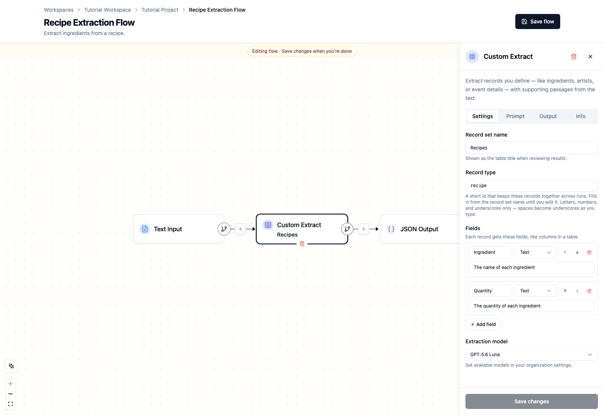
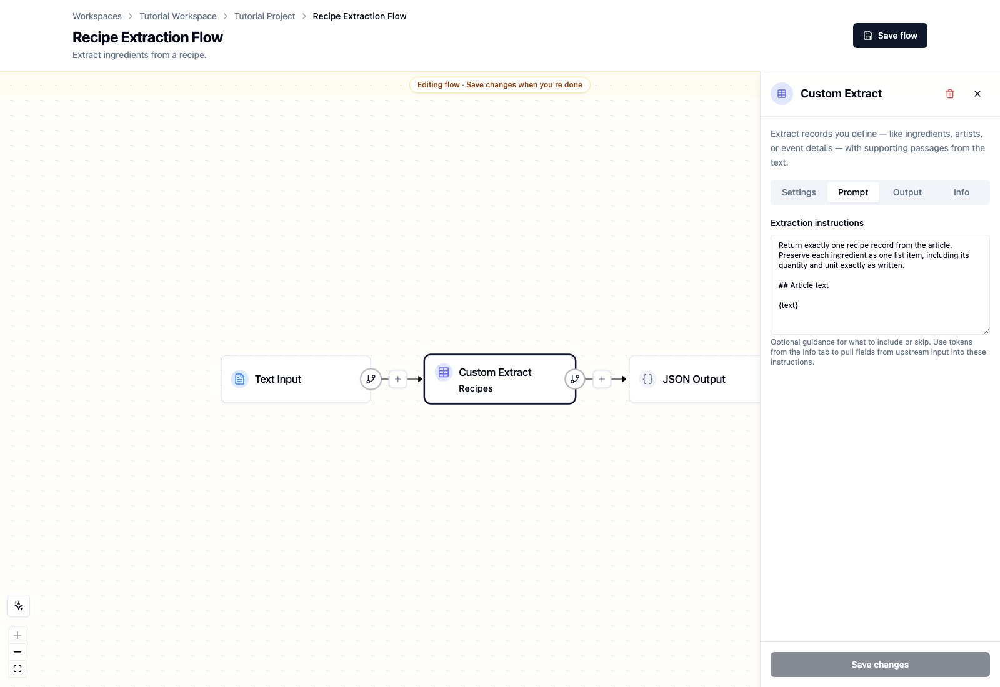
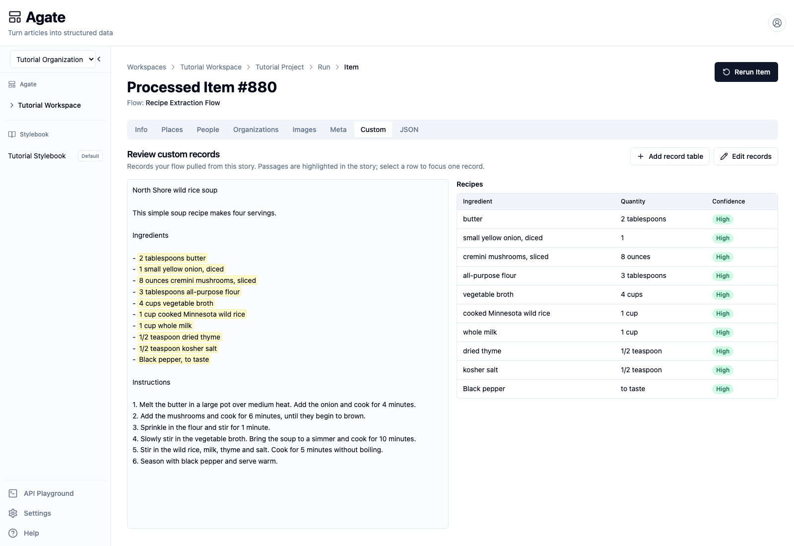
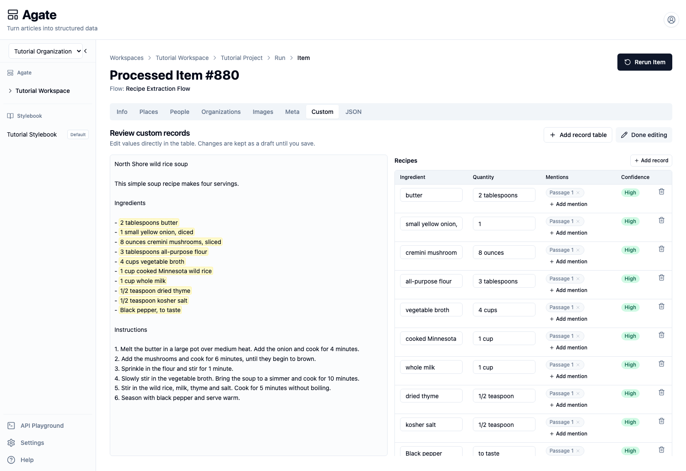

# Build a custom extraction

Use **Custom Extract** when the information you need does not belong in the
people, organization, or place catalogs. This tutorial turns a simple recipe
into one structured record for each ingredient.

## You'll learn

- How to define a custom record and its fields.
- How to write focused extraction instructions.
- How to review and correct custom records.

## Before you begin

You need Tutorial Project with **GPT-5.6 Luna** enabled.

## 1. Start a recipe flow

Open **Tutorial Project → Flows**, select **New flow**, and name it
`Recipe Extraction Flow`. Use `Extract ingredients from a recipe.`
as the optional description.

Choose **Type or paste text** and enter this recipe:

```text
North Shore wild rice soup

This simple soup recipe makes four servings.

Ingredients

- 2 tablespoons butter
- 1 small yellow onion, diced
- 8 ounces cremini mushrooms, sliced
- 3 tablespoons all-purpose flour
- 4 cups vegetable broth
- 1 cup cooked Minnesota wild rice
- 1 cup whole milk
- 1/2 teaspoon dried thyme
- 1/2 teaspoon kosher salt
- Black pepper, to taste

Instructions

1. Melt the butter in a large pot over medium heat. Add the onion and cook for 4 minutes.
2. Add the mushrooms and cook for 6 minutes, until they begin to brown.
3. Sprinkle in the flour and stir for 1 minute.
4. Slowly stir in the vegetable broth. Bring the soup to a simmer and cook for 10 minutes.
5. Stir in the wild rice, milk, thyme and salt. Cook for 5 minutes without boiling.
6. Season with black pepper and serve warm.
```

Choose **Continue**, select **JSON Output**, and choose **Continue** again.
This creates a separate flow so the recipe example does not change Tutorial
Flow or run unrelated extraction and metadata nodes.

## 2. Define the custom record

1. Select the **+** on the connection between Text Input and JSON Output.
2. Select **Extract**, then **Custom Extract**.
3. Enter `Recipes` for **Record set name**.
4. Enter `recipe` for **Record type**.
5. Add an `Ingredient` field, choose **Text**, and describe it as
   `The name of each ingredient`.
6. Add a `Quantity` field, choose **Text**, and describe it as
   `The quantity of each ingredient`.
7. Choose **GPT-5.6 Luna** as the extraction model.

The record set name appears above the review table. The record type is a stable
identifier used to keep these records together across runs.



Custom fields can contain text, numbers, yes-or-no values, dates, or lists of
text. Use the simplest type that represents the source.

## 3. Write the extraction instructions

Open **Prompt** and enter:

```text
Return exactly one recipe record from the article. Preserve each ingredient as
one list item, including its quantity and unit exactly as written.

## Article text

{text}
```

The `{text}` token inserts the upstream article text when the flow runs.



Select **Add node**, then **Save flow**.

The finished flow has one processing node:

**Text Input → Custom Extract → JSON Output**

## 4. Run and review the recipe

Run Recipe Extraction Flow, open the successful processed item, and select
**Custom**.

The verified tutorial run produced 10 **Recipes** rows. Each row contains:

- an ingredient name;
- its quantity and unit;
- high confidence;
- a highlighted passage connecting the record to the source.



Compare every value with the highlighted recipe. Confidence indicates the
model's certainty; it does not replace editorial review.

## 5. Correct a custom record

Select **Edit records** to make corrections.

- Edit an ingredient or quantity directly in its field.
- Use **Add mention** to attach another supporting passage.
- Use the trash icon to remove an unsupported record.
- Select **Add record** if the model missed an ingredient.



Changes remain a draft while editing. Select **Done editing** to save them.

## When to use Custom Extract

Custom records belong to the article that produced them. They are useful for
information such as recipes, public meetings, election results, inspections,
events, and obituaries.

Use Person, Organization, or Place Extract when the result should participate
in shared Stylebook matching. A recipe ingredient is article-specific, so it
belongs in a custom record instead.

## Related concepts

- [Extractor nodes](../../platform/agate/nodes/extractors.md#custom-extract)
- [Custom records API](../../api/custom-records/index.md)
