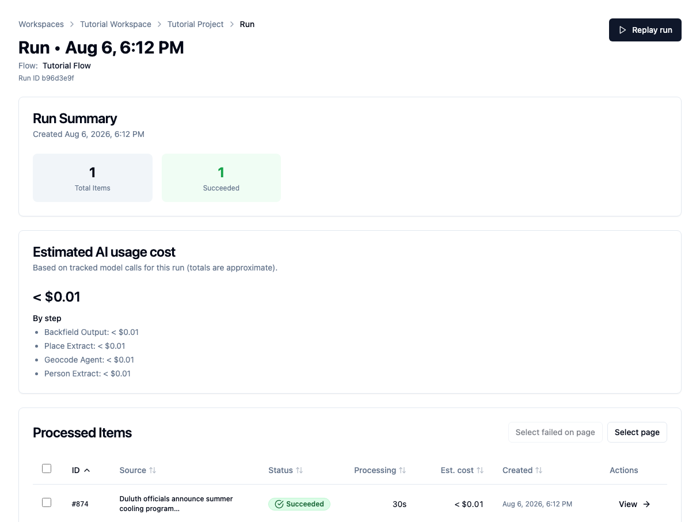
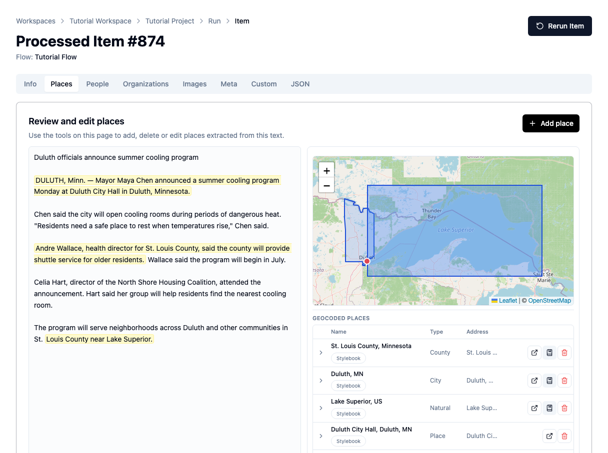
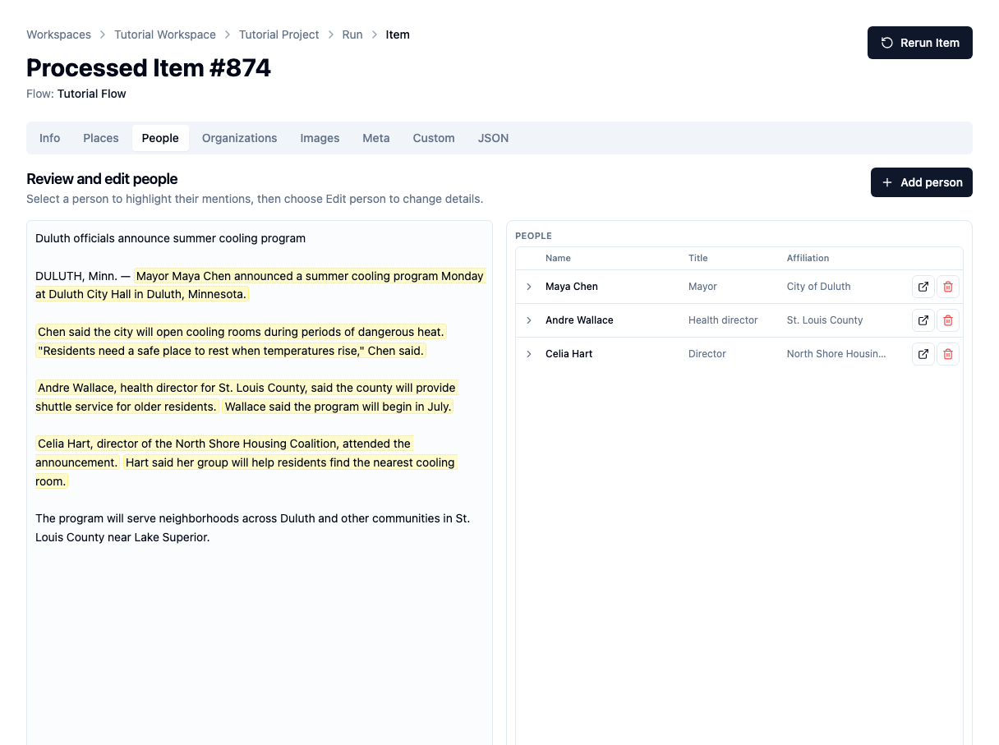

# Extract people and places

Run Tutorial Flow, then inspect the people, places, evidence, and Stylebook
matches it produces.

## Before you begin

Complete [Build your first flow](build-flow.md). Tutorial Flow should contain:

- Text Input with the prepared Duluth cooling-program article;
- Place Extract followed by Geocode Agent;
- Person Extract on a separate path;
- Backfield Output with Stylebook matching on.

GPT-5.6 Luna and the geocoding integrations must be configured for Tutorial
Project.

## 1. Review the extraction prompts

Open Tutorial Flow for editing and select **Person Extract**. On the **Prompt**
tab, make the editorial rules explicit:

- include named participants, officials, and quoted sources;
- exclude article bylines and unnamed role labels;
- merge repeated references to the same person;
- require each mention to be an array entry containing the exact text and
  whether it is a direct quote.

The mention rule matters because Backfield uses those exact passages as
reviewable evidence.

Open **Place Extract → Prompt** and specify that the node should:

- include relevant cities, counties, neighborhoods, lakes, and named buildings;
- exclude people, organizations, programs, job titles, and generic facilities;
- normalize places using the city, state, and country context in the article;
- retain the exact passage supporting each place.

Save each node, then choose **Save flow**.

## 2. Open the verified run

Open **Tutorial Project → Runs**, then select the most recent successful
Tutorial Flow run for `Duluth officials announce summer cooling program`.

Confirm that both the run and its one processed item show **Succeeded**.

This verified run processed one item in 30 seconds. Its estimated AI usage cost
was less than one cent. Times and costs vary by model and provider.

Choose **View** on the processed item.

## 3. Review the places

Open the **Places** tab.

The verified run produced four place results:

- St. Louis County, Minnesota;
- Duluth, Minnesota;
- Lake Superior;
- Duluth City Hall.

The left side highlights the passages that support the results. The right side
shows the map and structured records.

The **Stylebook** badge means a result is connected to a canonical record in
Tutorial Stylebook. It does not mean every field is unquestionably correct.
Review the name, type, address, boundary, and map location.

## 4. Review the people

Open the **People** tab.

The run found:

- Maya Chen, mayor, affiliated with the City of Duluth;
- Andre Wallace, health director, affiliated with St. Louis County;
- Celia Hart, director, affiliated with the North Shore Housing Coalition.

Select a person to focus their mentions in the article. Check that the model:

- chose the correct name;
- kept the role separate from the name;
- assigned the right affiliation;
- attached the correct passages and quotations.

These are article-level entities and mentions. Backfield Output may match them
to existing canonical people or send uncertain matches to Stylebook review.

## 5. Understand what the results prove

A successful run means the flow completed and returned valid structured data.
It does not mean every result is editorially correct.

Before accepting a processed item, check for:

- a real person or place that was missed;
- an organization mistakenly treated as a place;
- a broad region that should be more specific;
- an incorrect map result;
- a role, affiliation, mention, or quotation attached to the wrong person.

The retained evidence lets an editor make those decisions without trusting the
model blindly.

## Troubleshooting

- **No people appear:** confirm that the article names people, the Person Extract
  model is configured, and the prompt includes named officials and sources.
- **No places appear:** confirm that Place Extract receives Text Input and feeds
  Geocode Agent on the same path.
- **A run fails on mentions:** require `mentions` to be an array of exact-text
  entries in the Person Extract prompt.
- **A place has no geography:** review it manually; some broad or invented
  locations should not be forced onto a map.

## Next step

Continue with [Review and correct processed items](review-processed-items.md) to
edit extraction results and save reviewed changes.

## Related concepts

- [Extractor nodes](../../platform/agate/nodes/extractors.md)
- [Data model](../../platform/concepts/content-model.md)
- [Canonicalization](../../platform/stylebook/canonicalization.md)
