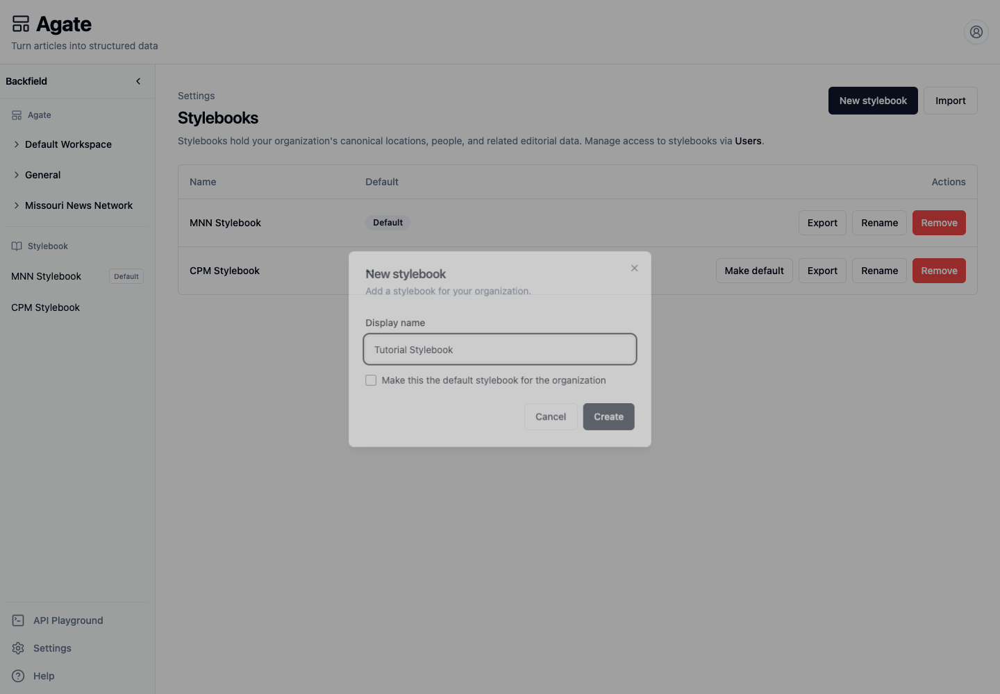
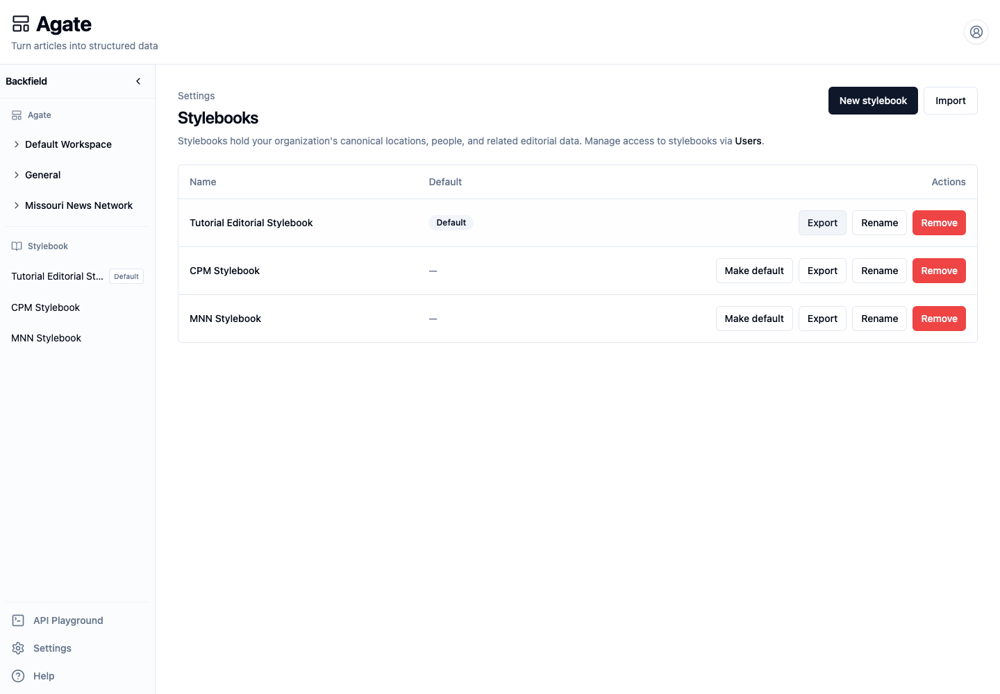
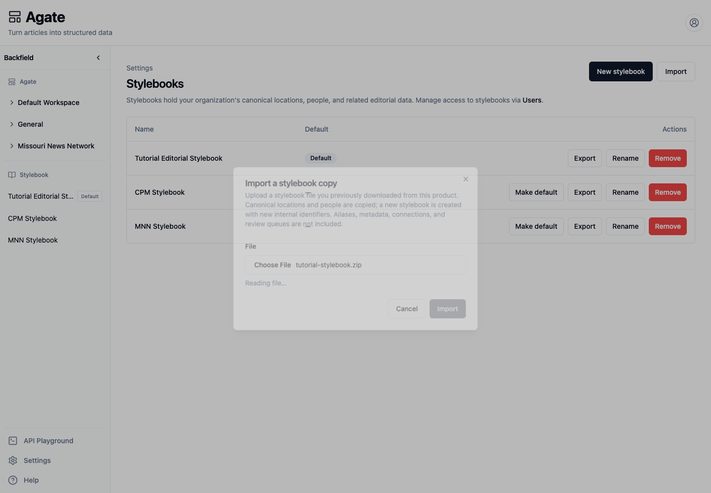
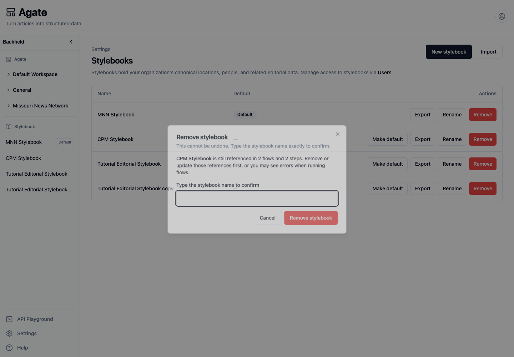

# Create and manage Stylebooks

Create, rename, export, import, and safely remove Stylebooks from Agate's
organization settings.

## Before you begin

You need organization-administrator access. Decide:

- what separate editorial identity the Stylebook represents;
- whether new projects should use it by default;
- which members may edit it;
- whether projects should share an existing Stylebook instead.

A separate Stylebook is a separate canonical namespace, not merely a folder.
Projects that should recognize the same people, organizations, and locations
should normally share one.

## 1. Open Stylebook administration

In Agate, choose **Settings → Stylebooks**. The table identifies the
organization default and provides actions for each Stylebook.

## 2. Create a Stylebook

1. Choose **New stylebook**.
2. Enter a **Display name**.
3. Optionally select **Make this the default stylebook for the organization**.
4. Choose **Create**.

The Stylebook appears in both the table and the sidebar. It begins as an empty
canonical catalog.

## 3. Choose the default

Choose **Make default** on a non-default Stylebook. Exactly one Stylebook is
marked **Default**.

Changing the default affects future project creation. It does not move existing
projects or their canonical data. A project's Stylebook is fixed when the
project is created.

## 4. Assign editors

Stylebook editor access is managed from **Settings → Users**, not from this
table:

1. Find the member.
2. Choose **Stylebooks**.
3. Select each Stylebook they may edit.
4. Choose **Save**.

Organization administrators may edit every Stylebook. For the complete access
workflow, see [Manage users and access](manage-users.md).

## 5. Rename a Stylebook

1. Choose **Rename**.
2. Change the **Display name**.
3. Choose **Save**.

The new name appears in the table and sidebar. Renaming does not merge,
duplicate, or move canonical records.

## 6. Export a Stylebook copy

Choose **Export** on the source row. Your browser downloads a ZIP file named
from the Stylebook and export date.

The copy workflow currently includes canonical locations and people. It does
not include organizations, aliases, metadata, connections, review queues, or
project data. Keep the ZIP in an approved location because it contains
editorial reference data.

## 7. Import a Stylebook copy

1. Choose **Import**.
2. Select a ZIP previously downloaded from Backfield.
3. Wait while the file is read.
4. Choose **Import** when the button becomes available.

Backfield reports that the import has started. The work is asynchronous; close
the message and refresh the page after a short wait. A new Stylebook appears
with a unique name such as `Stylebook name copy` and new internal identifiers.
The source Stylebook is unchanged.

!!! note
    The current import dialog does not provide a record-by-record preview. Use
    a small, known export first and inspect the imported people and locations
    before assigning the new Stylebook to a project.

## 8. Review deletion impact

Choose **Remove** on a Stylebook and wait for the impact check. The dialog:

- states whether Backfield found flow references;
- requires the exact Stylebook name before enabling removal;
- reminds you that deletion cannot be undone.

If references are reported, choose **Cancel** and update or remove those
references first. Also confirm that no project depends on the Stylebook and
export a copy if its canonical records may be needed later.

The final Stylebook in an organization cannot be removed. Never use deletion as
a way to change an existing project's Stylebook.

## Related concepts

- [Managing Stylebooks](../../platform/stylebook/stylebooks.md)
- [Import & export](../../platform/stylebook/import-export.md)
