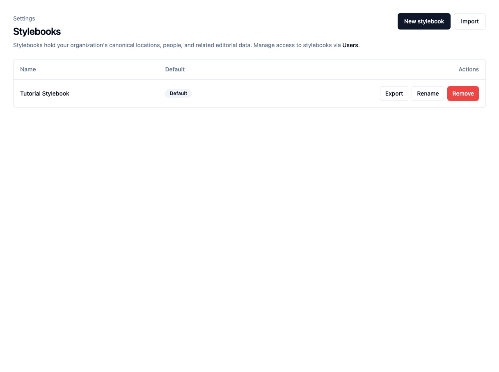
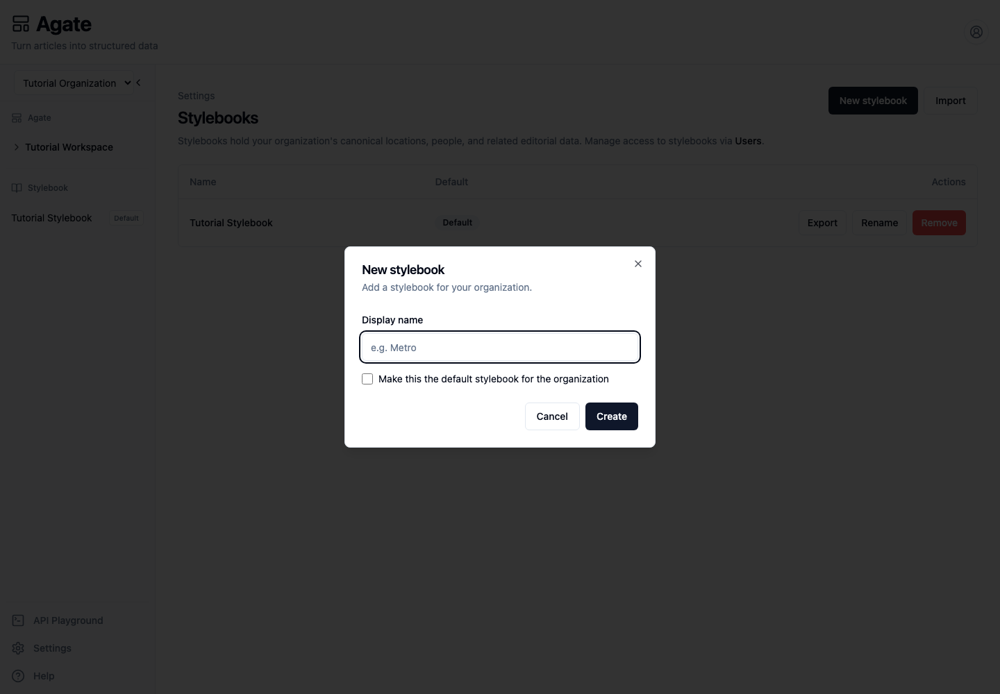

# Manage Stylebooks

Create and maintain the canonical catalogs used by your projects.

## Before you begin

You need organization-administrator access.

A Stylebook is more than a folder. It is a separate collection of canonical
people, places, and related editorial knowledge. Projects that should recognize
the same entities should usually share one Stylebook.

## 1. Open Stylebooks

In Agate, choose **Settings**, then **Stylebooks**.

The Tutorial Organization has one default Stylebook containing the Minnesota
records used throughout these tutorials.

## 2. Create a Stylebook

1. Choose **New stylebook**.
2. Enter a display name.
3. Optionally make it the organization default.
4. Choose **Create**.

The new Stylebook starts empty and appears in the Agate sidebar.

## Choose the default

The default Stylebook is selected automatically when an administrator creates a
new project. Changing the default does not move existing projects or canonical
records.

## Assign editors

Stylebook access is managed from **Settings → Users**:

1. Find a member.
2. Choose **Stylebooks**.
3. Select every Stylebook they may edit.
4. Choose **Save**.

Organization administrators can edit every Stylebook.

## Rename, export, or import

- **Rename** changes the display name only.
- **Export** downloads a ZIP copy.
- **Import** creates a separate Stylebook from an exported ZIP.

The copy workflow currently includes canonical locations and people. It does
not include project data, review queues, or every kind of related record.

!!! note
    The import dialog does not provide a record-by-record preview. Inspect the
    imported people and places before assigning the copy to a project.

## Remove a Stylebook

Choose **Remove** only after confirming that no project or flow depends on the
Stylebook. Export a copy first if its records may be needed later.

Removal cannot be undone, and the final Stylebook in an organization cannot be
removed.

## Related concepts

- [Managing Stylebooks](../../platform/stylebook/stylebooks.md)
- [Import & export](../../platform/stylebook/import-export.md)
