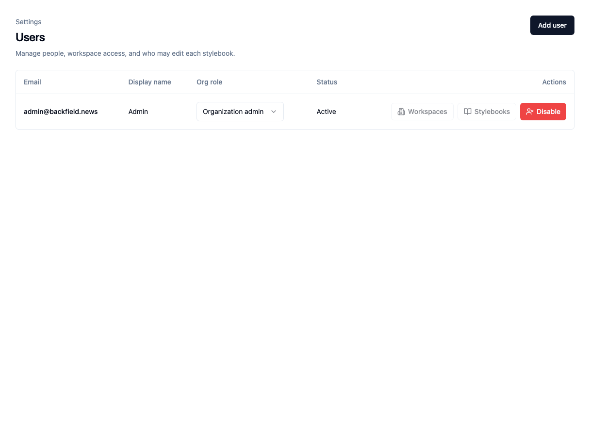
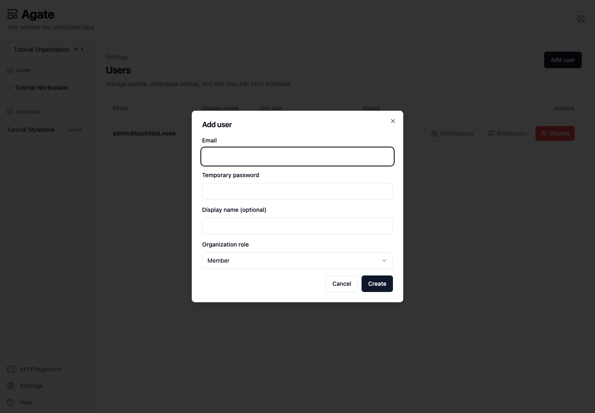

# Manage users and access

Add a person to your organization and decide what they can use.

## Before you begin

You must be an organization administrator. You will need the person's email
address and a strong initial password.

## 1. Open the Users page

In Agate, choose **Settings**, then **Users**.

The Tutorial Organization currently has one organization administrator.

## 2. Add a user

1. Choose **Add user**.
2. Enter the person's email address.
3. Enter a temporary password.
4. Add a display name if useful.
5. Choose **Member** for most people.
6. Choose **Create**.

Use **Organization admin** only when the person needs to manage users,
credentials, models, integrations, and Stylebooks.

!!! warning "Share the password securely"
    The person can sign in with the password you create. Ask them to change it
    promptly, and do not send the password in the same message as their email
    address.

## 3. Assign access

Use the actions on the new member's row:

- **Workspaces** controls which workspaces and projects they can open.
- **Stylebooks** controls which Stylebooks they may edit.

Select the complete access list in each dialog, then choose **Save**. Removing a
selection removes that access.

Organization administrators already have access to every workspace and
Stylebook, so these two buttons are unavailable on administrator rows.

## 4. Check their account

Ask the person to sign in and confirm that:

- they can see the assigned workspaces and projects;
- they cannot see unassigned workspaces;
- they can edit only the assigned Stylebooks;
- organization **Settings** are unavailable to a member.

Workspace access and Stylebook editing are separate. A person can review project
runs without being allowed to change shared canonical records.

## Change a role or disable an account

Use the menu in the **Org role** column to switch between **Member** and
**Organization admin**.

Choose **Disable** when a person should no longer be able to sign in. Their
historical work remains in Backfield.

!!! warning
    The current Users page does not provide a re-enable action. Check the email
    address carefully before disabling an account.

## Related concepts

- [Users & access](../../platform/concepts/users.md)
- [Organizations & workspaces](../../platform/concepts/organizations.md)
