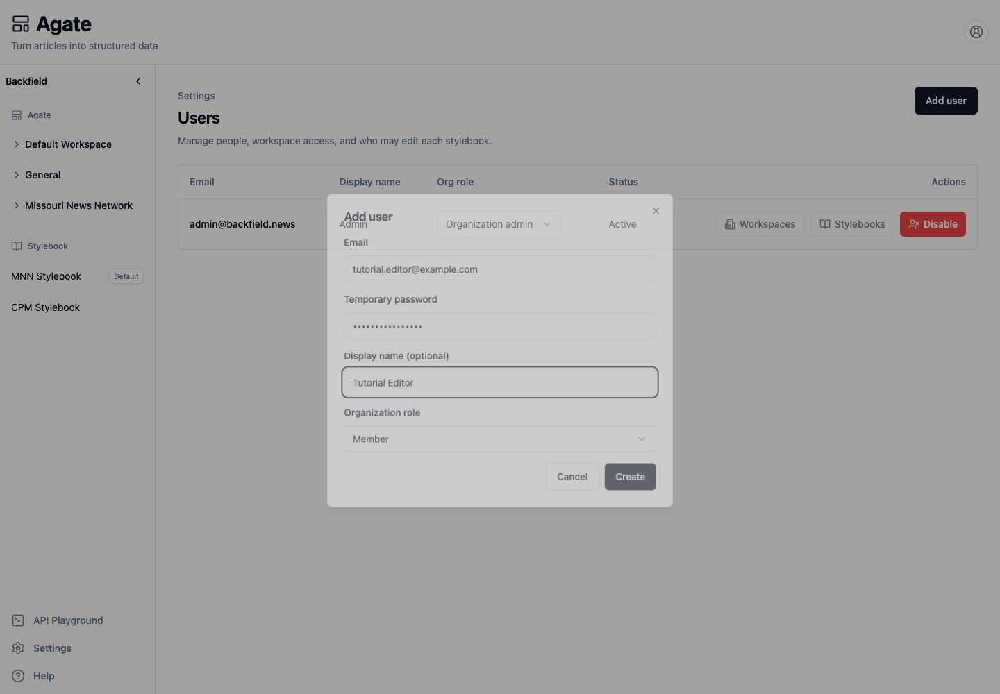
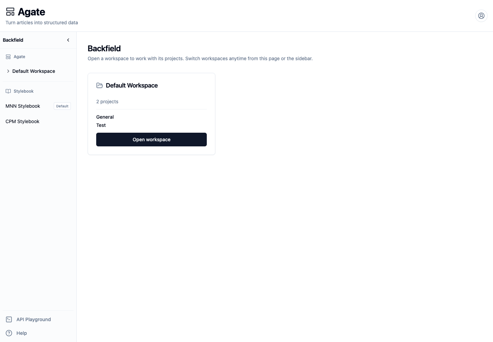

# Manage users and access

Create a member, give them access to the right workspaces and Stylebooks, verify
their view, and disable the account when it is no longer needed.

## Before you begin

You must be an organization administrator. Collect:

- the person's email address and display name;
- a strong initial password that you can share securely;
- whether they should be a member or organization administrator;
- every workspace they need;
- every Stylebook they should be allowed to edit.

Organization administrators can access every project and Stylebook. The
workspace and Stylebook assignments in this tutorial matter primarily for
members.

## 1. Open user administration

In Agate, choose **Settings** in the sidebar, then open **Users**. The table
shows each person's role and status.

## 2. Add the user

1. Choose **Add user**.
2. Enter the person's **Email**.
3. Enter a strong **Temporary password**.
4. Add a **Display name** if your team uses one.
5. Keep **Member**, or choose **Organization admin** only when the person needs
   to manage organization-wide settings.
6. Choose **Create**.

!!! warning "Share the initial password securely"
    In the version verified for this tutorial, an account created from this
    screen can sign in with the initial password without being forced through a
    password-change screen. Treat the password as temporary anyway. Ask the
    person to change it immediately from their account menu, and do not send it
    in the same message as their username.

## 3. Assign workspace access

1. Find the new member and choose **Workspaces**.
2. Select every workspace the person should be able to open.
3. Review the project names listed beneath each workspace.
4. Choose **Save**.

The selection is a complete access list, not an additional permission. Clearing
a checked workspace removes access to every project in it.

## 4. Assign Stylebook editing access

1. Choose **Stylebooks** on the member's row.
2. Wait for the Stylebook list to load.
3. Select each Stylebook the person may edit.
4. Choose **Save**.

Workspace access and Stylebook editing are independent. A member may review
project runs without being allowed to change canonical records, or curate a
shared Stylebook used by several workspaces.

## 5. Verify the member's view

Ask the person to sign in, or use a separate browser profile for a test account.
Confirm that:

- only assigned workspaces appear on the Agate home page;
- the expected projects appear inside each workspace;
- unassigned workspaces do not appear;
- the person can edit only the assigned Stylebooks;
- **Settings** is absent for a member.

The test member below can open one workspace containing two projects.

## 6. Change access or role

Return to **Settings → Users**:

- use **Workspaces** or **Stylebooks** to replace the corresponding access
  list;
- open the role menu in the **Org role** column to switch between **Member**
  and **Organization admin**.

Changing a member to an organization administrator immediately grants access to
all organization settings, projects, and Stylebooks. Changing an administrator
to a member makes their explicit workspace and Stylebook assignments effective.

Email, display name, and password do not have administrator edit controls on
this screen. A signed-in person changes their own password from the account
menu.

## 7. Disable an account

1. Choose **Disable** on the person's row.
2. Read the confirmation.
3. Choose **Disable** again.

The status changes to **Disabled**, and the person can no longer sign in. The
login screen returns a generic invalid-credentials message rather than
revealing that the account exists. Historical editorial work remains attached
to the user.

!!! warning
    The current Users screen does not provide a re-enable action. Confirm the
    account and person carefully before disabling it.

## Related concepts

- [Users & access](../../platform/concepts/users.md)
- [Organizations & workspaces](../../platform/concepts/organizations.md)
