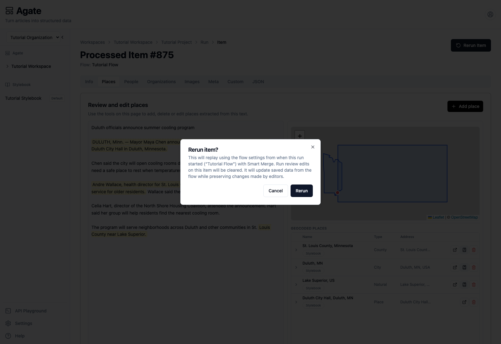
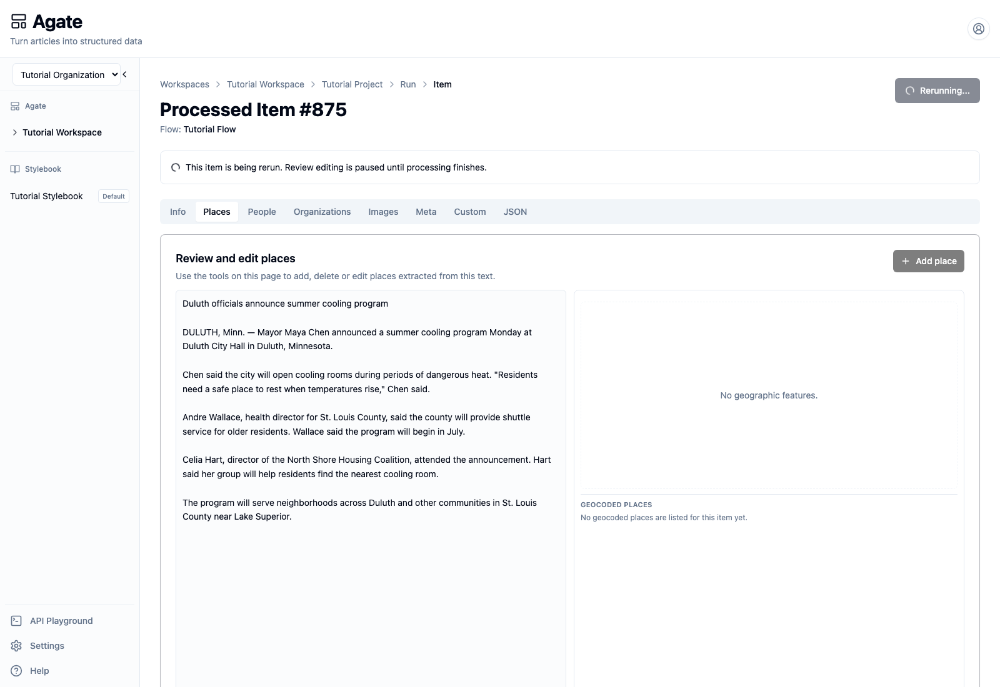
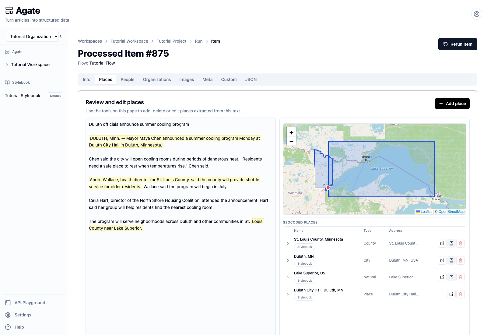

# Rerun processed items safely

Regenerate one processed item while protecting shared editorial work and
understanding which article-level corrections will be cleared.

## You'll learn

- Which flow settings an item rerun uses.
- Why Agate clears the item's review changes.
- How Backfield Output reconciliation protects editor-created evidence.
- What to check after the rerun finishes.

## Before you begin

Complete [Correct processed items](review-processed-items.md). The Duluth
processed item should have four places after you remove the duplicate Lake
Superior result.

## 1. Read the rerun warning

Open the processed item and select **Rerun Item**.

Read all three parts of the confirmation:

- The item will use the **flow settings saved when its original run started**.
  Later edits to Tutorial Flow are not substituted into this rerun.
- The item's **run review edits will be cleared**. In this example, that
  includes the earlier removal of the duplicate place.
- Backfield Output will use **Smart Merge**, updating saved machine data while
  preserving editor-made changes.

If you need the latest saved flow instead, start a new run from the flow rather
than rerunning this historical item.

## 2. Start the rerun

Select **Rerun**.

While processing is active, Agate shows **Rerunning…** and pauses review
editing. Tabs may temporarily show no results because the regenerated output
has not arrived yet.

Do not add or remove results during this state. Wait for processing to finish,
then reload the item if the page has not refreshed automatically.

## 3. Review the regenerated item

Open **Places** again after the rerun succeeds.

The verified rerun produced four places:

- St. Louis County, Minnesota;
- Duluth, Minnesota;
- Lake Superior as a natural feature;
- Duluth City Hall.

The incorrect duplicate did not return, but this is new machine output—not the
previous removal being preserved. The review overlay was cleared as warned.
Review every tab again because model-backed extraction and geocoding can vary
between executions.

## 4. Understand reconciliation

Backfield Output's policy controls how newly generated machine evidence is
combined with data already saved for the article:

- **Add Only** adds new results without treating omissions as removals.
- **Smart Merge** updates compatible machine output while retaining prior data
  where appropriate.
- **Replace** treats newly emitted machine domains as authoritative, including
  empty results.

Replace can retire earlier machine-generated associations that disappear from
the rerun. Editor-added and editor-modified evidence remains protected.
Canonical Stylebook edits are separate from the processed item's review layer
and are not silently rewritten.

## 5. Choose the right action

- Use **Rerun Item** to regenerate one item from its original run's flow
  settings and inputs.
- Use **Replay run** to create another run from all stored inputs.
- Use **Run flow** when you want the currently saved flow configuration.
- For a batch, select failed rows and rerun only those items when successful
  work does not need to be repeated.

## Related concepts

- [Runs](../../platform/agate/runs.md#cancellation-failures-and-reruns)
- [Output nodes](../../platform/agate/nodes/outputs.md#backfield-output)
