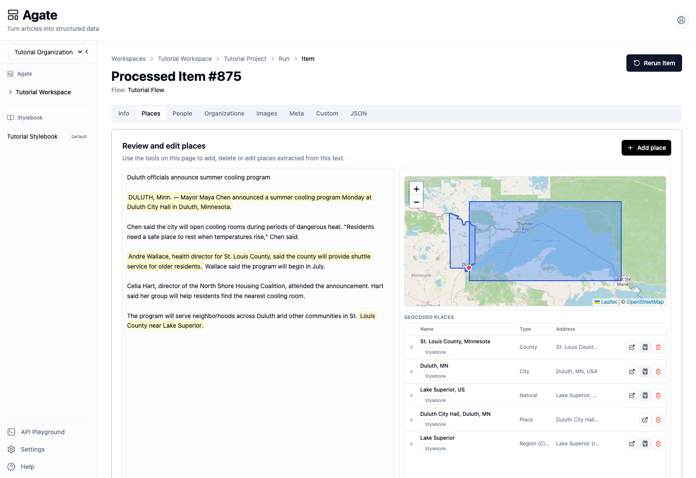
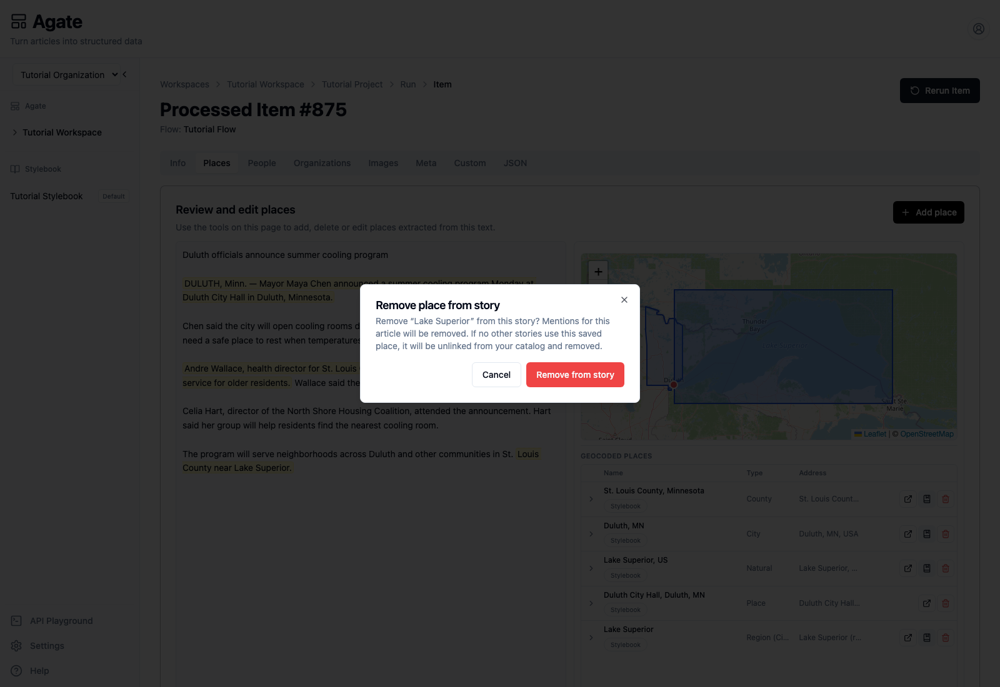
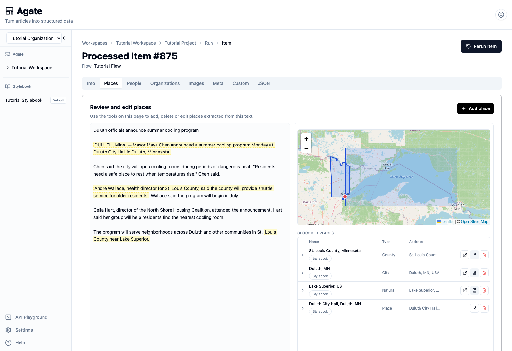

# Correct processed items

Compare a flow's output with the source story and correct an article-specific
mistake. This tutorial removes a duplicate place from the Duluth cooling-program
story.

## You'll learn

- How to verify a result against highlighted source text.
- How to remove an unsupported or duplicate extraction.
- Which corrections belong on the processed item and which belong in
  Stylebook.

## Before you begin

Complete [Extract people and places](extract-entities.md). Open the successful
Tutorial Flow run for `Duluth officials announce summer cooling program`, then
select **View** on its processed item.

## 1. Review the item

Start with **Info**. Confirm that the item succeeded and that the headline
preview identifies the expected story.

Then open **Places**. The story appears beside the map and place table.
Highlighted passages show the evidence that produced the place results.

The verified run contains five rows, but the article supports only four
distinct places. Lake Superior appears twice:

- `Lake Superior, US` is correctly identified as a natural feature.
- `Lake Superior` is also listed as `Region (City)`, which is an incorrect
  duplicate.

Do not judge a result from its confidence or map alone. Compare its name, type,
address, geometry, and highlighted source passage.

## 2. Remove the duplicate

In the `Lake Superior` row with type `Region (City)`, select the red
**Remove from story** button.

Agate explains the scope before making the change: mentions for this article
will be removed, and a saved place used by no other stories may be unlinked
from the catalog.

Select **Remove from story** to confirm.

## 3. Confirm the corrected result

The incorrect row disappears. The remaining table contains:

- St. Louis County, Minnesota;
- Duluth, Minnesota;
- Lake Superior as a natural feature;
- Duluth City Hall.

The correction applies to this processed story. Agate preserves the flow's
machine output as part of the run record and applies editorial changes as a
review layer.

## 4. Know when to use Stylebook

Removing a result from a story is different from editing shared canonical
knowledge.

- Correct the processed item when a person, place, mention, tag, or field is
  wrong for this article.
- Open **Stylebook** when the shared identity itself is wrong—for example, a
  canonical name, geography, metadata value, or connection used across
  stories.

The **Open in Stylebook** action beside a matched result takes you to that
canonical record. Do not rename a shared place merely to fix one article's
extraction.

## 5. Review the other tabs

Use the same source-first check throughout the item:

- **People** — verify names, titles, affiliations, mentions, and quotations.
- **Meta** — review each category with its rationale and confidence.
- **Info** — add or correct article-level source, URL, headline, author, or
  publication date when available.
- **JSON** — inspect or download the structured output.

Use **Add person**, **Add place**, or **Add tag** only when the source supports
something the flow missed. Remove results that are unsupported rather than
trying to make them fit.

## Next step

Continue with [Rerun processed items safely](rerun-items.md). Rerunning
regenerates the item from its original run's saved flow settings and clears its
run-level review changes.

## Related concepts

- [Processed items](../../platform/agate/processed-items.md)
- [Mentions & evidence](../../platform/stylebook/mentions.md)
