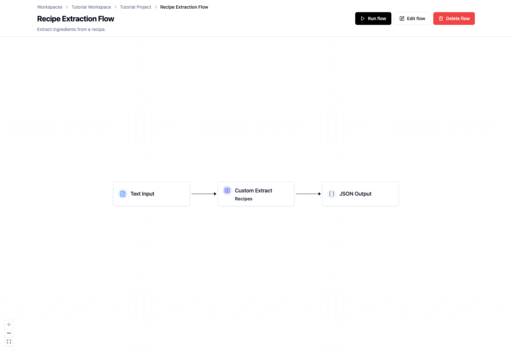
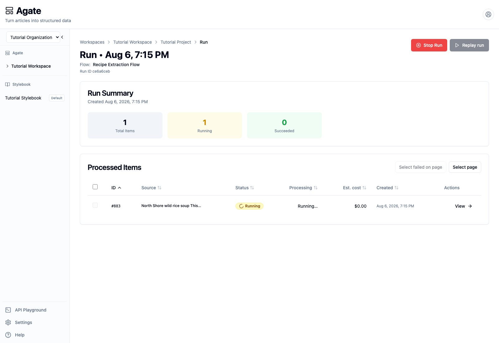
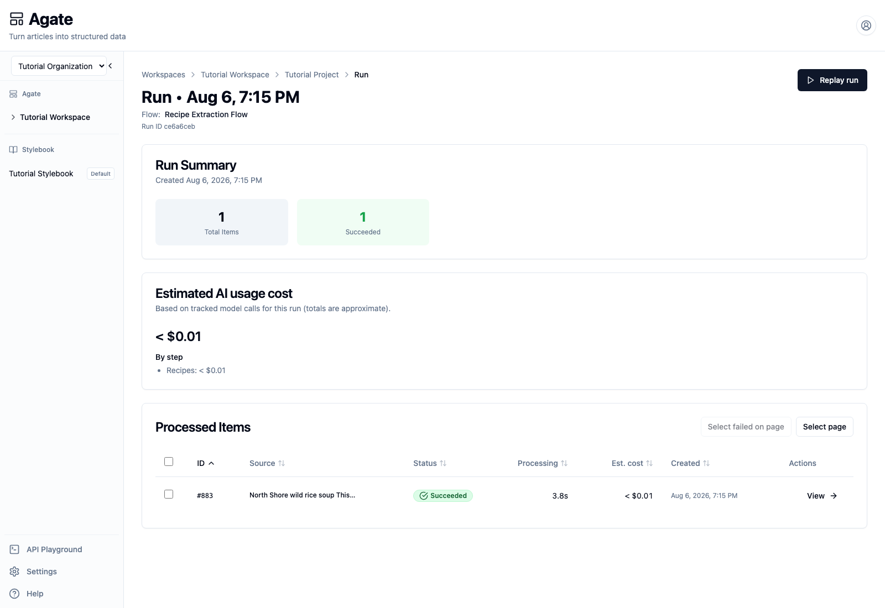

# Run and monitor a flow

Start a flow, follow its progress, and confirm that every item completed
successfully.

## You'll learn

- How run-level and item-level statuses differ.
- Where to find progress, duration, and estimated model cost.
- When to stop, replay, or inspect a run.

## Before you begin

Complete [Build a custom extraction](custom-extraction.md). You should have a
saved **Recipe Extraction Flow** containing:

- Text Input with the North Shore wild rice soup recipe;
- Custom Extract configured with GPT-5.6 Luna;
- JSON Output.

## 1. Check the flow

Open **Tutorial Project → Flows → Recipe Extraction Flow**.

Confirm that the flow is saved and that Text Input, Custom Extract, and JSON
Output form one complete path.

Select **Run flow**.

Text Input and JSON Input create one processed item. S3 Input can create many
items from a batch of files, so its run summary may contain a mixture of
pending, running, succeeded, and failed items.

## 2. Monitor an active run

The **Run details** panel appears when processing starts. Select **Open run
page** to see the full summary and processed-item table.

Use the summary and processed-item table to answer:

- **Total Items:** How many inputs belong to this run?
- **Running:** How many items are still being processed?
- **Succeeded:** How many finished without a technical error?
- **Status:** What is happening to this specific item?
- **Processing:** How long has the item been running?

The verified recipe run began with one running item and no completed items.
The **Replay run** action remains unavailable while the run is active.

Use **Stop Run** only when work should not continue. Stopping is not
instantaneous: a node already executing may take a short time to finish or
cancel.

## 3. Confirm completion

The page updates as the run progresses. When it finishes, confirm that:

1. no items remain pending or running;
2. the succeeded count equals the total item count;
3. every processed-item row shows **Succeeded**.

This verified run processed one recipe in 3.8 seconds. Its estimated AI cost
was less than one cent, attributed to the **Recipes** step. Times and costs vary
by model and provider, and cost figures are estimates rather than invoices.

Select **View** to open the processed item and review its Custom Extract
results.

## 4. Respond to failures

If an item fails, open it before starting another run. The error message and
failed step usually point to the next check:

- confirm that the input contains the expected fields or text;
- confirm that the selected model is enabled for the project;
- check any required integration credentials;
- review recent prompt or field changes.

For a batch, successful items remain available even when another item fails.
Use **Select failed on page** to work with the failed rows rather than
reprocessing successful items unnecessarily.

## 5. Replay or run again

After a completed run:

- **Replay run** creates another run from the stored inputs.
- **Run flow** starts the currently saved flow again.
- **Rerun Item** regenerates only that item with its original run's saved flow
  settings.

Use these actions deliberately. Regenerating an item can replace its run-level
review changes, while shared Stylebook edits remain separate.

## Related concepts

- [Runs](../../platform/agate/runs.md)
- [Input nodes](../../platform/agate/nodes/inputs.md)
- [Rerun processed items safely](rerun-items.md)
