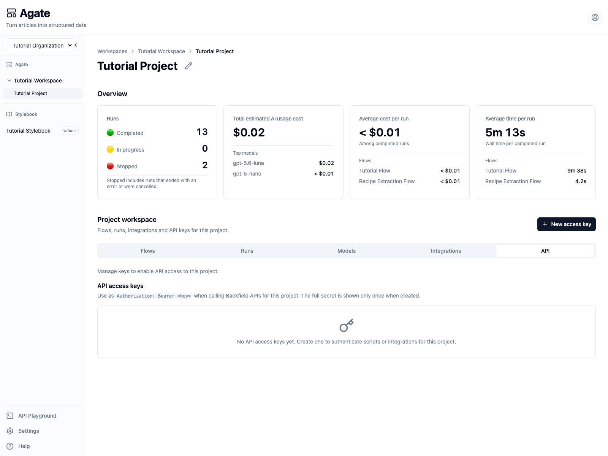
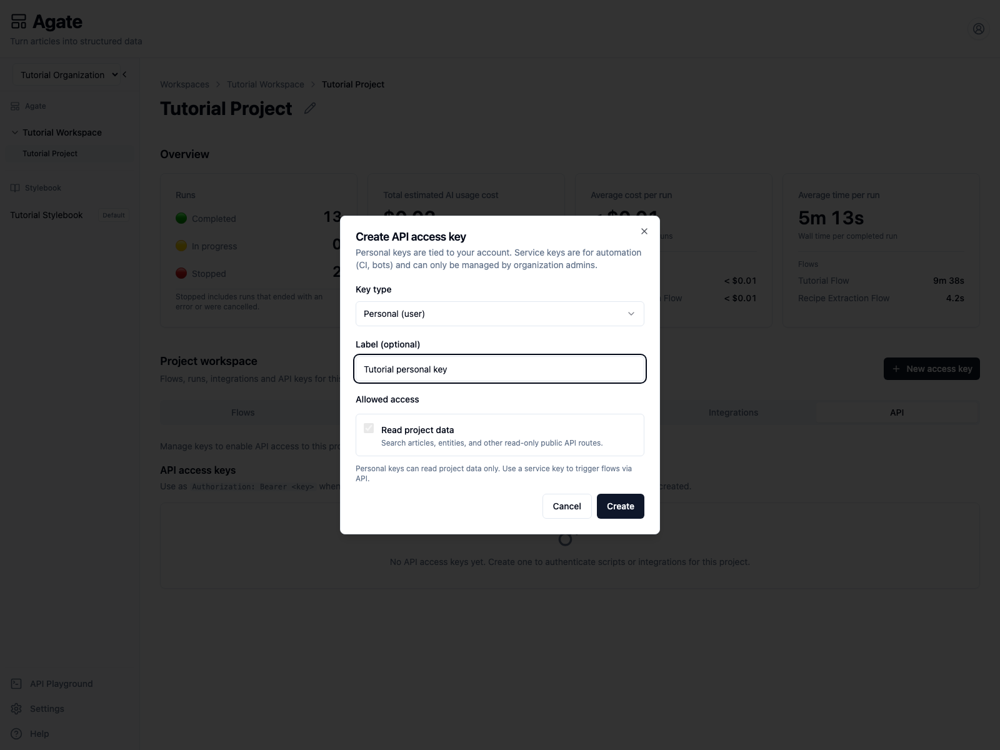
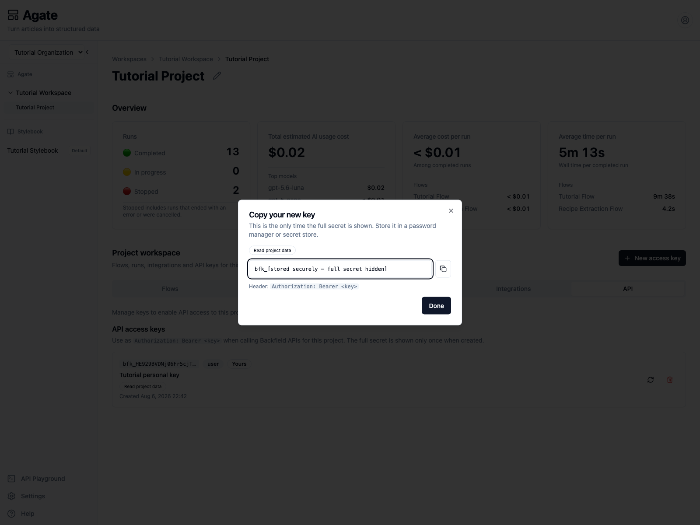
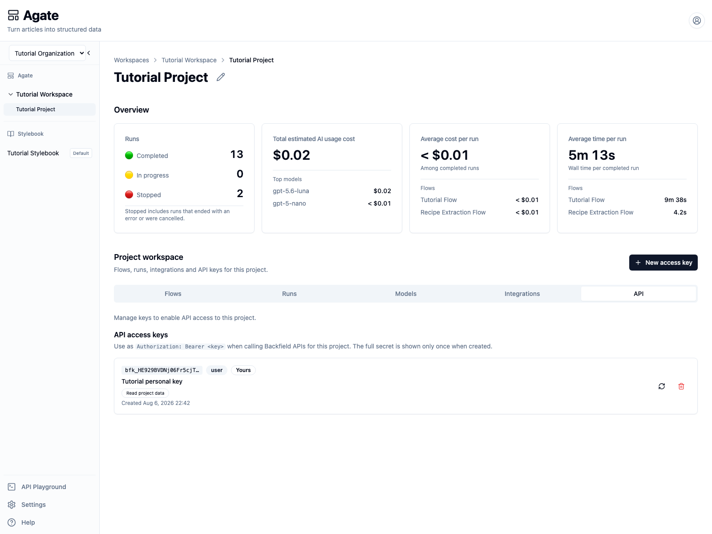
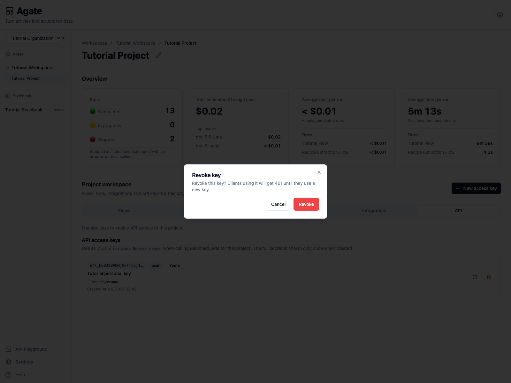
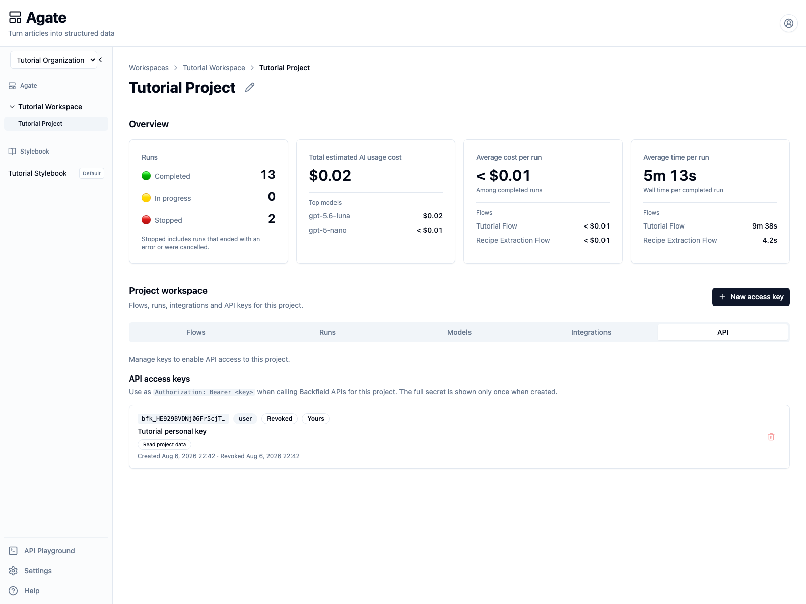

# Create and protect an API key

Create a project-scoped personal key, test it against the Backfield API, and
revoke it without exposing the secret.

## You'll learn

- When to use a personal key and when to use a service key.
- Why the full secret appears only once.
- How to send an authenticated request.
- How project access and key status affect authorization.
- How to rotate or revoke a key safely.

## Before you begin

You need access to **Tutorial Project** and an approved password manager or
secret store.

Do not put a real API key in tutorial text, screenshots, chat, source code, or a
public repository. This walkthrough creates a temporary personal key and
revokes it after testing.

## 1. Choose the key type

Backfield offers two project key types:

- **Personal (user):** read-only access for a script or tool used on behalf of
  one person.
- **Service (automation):** shared server-side automation managed by
  organization administrators. It can optionally receive permission to trigger
  flows.

Use a personal key for this interactive test. Do not use a personal key for a
shared production service that should continue after its owner changes roles
or leaves the organization.

## 2. Open the API tab

In Agate, open **Tutorial Project** and select **API** under **Project
workspace**.



API keys belong to one project. A Tutorial Project key cannot be used to query
another project.

Select **New access key**.

## 3. Create a personal key

Choose:

- **Key type:** `Personal (user)`
- **Label:** `Tutorial personal key`
- **Allowed access:** `Read project data`



The read scope is required for personal keys. It covers the public read-only
routes for articles, entities, mentions, metadata, and project information.

Select **Create**.

## 4. Store the secret immediately

Backfield displays the full key once.



The screenshot intentionally replaces the secret with a safe placeholder. In
your own session:

1. copy the full value beginning with `bfk_`;
2. save it in the approved password manager or secret store;
3. record its project, purpose, owner, and planned review date;
4. confirm that the stored value can be retrieved;
5. select **Done**.

Backfield stores enough information to recognize the key, but it cannot display
the full secret again.

## 5. Test the key

Load the key into `BACKFIELD_API_KEY` from your secret store. Do not paste it
into a script or commit it to an environment file that is tracked by Git.

Send a request to Tutorial Project:

```bash
curl "https://api.{organization_slug}.backfield.news/public/v1/projects/tutorial-project" \
  -H "Authorization: Bearer ${BACKFIELD_API_KEY}" \
  -H "X-Request-ID: tutorial-api-key-test"
```

For the local Tutorial Organization used in these screenshots, the URL is:

```text
http://localhost:8004/public/v1/projects/tutorial-project
```

The verified request returned `200` and identified the expected project:

```json
{
  "name": "Tutorial Project",
  "slug": "tutorial-project",
  "stylebook_slug": "tutorial-stylebook",
  "stats": {
    "articles": {"total": 4, "embedded": 0},
    "mentions": {"total": 16, "embedded": 0},
    "images": {"total": 0, "embedded": 0}
  }
}
```

Your counts may differ. The important checks are the `200` status, project
slug, and assigned Stylebook. The response also returns the request ID in the
`X-Request-ID` header for troubleshooting.

## 6. Inspect the key record

After closing the one-time dialog, the API tab shows the key's safe prefix,
type, owner, label, scope, and creation time.



The prefix helps identify a credential without exposing it. It cannot be used
to authenticate.

Personal-key requests are rechecked against the owner's account, organization
membership, and project access. Disabling the owner or removing all required
access invalidates the key.

## 7. Revoke the temporary key

Select the trash button beside **Tutorial personal key**.



Revocation is immediate. Select **Revoke** only after confirming that no client
still needs this temporary key.



The revoked key remains listed for identification and audit purposes. A
verified request with it returned `401`.

## Rotate a production key safely

Do not revoke a production key before its replacement works. Use this order:

1. create the replacement;
2. store it securely;
3. update every client;
4. test the replacement against the correct project;
5. revoke the old key;
6. confirm that the old key returns `401`.

The rotate action creates a replacement and shows its secret before revoking
the old key. Test and store the replacement while that dialog is open, then
finish the rotation.

## Service-key checklist

Before an organization administrator creates a service key, record:

- the automation and team responsible for it;
- where the secret will be stored;
- which project it may access;
- whether it needs only `read` or also `runs:trigger`;
- how it will be monitored, rotated, and retired.

Grant `runs:trigger` only when the automation must start an approved flow.
Service keys and personal keys should never be embedded in browser-side code.

## Related concepts

- [API keys](../../platform/settings/api-keys.md)
- [Authentication](../../api/authentication.md)
- [Get project](../../api/projects/get-project.md)
