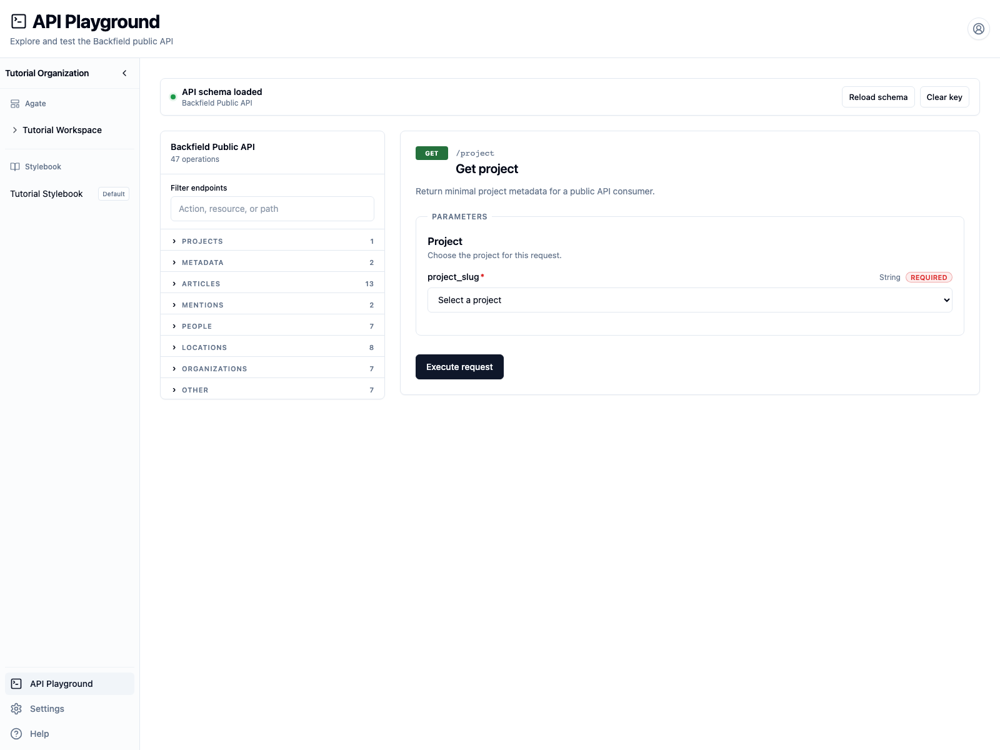
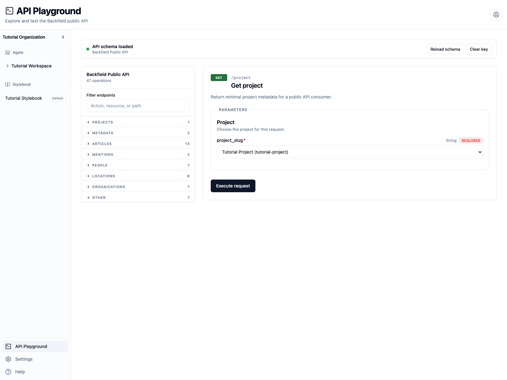
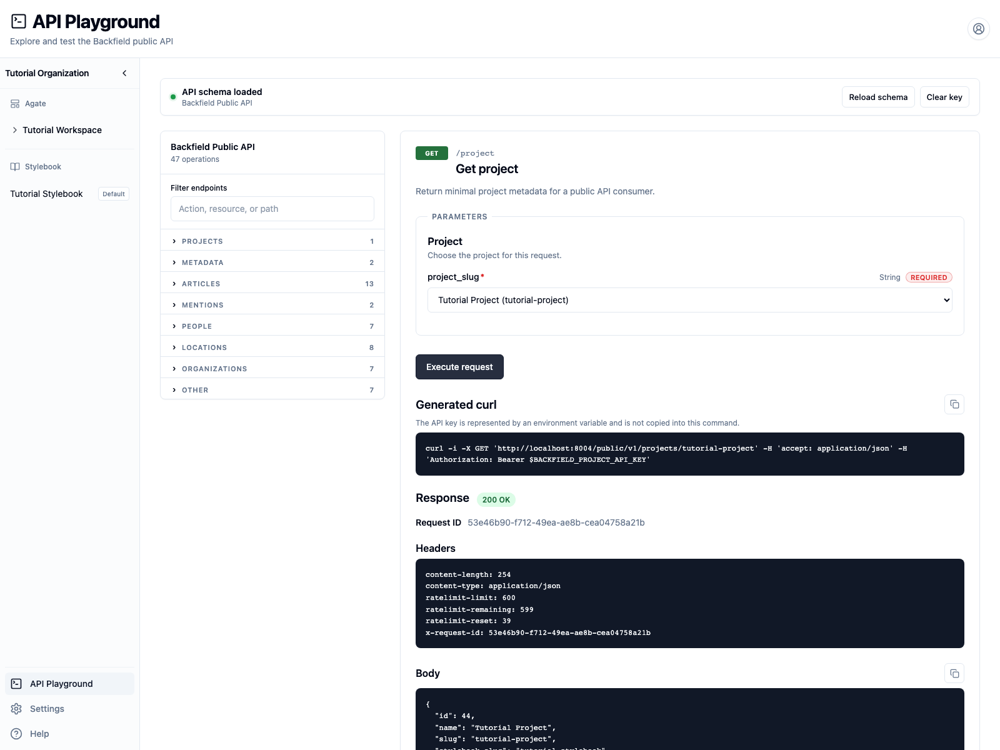
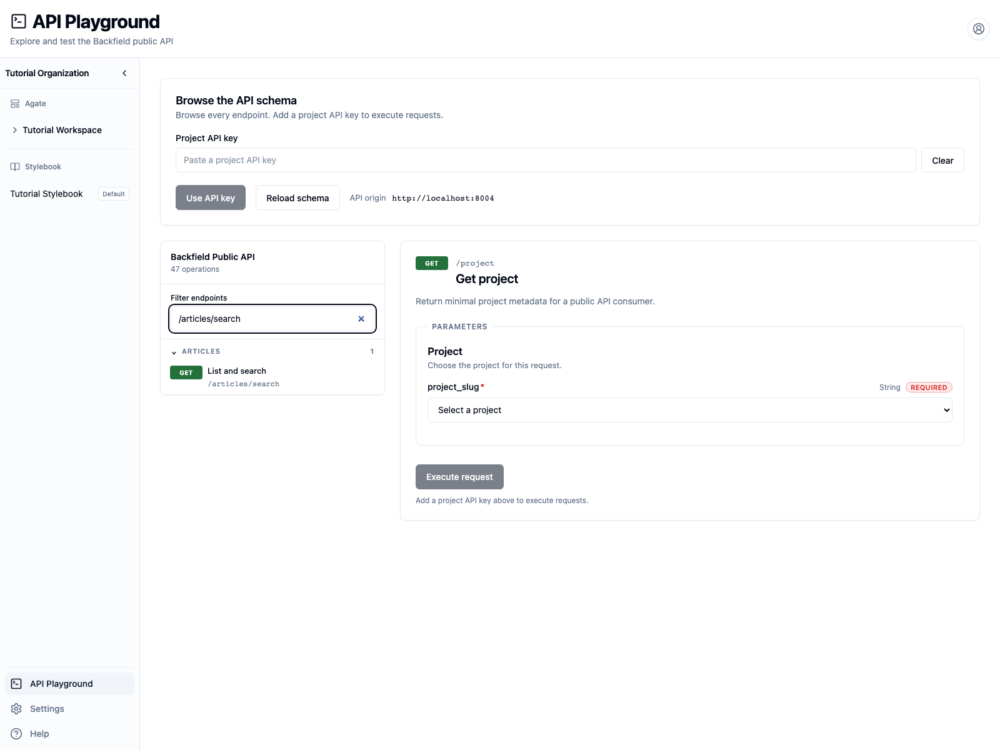

# Use the API Playground

Explore project-scoped endpoints interactively before writing application code.

## You'll learn

- How to authorize the Playground with a project API key.
- How to select an endpoint and enter request parameters.
- How to read response status, headers, and JSON.
- How to copy a request without exposing your key.

## Before you begin

Create a temporary personal key by following
[Create and protect an API key](create-api-key.md). This walkthrough uses
**Tutorial Project**, which already contains processed articles.

## 1. Authorize the Playground

1. Open **API Playground** from the Backfield sidebar.
2. Paste your temporary key into **Project API key**.
3. Select **Use API key**.

The key field disappears after authorization. **Clear key** removes it from the
current browser session.



## 2. Request the current project

The Playground initially opens **Get project**.

1. Under **Project**, select **Tutorial Project**.
2. Select **Execute request**.



A successful request shows:

- **200 OK**, the HTTP status.
- A request ID, which can help Backfield support trace a problem.
- Response headers, including rate-limit information.
- A JSON body with the project identity and content totals.
- A generated cURL command.



The Tutorial Project response also reports how many articles and mentions have
embeddings. That count matters before you try semantic search.

## 3. Find another endpoint

Enter `/articles/search` in **Filter endpoints**, then select **List and
search**.



After selecting **Tutorial Project**, try these fields:

- **q**: `Duluth`
- **limit**: `3`
- **Mention counts**: selected

Select **Execute request**. The response URL should contain:

```text
/articles/search?q=Duluth&limit=3&include=counts
```

Path fields identify the project or resource. Query fields such as `q` and
`limit` narrow a `GET` request. Endpoints that create work, such as **Trigger
run**, display a JSON request-body editor instead.

## 4. Read and reuse the request

The generated cURL command represents the key as an environment variable:

```bash
export BACKFIELD_PROJECT_API_KEY="paste-the-key-here"
```

Run the generated command in the same terminal. Do not replace
`$BACKFIELD_PROJECT_API_KEY` with the secret itself in source code, shell
history, screenshots, or issue reports.

If a request fails, read both the status and JSON error:

- **401** usually means the key is missing, invalid, or revoked.
- **403** means the key or flow lacks the required permission.
- **404** means a project or resource identifier is unknown.
- **422** means a parameter or request body is invalid.

## 5. Clean up

1. Select **Clear key** in the Playground.
2. Return to **Tutorial Project → API**.
3. Revoke the temporary key.

## Related concepts

- [API Playground](../../api/playground.md)
- [Pagination](../../api/conventions/pagination.md)
- [Errors](../../api/conventions/errors.md)
