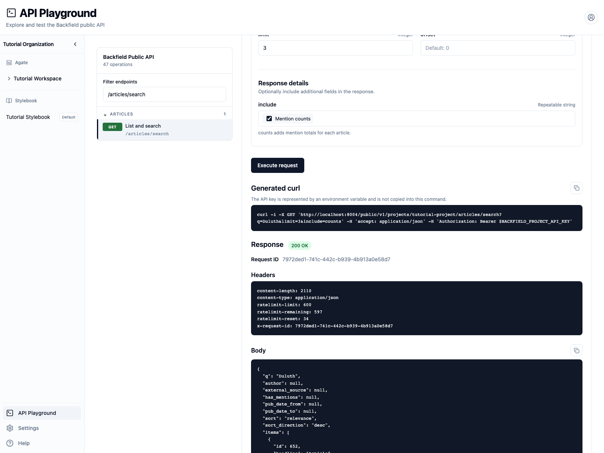

# Query project data

Retrieve articles, article entities, canonicals, mentions, custom records, and
connections while preserving their distinct meanings.

## You'll learn

- How project API keys establish the project boundary.
- How to move from an article to its entities and canonicals.
- How custom records differ from canonical entities.
- How to paginate list endpoints.
- How to follow identifiers between related resources.

## Before you begin

Complete [Create and protect an API key](create-api-key.md), then store the
temporary personal key in your terminal:

```bash
export BACKFIELD_PROJECT_API_KEY="paste-the-key-here"
export BACKFIELD_API_ORIGIN="http://localhost:8004"
export PROJECT_SLUG="tutorial-project"
```

Use your organization's public API origin instead of `localhost` outside the
local tutorial environment.

## 1. Confirm the project boundary

```bash
curl "$BACKFIELD_API_ORIGIN/public/v1/projects/$PROJECT_SLUG" \
  -H "Authorization: Bearer $BACKFIELD_PROJECT_API_KEY"
```

Confirm that the response names **Tutorial Project**. A project key cannot be
used to cross into another project.

## 2. List articles

Search for the tutorial stories and include entity counts:

```bash
curl "$BACKFIELD_API_ORIGIN/public/v1/projects/$PROJECT_SLUG/articles/search\
?q=Duluth&limit=3&include=counts" \
  -H "Authorization: Bearer $BACKFIELD_PROJECT_API_KEY"
```



The response contains `items` and `pagination`:

```json
{
  "pagination": {
    "limit": 3,
    "offset": 0,
    "total": 4
  },
  "items": [
    {
      "id": 654,
      "counts": {
        "mentions": {
          "locations": 4,
          "people": 3,
          "total": 7
        }
      }
    }
  ]
}
```

Use `offset` to request the next page. Increase it by the number of items
returned, and stop when `offset + items.length` reaches `pagination.total`.
Keep a stable sort while paging.

## 3. Follow an article

Article `654` is the verified cooling-program example. Retrieve its full
record, then request each kind of extracted evidence separately:

```bash
BASE="$BACKFIELD_API_ORIGIN/public/v1/projects/$PROJECT_SLUG"

curl "$BASE/articles/654" \
  -H "Authorization: Bearer $BACKFIELD_PROJECT_API_KEY"

curl "$BASE/articles/654/people" \
  -H "Authorization: Bearer $BACKFIELD_PROJECT_API_KEY"

curl "$BASE/articles/654/locations" \
  -H "Authorization: Bearer $BACKFIELD_PROJECT_API_KEY"

curl "$BASE/articles/654/metadata" \
  -H "Authorization: Bearer $BACKFIELD_PROJECT_API_KEY"
```

The people response includes Maya Chen, Andre Wallace, and Celia Hart. Each
article entity contains:

- The label and article-specific details.
- Evidence showing where it appeared in the story.
- A `canonical` object when the mention has been linked to the Stylebook.

## 4. Follow a canonical

Maya Chen's article entity links to canonical ID
`13e29fdd-1c65-4649-a2ab-b81847147441`.

```bash
PERSON_ID="13e29fdd-1c65-4649-a2ab-b81847147441"

curl "$BASE/people/$PERSON_ID" \
  -H "Authorization: Bearer $BACKFIELD_PROJECT_API_KEY"

curl "$BASE/people/$PERSON_ID/mentions" \
  -H "Authorization: Bearer $BACKFIELD_PROJECT_API_KEY"

curl "$BASE/people/$PERSON_ID/connections" \
  -H "Authorization: Bearer $BACKFIELD_PROJECT_API_KEY"
```

The article entity is evidence from one processed story. The canonical is the
shared Stylebook record. Its mentions show where that person appeared; its
connections show maintained relationships to other canonicals.

## 5. Retrieve custom records

Custom records have their own schema and are not canonical people, places, or
organizations. Article `655` contains the recipe record created in the custom
extraction tutorial:

```bash
curl "$BASE/articles/655/custom-records?record_type=recipe" \
  -H "Authorization: Bearer $BACKFIELD_PROJECT_API_KEY"
```

Its `fields` object contains the extracted ingredients and steps, while
`field_schema` describes those values.

## 6. Handle errors and pages in code

This small Python loop reads every page without assuming a fixed total:

```python
import os
import requests

origin = os.environ["BACKFIELD_API_ORIGIN"]
project = os.environ["PROJECT_SLUG"]
headers = {"Authorization": f"Bearer {os.environ['BACKFIELD_PROJECT_API_KEY']}"}
offset = 0

while True:
    response = requests.get(
        f"{origin}/public/v1/projects/{project}/articles/search",
        headers=headers,
        params={"limit": 100, "offset": offset},
        timeout=30,
    )
    response.raise_for_status()
    page = response.json()
    for article in page["items"]:
        print(article["id"], article["headline"])
    offset += len(page["items"])
    if offset >= page["pagination"]["total"]:
        break
```

An unknown article or canonical ID returns **404**. An invalid parameter, such
as a negative offset, returns **422**. Treat both as structured API errors
rather than empty result sets.

When finished, revoke the temporary key from **Tutorial Project → API**.

## Related concepts

- [Articles API](../../api/articles/index.md)
- [Canonical entities API](../../api/entities/index.md)
- [Custom records API](../../api/custom-records/index.md)
