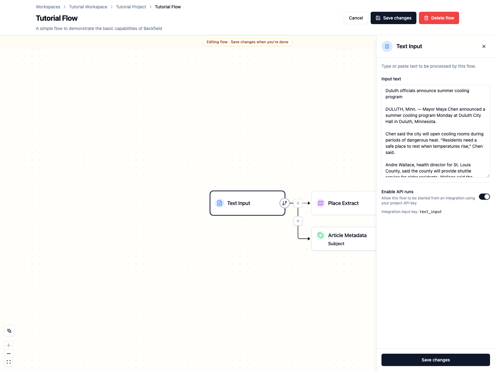
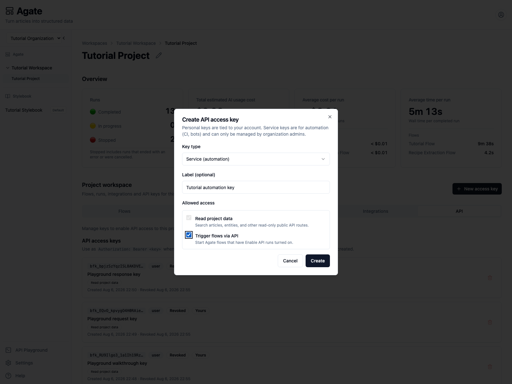
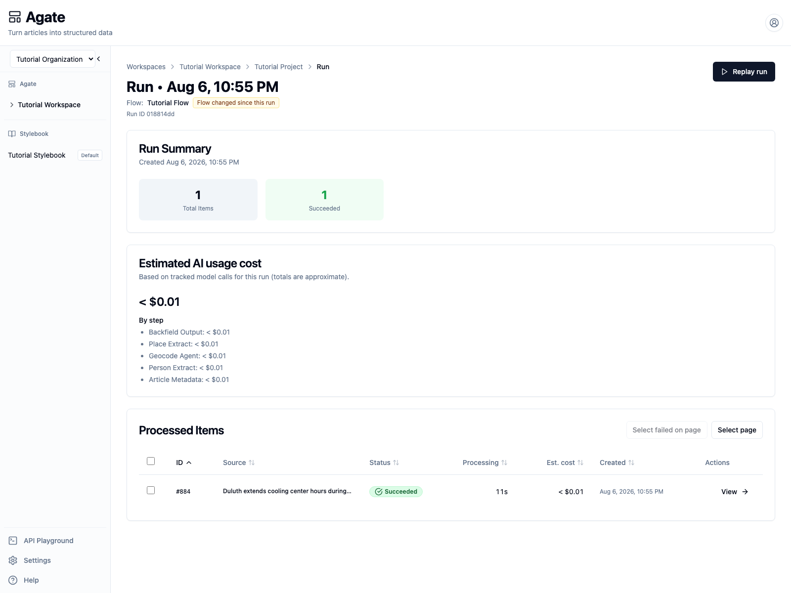
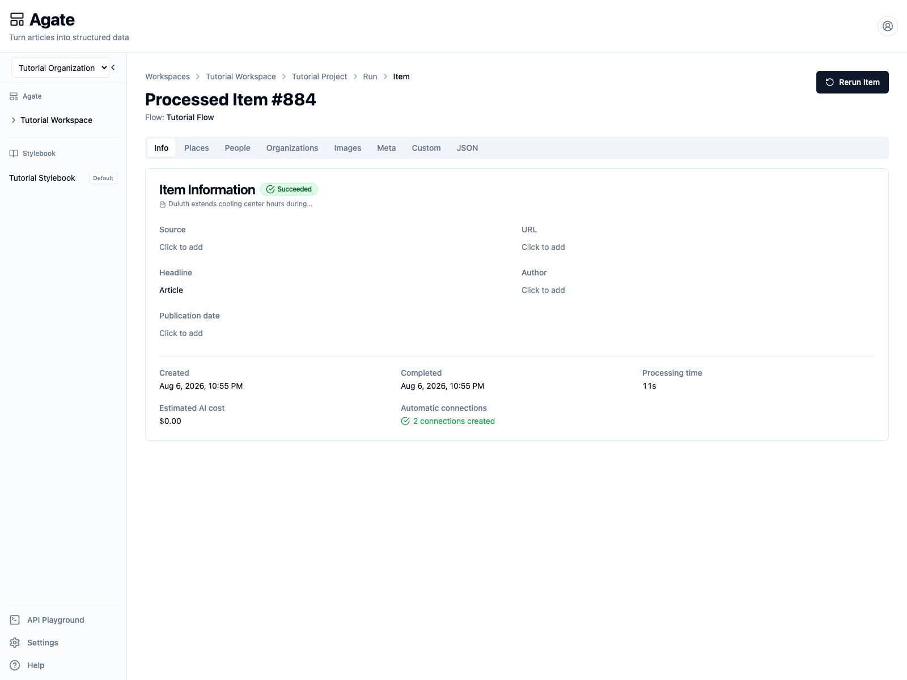

# Trigger and monitor a run

Start an approved Agate flow from trusted automation and monitor the resulting
run without reproducing flow logic in the calling application.

## You'll learn

- How API-triggered runs use saved project flows.
- How input type determines the request payload.
- How idempotency prevents duplicate runs.
- How to poll run state with bounded backoff.
- How to surface run and item errors to operators.

## Before you begin

Complete [Build your first flow](../agate/build-flow.md) and run **Tutorial
Flow** successfully in Agate. API automation should use a tested, saved flow.

## 1. Allow API runs

1. Open **Tutorial Project → Flows → Tutorial Flow**.
2. Select **Edit flow**.
3. Select the **Text Input** node.
4. Turn on **Enable API runs**.
5. Save the flow.



Enabling the flow creates a stable input alias from the node name. For **Text
Input**, the alias is `text_input`.

!!! warning
    Enabling API runs allows a service key with `runs:trigger` access to start
    this saved flow. Enable only flows that have appropriate models,
    integrations, output behavior, and cost controls.

## 2. Create a service key

Open **Tutorial Project → API**, then select **New access key**.

1. Set **Key type** to **Service (automation)**.
2. Enter the label `Tutorial automation key`.
3. Keep **Read project data** selected.
4. Select **Trigger flows via API**.
5. Create the key and copy its secret once.



Store it in the terminal that will run the example:

```bash
export BACKFIELD_PROJECT_API_KEY="paste-the-service-key-here"
export BACKFIELD_API_ORIGIN="http://localhost:8004"
export PROJECT_SLUG="tutorial-project"
export GRAPH_ID="cc04ce8d-184f-4786-a047-b1a05e65ce2d"
```

`GRAPH_ID` is the Tutorial Flow identifier. You can also read it from the flow
URL after opening the flow.

## 3. Trigger one story

Use a unique `Idempotency-Key` for this logical submission:

```bash
curl -i -X POST \
  "$BACKFIELD_API_ORIGIN/public/v1/projects/$PROJECT_SLUG/runs" \
  -H "Authorization: Bearer $BACKFIELD_PROJECT_API_KEY" \
  -H "Content-Type: application/json" \
  -H "Idempotency-Key: tutorial-duluth-2026-08-06-01" \
  -d "{
    \"graph_id\": \"$GRAPH_ID\",
    \"inputs\": {
      \"text_input\": {
        \"text\": \"Duluth extends cooling center hours during August heat\n\nDULUTH, Minn. — Mayor Maya Chen said Tuesday that Duluth will keep its cooling rooms open until 9 p.m. through Friday as temperatures rise near Lake Superior.\n\nAndre Wallace, health director for St. Louis County, said shuttle service will be available for older residents.\"
      }
    }
  }"
```

The API returns **202 Accepted** immediately:

```json
{
  "run_id": "018814dd-67ca-4589-accb-420d43cd8c77",
  "status": "running",
  "counts": {
    "total": 1,
    "pending": 1,
    "running": 0,
    "succeeded": 0,
    "failed": 0
  },
  "error_message": null
}
```

Store `run_id`; it is the handle for monitoring and operator links.

If the trigger response is lost, repeat the same body with the same
`Idempotency-Key`. Backfield returns the original run instead of creating a
duplicate. Reusing that key with a different body returns **409**.

## 4. Poll until terminal

This Python example honors `Retry-After`, caps the delay, and stops after five
minutes:

```python
import os
import time
import requests

origin = os.environ["BACKFIELD_API_ORIGIN"]
project = os.environ["PROJECT_SLUG"]
run_id = "018814dd-67ca-4589-accb-420d43cd8c77"
headers = {"Authorization": f"Bearer {os.environ['BACKFIELD_PROJECT_API_KEY']}"}
url = f"{origin}/public/v1/projects/{project}/runs/{run_id}"
deadline = time.monotonic() + 300

while True:
    response = requests.get(url, headers=headers, timeout=30)
    response.raise_for_status()
    run = response.json()
    print(run["status"], run["counts"])

    if run["status"] in {"succeeded", "failed"}:
        break
    if time.monotonic() >= deadline:
        raise TimeoutError("Run did not finish within five minutes")

    delay = min(int(response.headers.get("Retry-After", "3")), 15)
    time.sleep(delay)
```

Do not send another `POST` while polling. Poll the returned run URL.

## 5. Inspect the result in Agate

Open **Tutorial Project → Runs**. The verified tutorial request completed one
item successfully in 12 seconds.



Open the processed item to review its source and extracted results just as you
would for a UI-triggered run.



The public run response uses `succeeded` or `failed` as terminal states. Also
inspect `counts.failed`: a run can finish while one or more items need
attention. In Agate, this appears as **Completed With Errors**.

Surface these details to operators:

- Project and flow name.
- `run_id`.
- Run status and item counts.
- `error_message`, when present.
- A link to the Agate run page.

## 6. Retry deliberately

Retry only after deciding whether the submission represents:

- The same logical input: reuse the original idempotency key and body.
- A corrected or intentionally new input: use a new idempotency key.

Do not create a new run merely because polling timed out. First retrieve the
original `run_id`.

## 7. Revoke the tutorial key

Return to **Tutorial Project → API** and revoke `Tutorial automation key`.
Production automation should use its own narrowly scoped service key, with a
documented owner and rotation process.

## Related concepts

- [Trigger run](../../api/runs/trigger-run.md)
- [Get run](../../api/runs/get-run.md)
