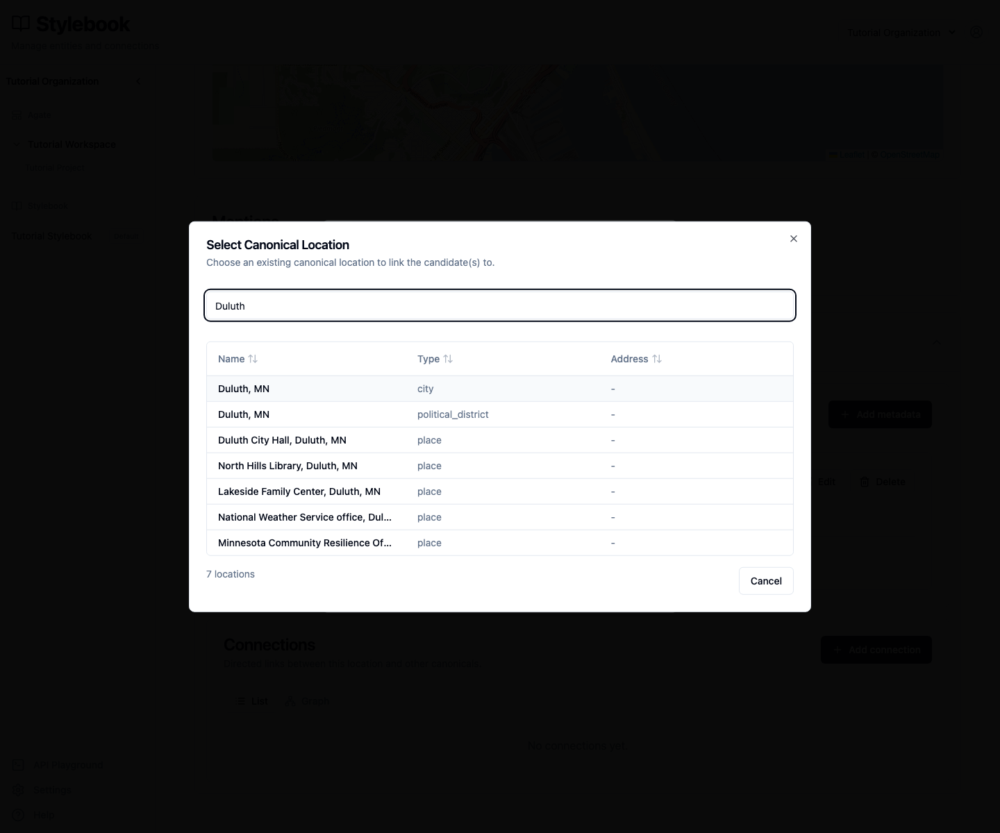
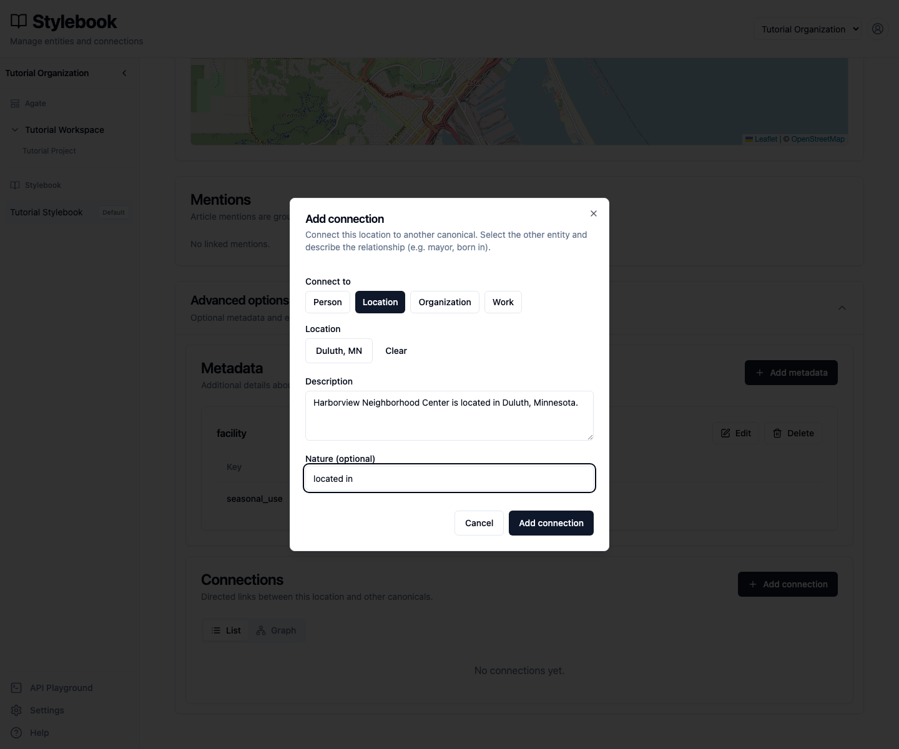
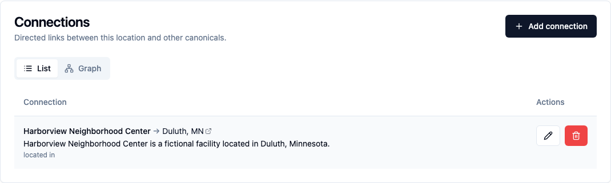
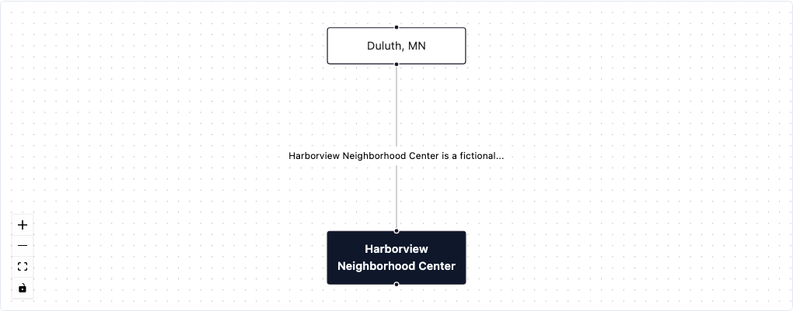
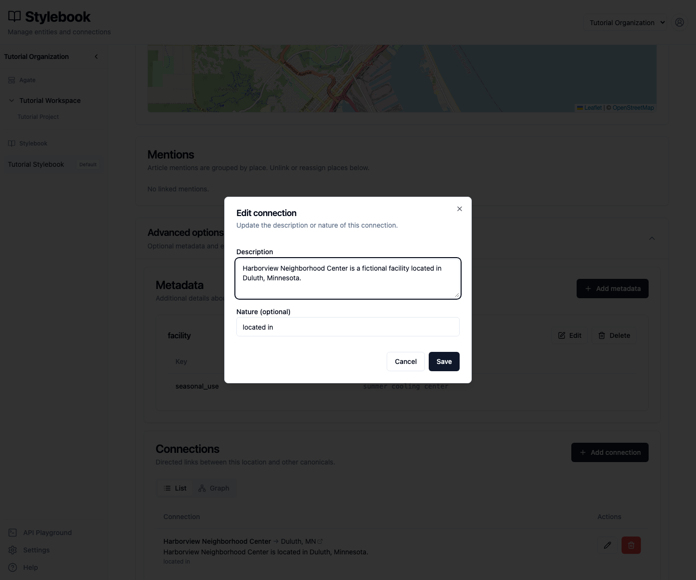
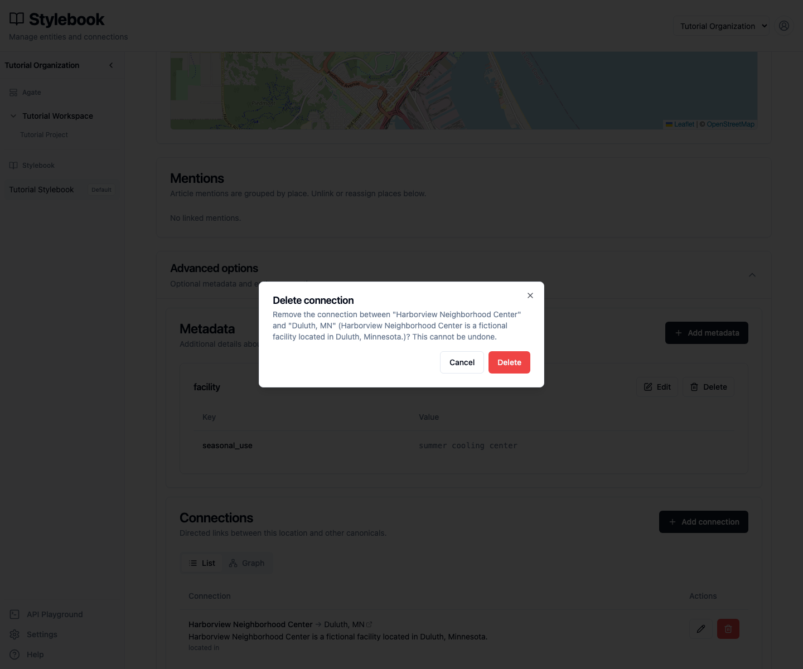

# Manage canonical connections

Connect two canonical locations, confirm the relationship's direction, and
practice editing and reviewing it.

## You'll learn

- How to choose the source and target records.
- Why connection direction changes the meaning.
- How **Nature** and **Description** complement each other.
- How to use the list and graph views.
- How to edit or remove a connection.

## Before you begin

You need editing access to **Tutorial Stylebook** and the records used in the
[Create and edit canonical records](edit-canonicals.md) tutorial:

- **Harborview Neighborhood Center**, a fictional place;
- **Duluth, MN**, the canonical city.

The relationship will read:

> Harborview Neighborhood Center is located in Duluth, Minnesota.

## 1. Choose the direction

Open **Harborview Neighborhood Center** in **Tutorial Stylebook → Locations →
Canonical locations**.

A connection starts at the canonical you have open and points to the canonical
you select. In this tutorial, the direction is:

> Harborview Neighborhood Center → Duluth, MN

Direction carries meaning. Reversing these records would claim that Duluth is
located in the fictional neighborhood center.

## 2. Select the target

Expand **Advanced options** and select **Add connection**.

Under **Connect to**, select **Location**, then **Select location**. Search for
`Duluth`.

Several records may contain the same place name. Select **Duluth, MN** whose
type is `city`, not the political district or a building in Duluth.

## 3. Describe the relationship

Enter:

- **Description:** `Harborview Neighborhood Center is located in Duluth, Minnesota.`
- **Nature:** `located in`

Select **Add connection**.

**Nature** is a short, reusable relationship type. **Description** provides the
plain-language context an editor needs. Use consistent Nature values and keep
the description specific enough to remain accurate.

## 4. Verify the connection

The **List** view shows the source, arrow, target, description, and Nature.

Check all five parts:

- source: **Harborview Neighborhood Center**;
- direction: `→`;
- target: **Duluth, MN**;
- description: the relationship in plain language;
- Nature: `located in`.

Select **Graph** to see the same records and relationship visually.

The graph is another view of the maintained connection. It does not create a
second relationship or change the source of the information. Use the List view
when you need to confirm the exact direction and wording.

## 5. Edit the description

Return to **List** and select the pencil button. Change the description to:

> Harborview Neighborhood Center is a fictional facility located in Duluth,
> Minnesota.

Select **Save**. Editing changes the description or Nature; it does not change
the source or target. If the direction or target is wrong, remove the
connection and create the correct one.

## 6. Review the deletion warning

Select the trash button beside the connection.

Confirm that the warning names both records and the current description.
Deleting a connection cannot be undone, but it does not delete either
canonical record. Select **Cancel** so the tutorial connection remains
available.

## Manual and inferred connections

This tutorial creates a **manual** connection: an editor chooses both records
and writes the relationship.

Backfield can also create an **inferred** connection from reporting. Inferred
connections can display an **Automatic** label, confidence, a supporting
passage, and a reason. Treat that evidence as material for editorial review,
not as proof that the relationship is current or correctly directed.

Connections belong to the shared Stylebook. Article evidence remains tied to
its project and article, but changing a connection changes the maintained
relationship wherever the Stylebook is used.

## Check your work

The saved connection should show:

- **Harborview Neighborhood Center → Duluth, MN**;
- Nature `located in`;
- the edited description that identifies Harborview as a fictional facility.

## Related concepts

- [Connections](../../platform/stylebook/connections.md)
- [Data model](../../platform/concepts/content-model.md)
