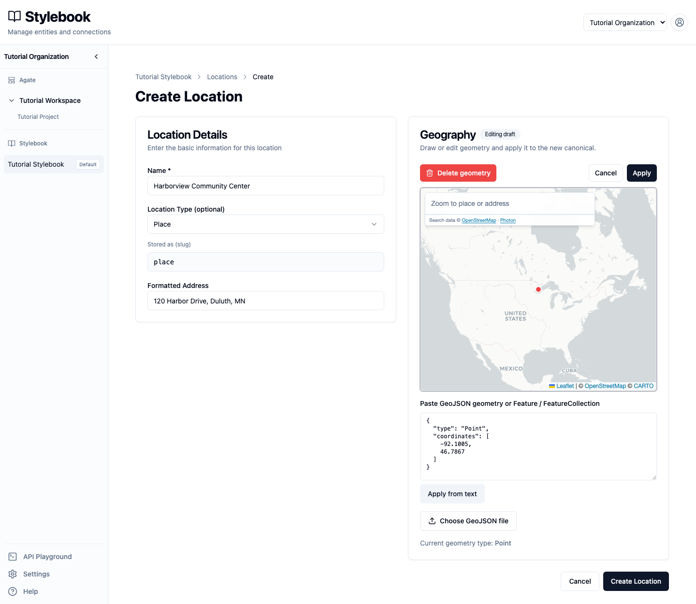
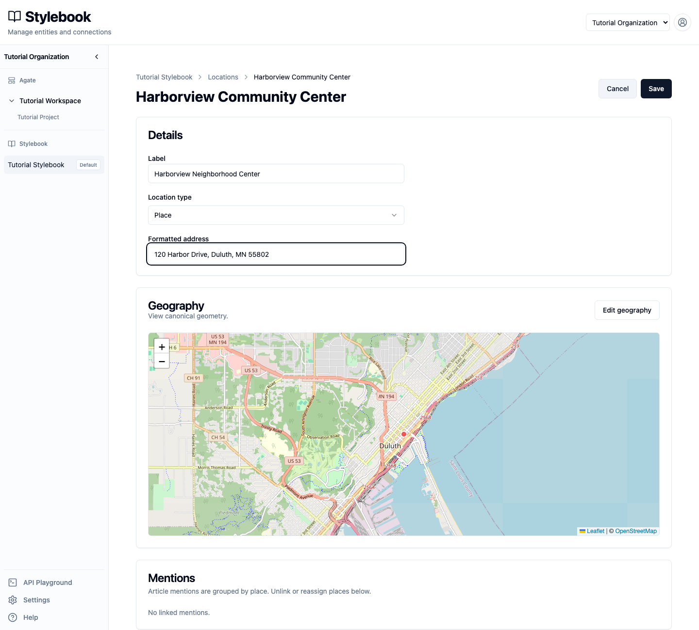
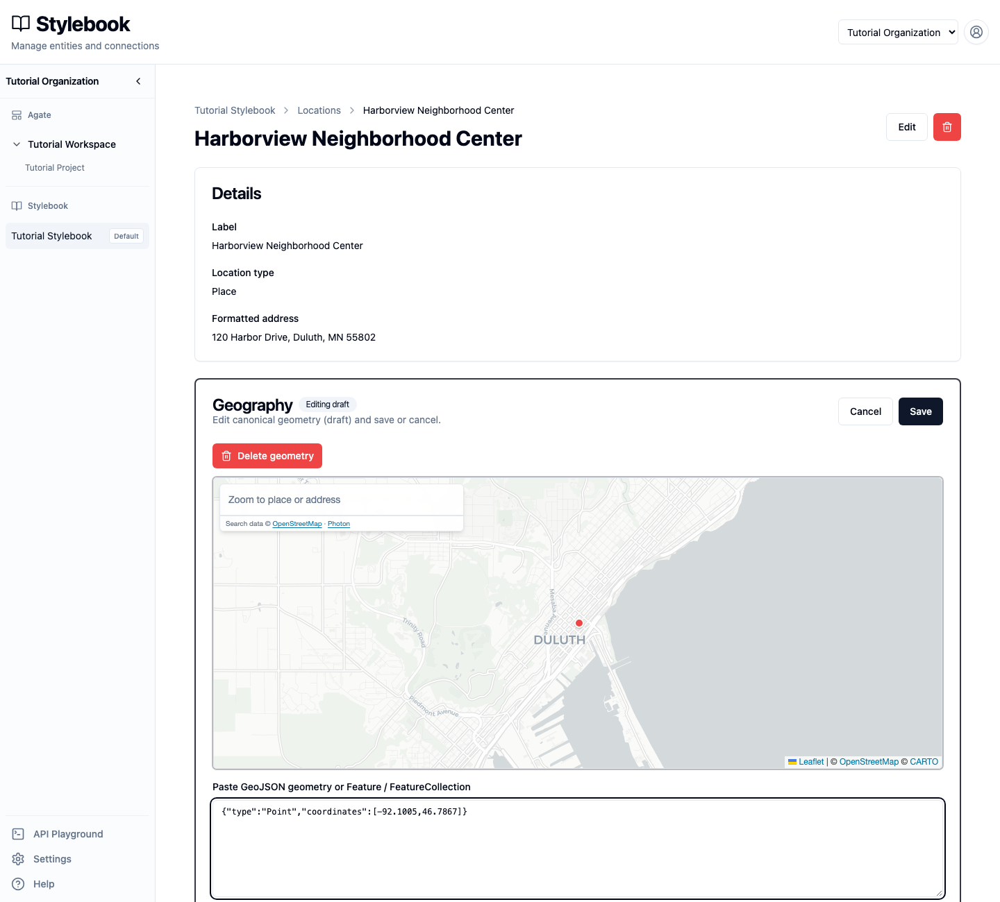
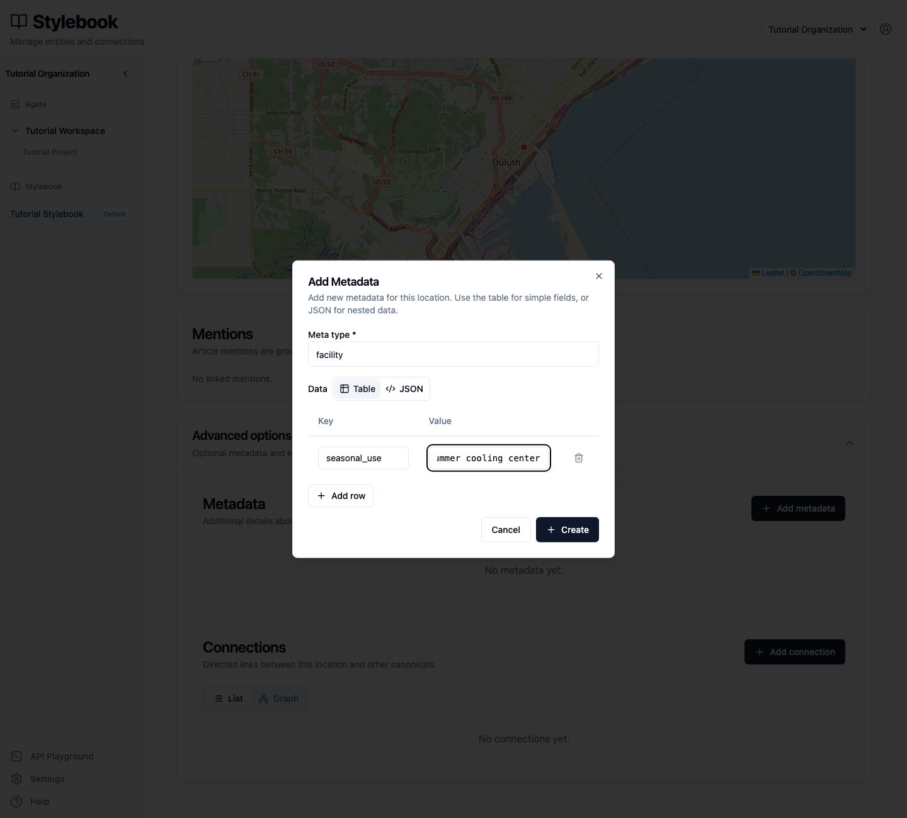
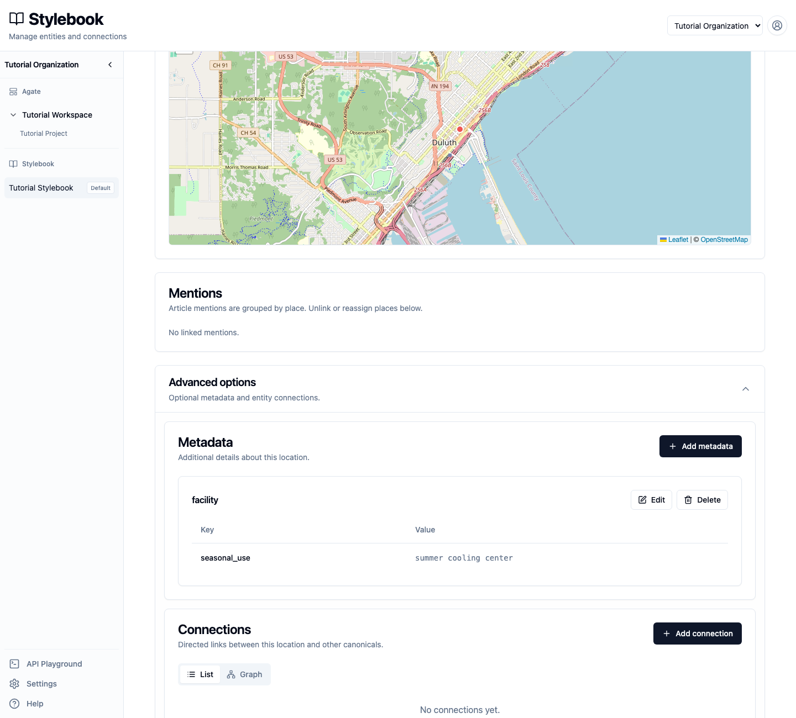
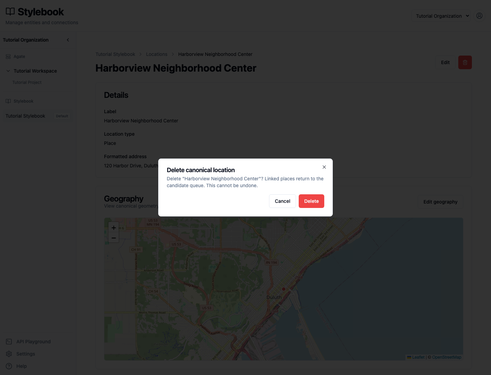

# Create and edit canonical records

Create a location manually, correct its details, add metadata, and review the
safeguards around geography, mentions, and deletion.

## You'll learn

- How to search before creating a canonical.
- How to create and edit a location.
- How to maintain canonical geography and metadata.
- How canonical details differ from article mentions.
- What happens when a canonical is deleted.

## Before you begin

You need editing access to **Tutorial Stylebook**. Deleting an entire canonical
requires organization administrator access.

This walkthrough creates a fictional place called **Harborview Community
Center**. Use tutorial data rather than adding a fictional record to a
production Stylebook.

## 1. Search before creating

Open **Tutorial Stylebook → Locations → Canonical locations**. Search for the
place by its name, address, and any common variation you know.

Do not create a second canonical simply because the first search returns no
result. Try broader terms and check the location type and jurisdiction. Two
records for the same place divide its article history and create cleanup work.

Select **Create** when you are confident the place is not already present.

## 2. Create the location

Enter:

- **Name:** `Harborview Community Center`
- **Location Type:** `Place`
- **Formatted Address:** `120 Harbor Drive, Duluth, MN`

For this fictional example, paste the following point into the GeoJSON field
and select **Apply from text**:

```json
{"type":"Point","coordinates":[-92.1005,46.7867]}
```



Select **Create Location**.

The location type describes what the place is. The formatted address is a
display value. Geography is the point, line, or boundary used for maps and
geographic search.

Only save geography you can support. Leaving geography empty is better than
attaching a precise but incorrect point or boundary.

## 3. Correct the details

Open the new canonical and select **Edit**. Change:

- **Label:** `Harborview Neighborhood Center`
- **Formatted address:** `120 Harbor Drive, Duluth, MN 55802`



Select **Save**.

The label, type, address, geography, and metadata belong to the shared
canonical. If several projects use this Stylebook, the correction is visible
to all of them.

People and organizations have different identifying fields. A person can
include a title and affiliation, while an organization can include an
organization type. The same rule still applies: search first, then save enough
trusted detail to distinguish the record.

## 4. Review the geography

Select **Edit geography**.



The editor can:

- search the map by place name or address;
- draw or adjust supported geography;
- accept GeoJSON text or a GeoJSON file;
- remove geography.

Select **Save** only after checking that the point or shape represents the
canonical place. Select **Cancel** to leave the existing geography unchanged.

A point is appropriate for a specific venue. A neighborhood, city, park, or
district may need an area. A road may use a line. The most detailed available
shape is not always the most accurate or responsible choice.

## 5. Add maintained metadata

Expand **Advanced options**, then select **Add metadata**. Enter:

- **Meta type:** `facility`
- **Key:** `seasonal_use`
- **Value:** `summer cooling center`



Select **Create**.



Metadata is maintained information about the shared place. It is not evidence
that the place appeared in a particular story. Use a clearly defined type and
key, record the source in your newsroom's normal system, and plan to review
facts that can change.

Use **Edit** or **Delete** on the metadata card when a value needs correction or
should no longer be maintained.

## 6. Understand mentions

The new canonical shows **No linked mentions** because it was created manually.
Mentions appear after article places are linked to it.

Each mention remains tied to its article and project. The controls operate on a
linked article place and all the mentions grouped beneath it. Use **Move** to
reassign that place to another canonical, or **Unlink** to return it to the
candidate queue. These actions change the canonical link; they do not rewrite
the source article.

If removing the final mention leaves a canonical empty, Stylebook asks whether
to delete the record or keep it. Keep a record when its maintained details,
metadata, geography, or planned use still have editorial value.

## 7. Review the deletion warning

If you are an organization administrator, select the trash button on the
canonical page. Stylebook editors who are not administrators can maintain the
record but cannot delete the entire canonical.



Deleting a canonical cannot be undone. Any linked article places return to the
candidate queue instead of being deleted with it. Select **Cancel** for this
tutorial so the example remains available.

## Check your work

The completed canonical should have:

- the label **Harborview Neighborhood Center**;
- the type **Place**;
- the updated formatted address;
- point geography in Duluth;
- `facility` metadata with the `seasonal_use` value;
- no linked mentions.

## Related concepts

- [Entity types](../../platform/stylebook/entity-types.md)
- [Metadata](../../platform/stylebook/meta.md)
- [Geography](../../platform/stylebook/geography.md)
- [Mentions & evidence](../../platform/stylebook/mentions.md)
