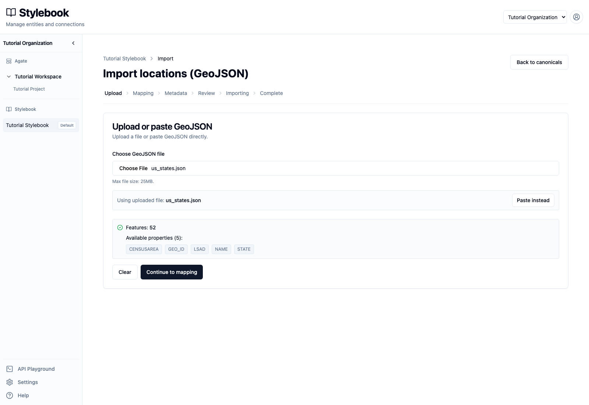
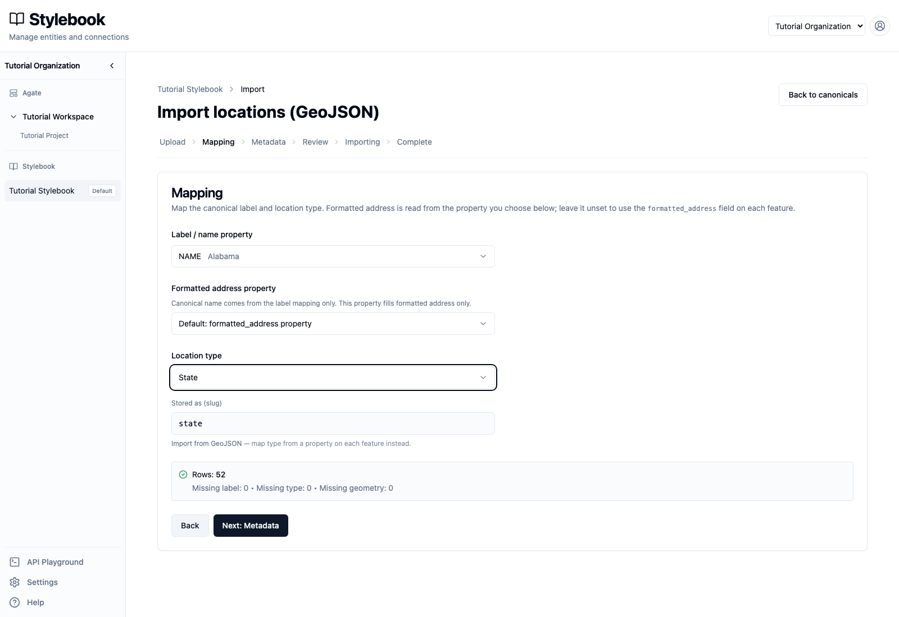
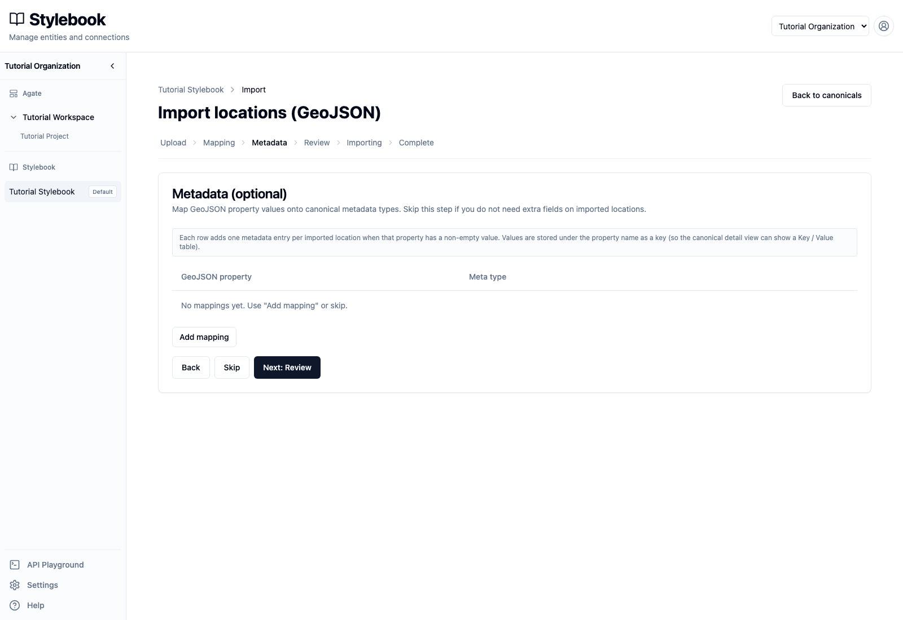
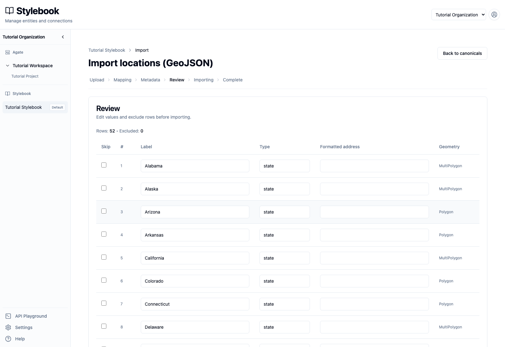
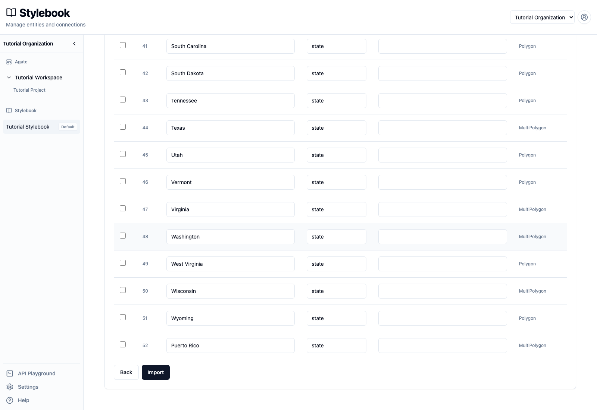
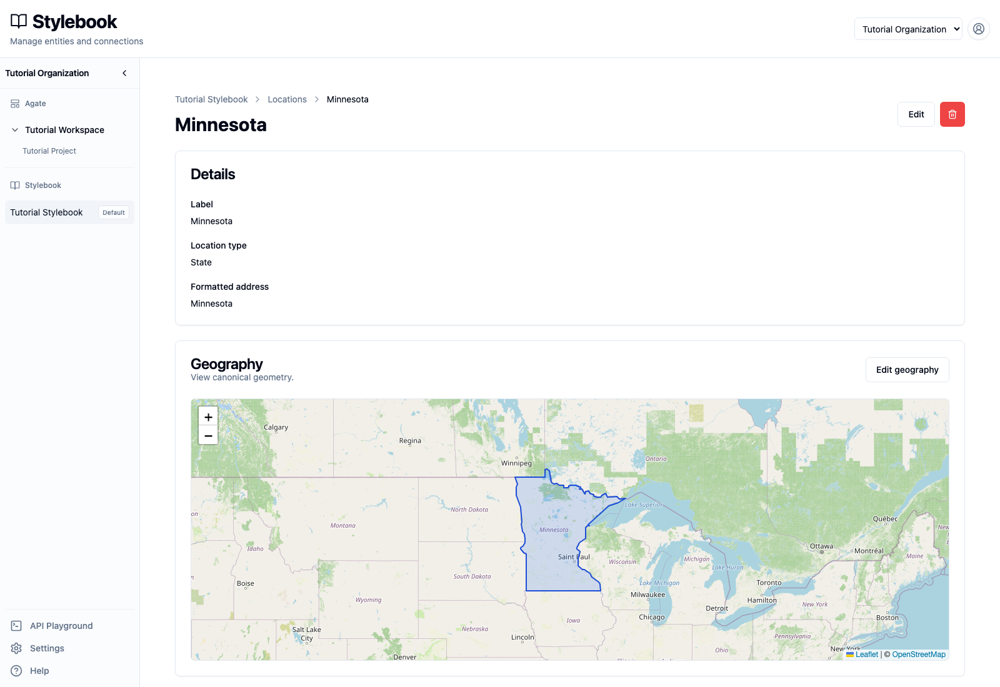

# Import canonical records

Create canonical locations from a GeoJSON file. This walkthrough uses a file of
U.S. states.

## You'll learn

- How to validate a GeoJSON file.
- How to map source properties to canonical fields.
- How to review and exclude records before importing.
- What to inspect after a completed import.

## Before you begin

You need editing access to Tutorial Stylebook and the sample
`us_states.json` file.

The sample is a valid GeoJSON `FeatureCollection` containing 52 features. Each
feature has Polygon or MultiPolygon geography and these properties:

- `NAME`
- `STATE`
- `GEO_ID`
- `LSAD`
- `CENSUSAREA`

Keep the source file. A completed import does not have a one-click rollback.

## 1. Open the location importer

Open **Tutorial Stylebook → Locations → Canonical locations**, then select
**Import**.

Stylebook uses different bulk formats for different canonical types:

- locations use GeoJSON;
- people and organizations use CSV.

Imports create canonical records directly. They do not create article mentions
or pass through the candidate queue.

## 2. Upload and validate the file

Choose the GeoJSON file. Stylebook accepts `.geojson` and `.json` files up to
25 MB. Select **Validate**.

The sample reports:

- 52 features;
- five available properties;
- no file-level validation error.

Validation confirms that Stylebook can parse the file. It does not confirm that
the labels, types, geometry, or records are editorially correct.

Select **Continue to mapping**.

## 3. Map canonical fields

Use these mappings:

- **Label / name property:** `NAME`
- **Formatted address property:** leave at its default
- **Location type:** `State`

The importer now reports:

- Missing label: 0
- Missing type: 0
- Missing geometry: 0

Do not use the `STATE` property as the location type. Its values are numeric
state codes, while every feature in this file should receive the canonical type
`state`.

Select **Next: Metadata**.

## 4. Decide whether to add metadata

Metadata mapping is optional. Each mapping stores one non-empty GeoJSON
property as a metadata entry on the imported canonical.

Skip metadata for this walkthrough. Properties such as `CENSUSAREA` can be
useful, but only after the newsroom has documented the value's units, source,
meaning, and maintenance plan. Importing an unexplained number creates future
cleanup work.

Select **Skip**.

## 5. Review every record

The review table contains all 52 proposed canonicals. Check:

- the label;
- the normalized type slug, `state`;
- optional formatted address;
- Polygon or MultiPolygon geometry;
- the **Skip** box for records that should not be imported.

Values can be edited in this table before import. The final rows include
Wyoming and Puerto Rico, confirming that this is a 52-feature source rather
than a list containing only the 50 states.

When the review is complete, select **Import**. Keep the page open while
Stylebook processes the file, then review the totals shown on **Complete**.

## 6. Inspect an imported canonical

Return to **Canonical locations**, search for `Minnesota`, and open the result
whose type is **State**.

Confirm that the canonical has:

- label `Minnesota`;
- location type `State`;
- formatted address `Minnesota`;
- state boundary geometry.

The mention shown on this record came from a later article. The geographic
import created the canonical and its geometry; imports do not create mentions.

## After import

Inspect several records immediately, including one Polygon and one
MultiPolygon. Search for similarly named canonicals and run the relevant
Stylebook quality checks. Import validation does not deduplicate records that
already exist.

## Related concepts

- [Import & export](../../platform/stylebook/import-export.md)
- [Entity types](../../platform/stylebook/entity-types.md)
