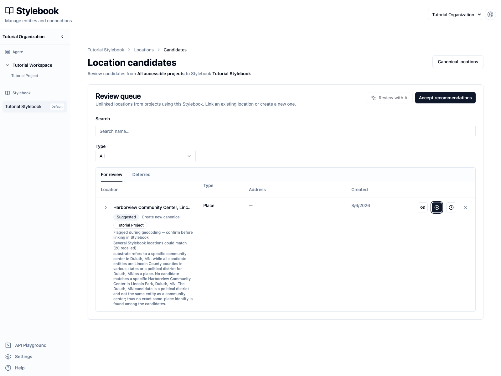
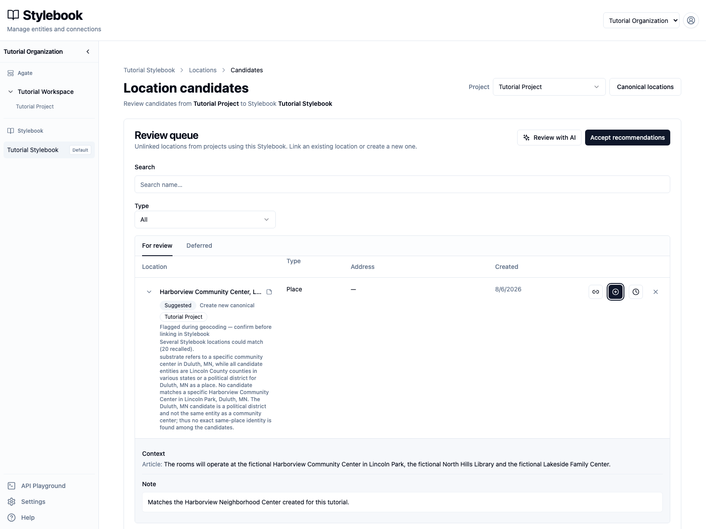
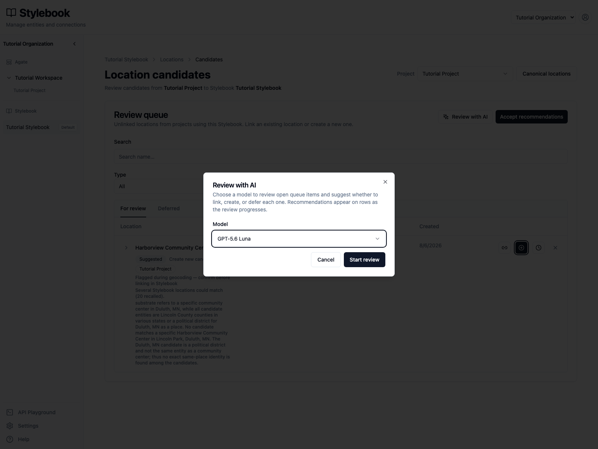
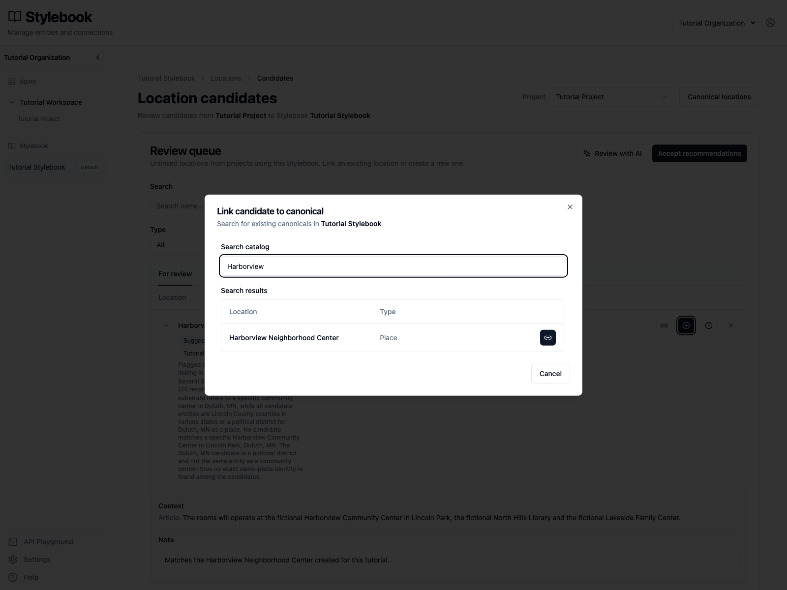
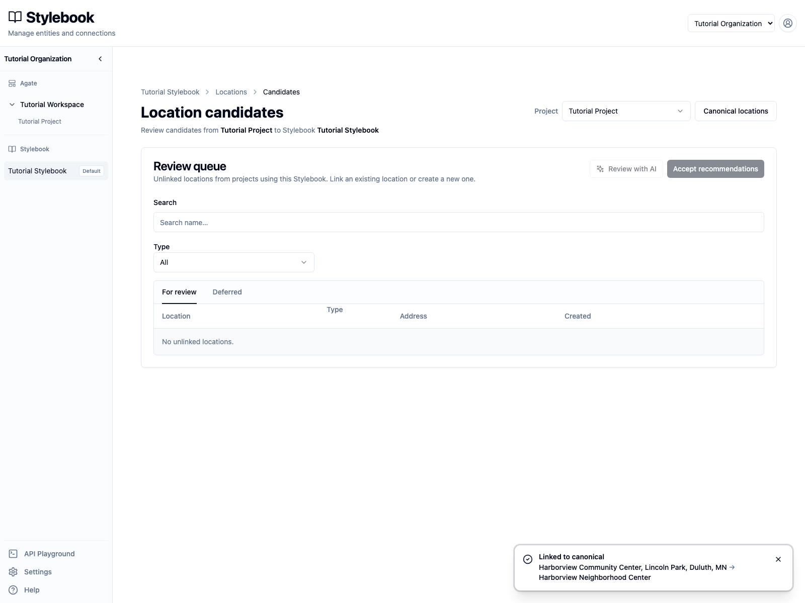
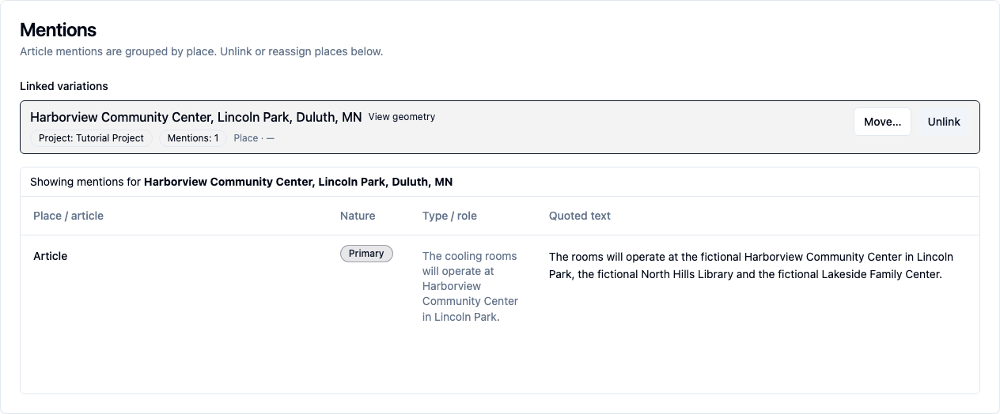

# Review candidate queues

Resolve article entities that Backfield could not safely link to an existing
canonical record.

## You'll learn

- How to narrow a queue to one project.
- How to inspect review reasons and article context.
- When to link, create, or defer a candidate.
- How to record an editor note.
- Why an AI recommendation is not an automatic decision.

## Before you begin

You need editing access to **Tutorial Stylebook**. This walkthrough uses:

- the location candidate **Harborview Community Center, Lincoln Park, Duluth,
  MN**, produced by the tutorial story;
- the canonical **Harborview Neighborhood Center**, created in
  [Create and edit canonical records](edit-canonicals.md).

Candidate queues are separated into people, organizations, and locations. This
tutorial uses the location queue, but the editorial decision is the same for
each type.

## 1. Open the review queue

Open **Tutorial Stylebook → Locations → Candidates**.

The queue initially covers all accessible projects that use this Stylebook.
Choose **Tutorial Project** from the project filter before reviewing. This
narrows the queue and enables project-specific AI review.

The Harborview row shows:

- the extracted name and type;
- the project that produced it;
- why the item needs review;
- an AI suggestion to **Create new canonical**;
- actions to link, create, defer, or clear the recommendation.

The highlighted action is a recommendation, not a completed decision.

## 2. Read the evidence

Select the arrow beside Harborview to expand the row.

Read the article passage and compare it with:

- the extracted name, type, and address;
- the review reasons;
- the recommendation and its explanation;
- the records currently in Stylebook.

The recommendation says to create a canonical because no matching community
center was found during its review. Since then, an editor manually created
**Harborview Neighborhood Center**. The newer Stylebook record changes the
decision.

Select **Click to add a note** and enter:

> Matches the Harborview Neighborhood Center created for this tutorial.

Click outside the field or press **Command/Control+Enter** to save. Notes
preserve useful review context for other editors; they do not resolve the
candidate.

## 3. Understand AI review

Select **Review with AI** and choose **GPT-5.6 Luna**.

Starting a review asks the model to recommend **link**, **create**, or
**defer** for each open candidate in the selected project. Recommendations
appear on rows as review progresses.

This row already has a recommendation, so select **Cancel** for this
walkthrough. Even a well-reasoned suggestion can become stale when an editor
adds or changes a canonical. Review the evidence before accepting any
recommendation.

## 4. Choose the correct action

The available decisions are:

- **Link to existing canonical** when the article entity and a Stylebook record
  represent the same real-world identity.
- **Create new canonical** when no existing record represents the entity.
- **Defer** when the evidence is insufficient or the decision needs another
  editor. The candidate moves to **Deferred** without losing its article
  evidence.

For Harborview, select **Link to existing canonical**. Search for
`Harborview`.

Confirm that the result is **Harborview Neighborhood Center** with type
**Place**, then select the link button on that row.

Do not link only because two names are similar. For people, compare title and
affiliation. For organizations, check acronyms and organization type. For
locations, check type, address, jurisdiction, and geography.

## 5. Confirm the result

The candidate leaves **For review**, and a confirmation names both the article
place and its canonical.

Open **Harborview Neighborhood Center** from the confirmation. Its **Mentions**
area now shows the linked article place and its evidence.

The article mention remains tied to Tutorial Project and the source article.
Linking attaches that evidence to the canonical; it does not replace the
canonical's maintained label, address, geography, metadata, or connections.

## Review recommendations safely

**Accept recommendations** applies recommendations across the full filtered
queue, not only the rows visible on the current page. Before using it:

1. select the intended project;
2. inspect the recommendation types and review reasons;
3. search Stylebook for records added after the AI review;
4. resolve unusual or ambiguous items individually;
5. confirm that the remaining recommendations are safe to apply together.

Use **Deferred** as a working queue, not as a place to discard difficult
records. Deferred candidates can still be linked or used to create a canonical
when better evidence becomes available.

## Check your work

- Tutorial Project has no open location candidates.
- Harborview Neighborhood Center has one linked variation from the tutorial
  story.
- The linked variation retains its article passage and project.
- The canonical's maintained fields remain unchanged.

## Related concepts

- [Canonicalization](../../platform/stylebook/canonicalization.md)
- [Mentions & evidence](../../platform/stylebook/mentions.md)
