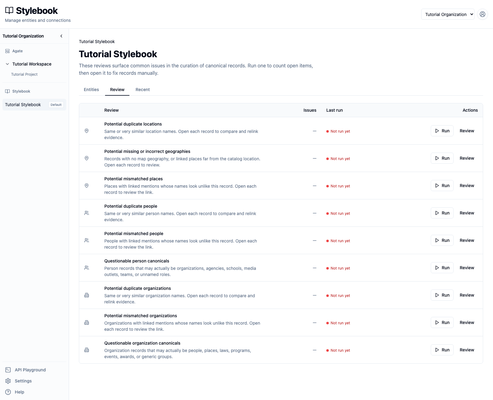
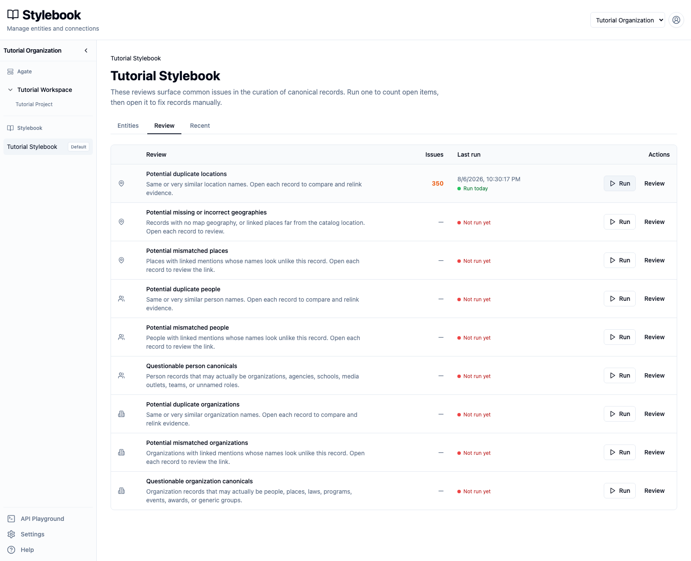
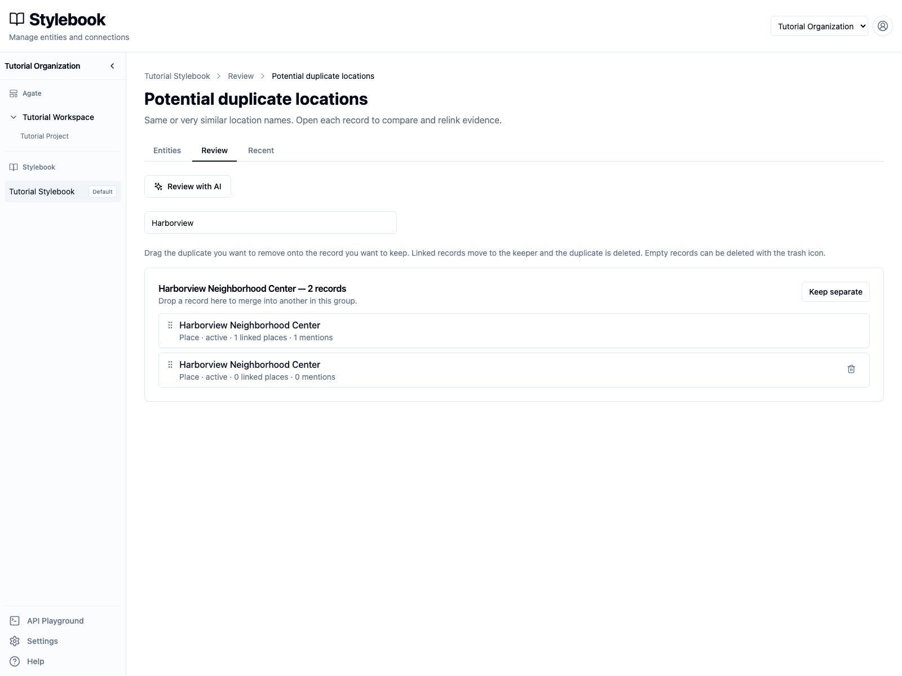
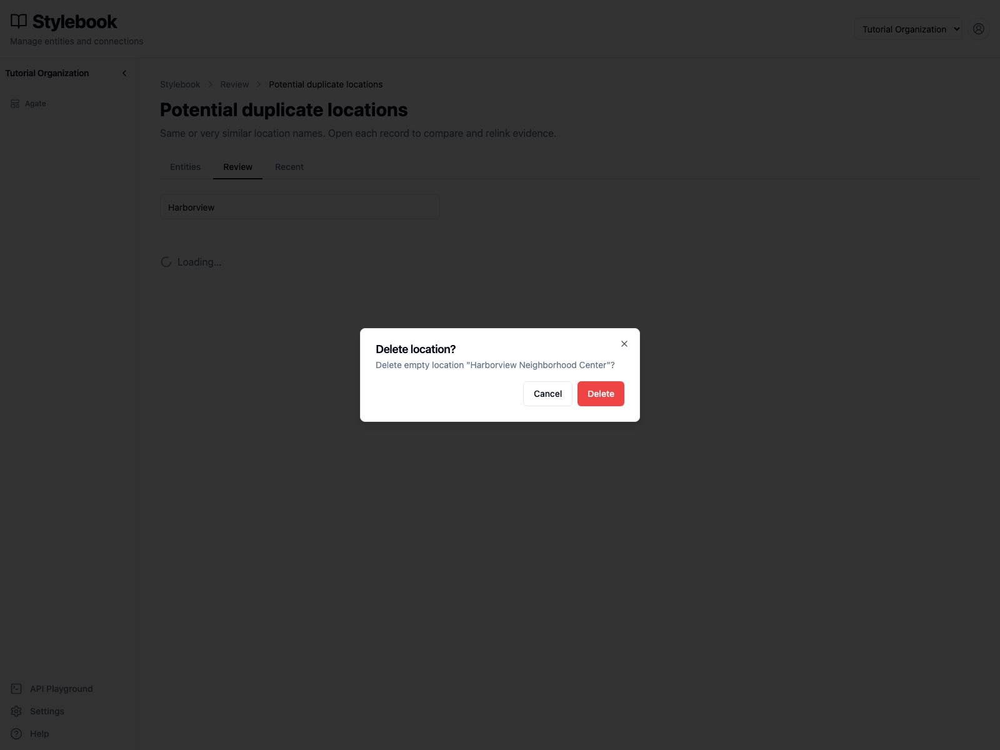
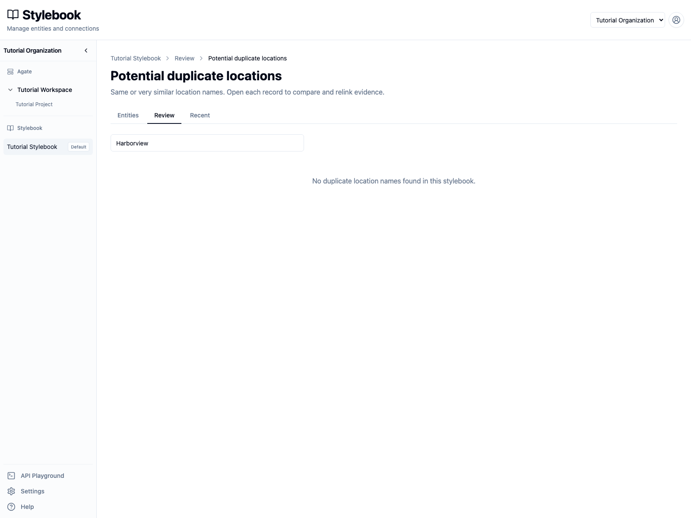
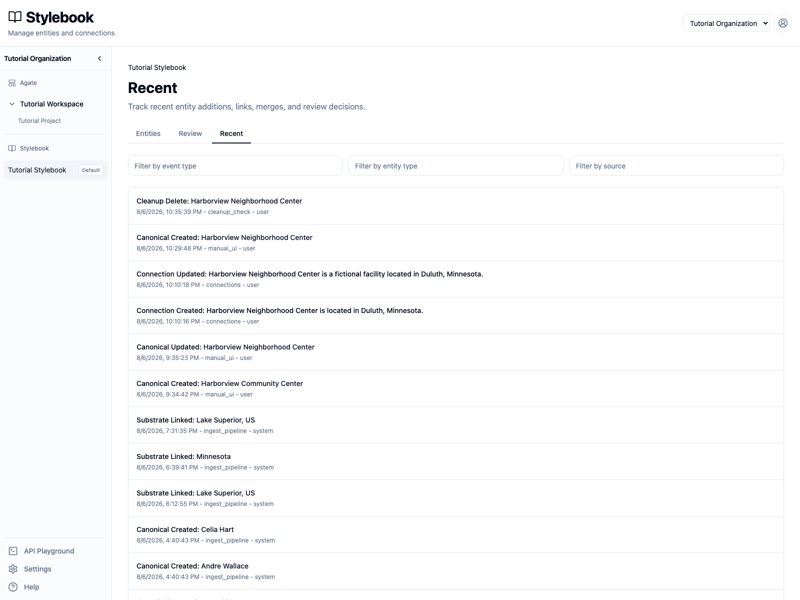

# Check catalog quality

Run Stylebook Review checks and resolve possible duplicates, mismatches,
questionable records, and geography concerns.

## You'll learn

- How to run a catalog-quality check.
- How to read its issue count and last-run time.
- How to compare records in a duplicate cluster.
- When to merge, delete, or keep records separate.
- How to confirm a review decision in Recent activity.

## Before you begin

You need editing access to **Tutorial Stylebook**.

This walkthrough uses a deliberately empty duplicate of **Harborview
Neighborhood Center**. The maintained Harborview record has article evidence,
geography, metadata, and a connection to Duluth. The duplicate has none of
those things.

## 1. Open Stylebook Review

Open **Tutorial Stylebook**, then select **Review**.

Review lists separate checks for locations, people, and organizations. Opening
this page does not run them. Each row shows:

- the kind of issue it looks for;
- the number of issues in its latest result;
- when it last ran;
- actions to run or open the check.

Choose **Tutorial Project** when a project filter is available. The project
scope controls which linked article records are considered by checks that use
article evidence.

## 2. Run the duplicate-location check

Find **Potential duplicate locations** and select **Run**. While it runs, the
row shows **Running review** and offers **Stop**.

Wait for the issue count and last-run time to appear.

The tutorial catalog reports many possible duplicate groups because it includes
thousands of imported locations with similar names. A high count is a set of
items to inspect, not proof that the catalog contains that many errors.

Review results are a snapshot. Creating, importing, linking, or editing records
does not silently rerun the check. Run it again when you need a fresh result.

## 3. Find the Harborview group

Select **Review** on the duplicate-location row. Enter `Harborview` in **Filter
by name**.

The group contains two records with the same label:

- one has **1 linked place** and **1 mention**;
- one has **0 linked places** and **0 mentions**.

Open each record before deciding. Compare its:

- label, type, and address;
- article mentions and linked variations;
- geography;
- metadata and connections;
- active or inactive status.

The populated record is the keeper. The second record is an empty duplicate.
Name similarity alone would not be enough to make that decision.

## 4. Choose the right cleanup action

Duplicate groups support three outcomes.

### Delete an empty duplicate

An empty record has a trash button. Select it for the Harborview record with
zero linked places and zero mentions.

Confirm that the dialog says **Delete empty location**, then select **Delete**.
This removes the empty record without moving article evidence.

### Merge populated duplicates

When both records contain useful linked article records, drag the duplicate
onto the record you want to keep. Stylebook asks for confirmation before it:

1. moves the duplicate's linked records to the keeper;
2. deletes the duplicate canonical.

Review the direction carefully. The drop target is the record that survives,
and a merge cannot be undone.

### Keep separate

Select **Keep separate** when the records represent different real-world
places despite their similar names. The group leaves the current results.
Additional records or changed evidence can produce a new match in a later run.

Do not use **Keep separate** merely to clear a difficult decision. Leave the
group open until an editor has enough evidence.

## 5. Confirm the filtered result

After deleting the empty duplicate, the Harborview filter has no remaining
duplicate group.

This only resolves the reviewed Harborview group. The full check still contains
other possible duplicates that require their own decisions.

## 6. Confirm the activity

Select **Recent**.

The newest event is **Cleanup Delete: Harborview Neighborhood Center**. Recent
activity records what happened, when it happened, and whether a user or the
system performed it. It is an audit trail, not an undo feature.

## AI-assisted duplicate review

Duplicate checks also offer **Review with AI**. Select **GPT-5.6 Luna** to ask
for merge or keep-separate proposals across the check's duplicate groups.

The review does not apply proposals automatically. Inspect the proposed keeper,
the records being removed, confidence, and explanation before accepting or
rejecting each proposal. The same merge safeguards apply whether the proposal
came from an editor or a model.

## Other catalog checks

Use the same pattern for the other Review rows:

1. run the check;
2. note its freshness and scope;
3. open the result;
4. inspect the affected canonical and linked evidence;
5. correct the record or link when needed;
6. mark or keep a valid record as reviewed.

Geography checks can flag missing map geography or linked places far from the
canonical shape. Mismatch checks compare linked article entities with the
canonical identity. Questionable-record checks flag people or organizations
that may have been assigned the wrong entity type.

## Check your work

- Potential duplicate locations has a completed run time and issue count.
- Filtering the result for `Harborview` returns no duplicate group.
- The populated Harborview canonical still has its mention and maintained
  fields.
- Recent activity records the cleanup deletion.

## Related concepts

- [Stylebook](../../platform/stylebook/index.md#two-kinds-of-review)
- [Canonicalization](../../platform/stylebook/canonicalization.md#canonical-cleanup)
